<!-- TOC -->

- [1 知识共享许可协议说明](#1-知识共享许可协议说明)
- [2 前言](#2-前言)
- [3 了解SDK](#3-了解sdk)
    - [3.1 SDK介绍](#31-sdk介绍)
    - [3.2 软件架构](#32-软件架构)
    - [3.3 安全介绍](#33-安全介绍)
    - [3.4 OTA升级](#34-ota升级)
- [4 下载SDK](#4-下载sdk)
- [5 集成开发](#5-集成开发)
    - [5.1 针对模组厂商](#51-针对模组厂商)
        - [5.1.1 AT指令规划](#511-at指令规划)
            - [5.1.1.1 MQTT协议AT指令规划](#5111-mqtt协议at指令规划)
            - [5.1.1.2 LwM2M协议AT指令规划](#5112-lwm2m协议at指令规划)
        - [5.1.2 云服务抽象层API](#512-云服务抽象层api)
            - [5.1.2.1 OC-MQTT](#5121-oc-mqtt)
            - [5.1.2.2 OC-LwM2M](#5122-oc-lwm2m)
            - [5.1.2.3 OC-CoAP](#5123-oc-coap)
        - [5.1.3 物联组件协议层](#513-物联组件协议层)
            - [5.1.3.1. MQTT AL](#5131-mqtt-al)
            - [5.1.3.2. LWM2M AL](#5132-lwm2m-al)
            - [5.1.3.3. COAP AL](#5133-coap-al)
        - [5.1.4 基础组件适配](#514-基础组件适配)
            - [5.1.4.1 适配TCP/IP](#5141-适配tcpip)
        - [5.1.5 OS适配](#515-os适配)
            - [5.1.5.1 适配OS](#5151-适配os)
    - [5.2 集成示例](#52-集成示例)
        - [5.2.1 Linux平台MQTT连接华为云demo](#521-linux平台mqtt连接华为云demo)
            - [5.2.1.1 华为DMP环境](#5211-华为dmp环境)
            - [5.2.1.2 进入开发界面并建立项目](#5212-进入开发界面并建立项目)
            - [5.2.1.3 创建产品模型](#5213-创建产品模型)
            - [5.2.1.4 创建设备](#5214-创建设备)
            - [5.2.1.5 开发环境](#5215-开发环境)
            - [5.2.1.6 示例代码分析](#5216-示例代码分析)
            - [5.2.1.7 编译运行](#5217-编译运行)
            - [5.2.1.8 平台演示及调试](#5218-平台演示及调试)
        - [5.2.2 基于MQTT协议的模组连接云平台](#522-基于mqtt协议的模组连接云平台)
        - [5.2.3 基于LWM2M协议的模组连接云平台](#523-基于lwm2m协议的模组连接云平台)
    - [5.3 针对设备厂商](#53-针对设备厂商)
        - [5.3.1 配有模组的设备](#531-配有模组的设备)
            - [5.3.1.1 MCU+模组模式](#5311-mcu模组模式)
            - [5.3.1.2 openCPU模式](#5312-opencpu模式)
            - [5.3.2 没有模组的设备](#532-没有模组的设备)

<!-- /TOC -->

# 1 知识共享许可协议说明

**您可以自由地：**

**分享** — 在任何媒介以任何形式复制、发行本作品

**演绎** — 修改、转换或以本作品为基础进行创作

只要你遵守许可协议条款，许可人就无法收回你的这些权利。

**惟须遵守下列条件：**

**署名** — 您必须提供适当的证书，提供一个链接到许可证，并指示是否作出更改。您可以以任何合理的方式这样做，但不是以任何方式表明，许可方赞同您或您的使用。

**非商业性使用** — 您不得将本作品用于商业目的。

**相同方式共享** — 如果您的修改、转换，或以本作品为基础进行创作，仅得依本素材的授权条款来散布您的贡献作品。

**没有附加限制** — 您不能增设法律条款或科技措施，来限制别人依授权条款本已许可的作为。

**声明：**

当您使用本素材中属于公众领域的元素，或当法律有例外或限制条款允许您的使用，则您不需要遵守本授权条款。

未提供保证。本授权条款未必能完全提供您预期用途所需要的所有许可。例如：形象权、隐私权、著作人格权等其他权利，可能限制您如何使用本素材。

为了方便用户理解，这是协议的概述。您可以访问网址<https://creativecommons.org/licenses/by-nc-sa/3.0/legalcode>了解完整协议内容。

# 2 前言

**目的**

本文档用于指导开发者了解Agent Tiny SDK，并且能够通过集成Agent Tiny SDK对接华为OceanConnect云平台，开发自己的物联网应用。

**符号约定**

在本文中可能出现下列标志，它们所代表的含义如下。

| 符号                                 | 说明                                                         |
| ------------------------------------ | ------------------------------------------------------------ |
|  | 用于警示潜在的危险情形，若不避免，可能会导致人员死亡或严重的人身伤害 |
|  | 用于警示潜在的危险情形，若不避免，可能会导致中度或轻微的人身伤害 |
|  | 用于传递设备或环境安全警示信息，若不避免，可能会导致设备损坏、数据丢失、设备性能降低或其它不可预知的结果 “注意”不涉及人身伤害 |
|  | “说明”不是安全警示信息，不涉及人身、设备及环境伤害信息       |

**术语**

| 序号 | 术语名称              | 描述                                                         |
| ---- | ---------------------| ------------------------------------------------------------ |
| 1    | Agent Tiny SDK       |Agent Tiny SDK是Huawei LiteOS的软件开发工具包（Software Development Kit），包括端云互通组件、FOTA、JS引擎、传感框架等内容。|
| 2    | 设备                 | 用于采集数据的嵌入式设备，比如STM32开发板，或者温湿度采集的传感器等。|
| 3    | 应用                |物联网平台中，应用包括用户在物联网平台上创建的应用和用户自行开发的应用服务器。应用是用户在物联网平台中为用户的业务划分一个项目空间，每个项目空间会分配一个应用ID和应用密钥，用于将开发完的应用服务器与真实设备接入到这个项目空间中，实现设备的数据采集和设备管理。应用服务器是用户基于物联网平台开放的API接口或者SDK进行自行开发的物联网应用，可接入物联网平台进行设备的管理。|
| 4    | 产品模型            | 产品模型（也称Profile）用于描述设备具备的能力和特性。开发者通过定义Profile，在物联网平台构建一款设备的抽象模型，使平台理解该款设备支持的服务、属性、命令等信息。  |
| 5    | 编解码插件            | 物联网平台和应用服务器使用JSON格式进行通信，所以当设备使用二进制格式上报数据时，开发者需要在物联网平台上开发编解码插件，帮助物联网平台完成二进制格式和JSON格式的转换。 |
| 6    | AT指令               | AT指令集是从终端设备（Terminal Equipment，TE)或数据终端设备（Data Terminal Equipment，DTE)向终端适配器(Terminal Adapter，TA)或数据电路终端设备(Data Circuit Terminal Equipment，DCE)发送的。本文通过AT指令操作WIFI或者GSM模组。|
| 7    | 端云互通组件          | 端云互通组件是华为物联网解决方案中，资源受限终端对接到OceanConnect云平台的重要组件。|
| 8    | OceanConnect         | 华为物联网联接管理平台（IoT Connection Management Platform）是面向运营商和企业/行业领域的统一开放云平台，支持SIM和非SIM场景的各种联接和联接管理。 |
|9|nodeId|设备唯一物理标识，如IMEI、MAC地址等，用于设备在接入物联网平台时携带该标识信息完成注册鉴权。|
|10|deviceId|设备ID，用于唯一标识一个设备，在注册设备时由物联网平台分配获得，是设备在IoT平台上的内部标识，用于设备注册鉴权，及后续在网络中通过deviceId进行消息传递。|
|11|密钥|用于设备采用原生MQTT协议接入物联网平台时的鉴权认证。|
|12|MQTT|MQTT（Message Queue Telemetry Transport）是一个物联网传输协议，被设计用于轻量级的发布/订阅式消息传输，旨在为低带宽和不稳定的网络环境中的物联网设备提供可靠的网络服务。MQTTS指MQTT+SSL/TLS，在MQTTS中使用SSL/TLS协议进行加密传输。|
|13|CoAP|受约束的应用协议CoAP（Constrained Application Protocol）是一种软件协议，旨在使非常简单的电子设备能够在互联网上进行交互式通信。CoAPS指CoAP over DTLS，在CoAPS中使用DTLS协议进行加密传输。|
|14|LwM2M|LwM2M（lightweight Machine to Machine）是由OMA（Open Mobile Alliance)定义的物联网协议，主要使用在资源受限(包括存储、功耗等)的NB-IoT终端。|

# 3 了解SDK
## 3.1 SDK介绍
Agent Tiny SDK是部署在具备广域网能力、对功耗/存储/计算资源有苛刻限制的终端设备上的轻量级互联互通中间件，您只需调用API接口，便可实现设备快速接入到物联网平台以及数据上报和命令接收等功能。

Agent Tiny SDK提供端云协同能力，集成了MQTT、LwM2M、CoAP、mbedtls、LwIP 全套 IoT 互联互通协议栈，且在这些协议栈的基础上，提供了开放 API，用户只需关注自身的应用，而不必关注协议内部实现细节，直接使用Agent Tiny SDK封装的API，通过连接、数据上报、命令接收和断开四个步骤就能简单快速地实现与华为OceanConnect云平台的安全可靠连接。使用Agent Tiny SDK，用户可以大大减少开发周期，聚焦自己的业务开发，快速构建自己的产品。
## 3.2 软件架构
Agent Tiny SDK的软件架构如下图所示，主要分为以下几层：

- API接口：通过应用编程接口将Agent Tiny SDK能力开放给设备，终端设备调用SDK能力，快速完成华为物联网平台的接入、业务数据上报、下发命令处理等。

- 端云互通组件：提供了终端采用MQTT、CoAP、LWM2M等多种协议接入华为物联网平台的能力。

- 物联组件：集成了LWM2M、CoAP、MQTT等物联网标准协议，您可以根据现有设备特征，添加自定义的协议。

- 基础组件：提供了驱动、传感器、AT指令等框架，您可以基于SDK提供的框架，根据具体的硬件平台进行适配。

- OS适配层：提供了LiteOS、Linux等操作系统内核，您也可以添加第三方操作系统内核。

- HAL硬件平台抽象层：提供交叉编译能力，以便于Agent Tiny 集成在不同硬件平台。

集成策略如下图所示：

|         集成策略     |说明                        |
|:---------------------:|----------------------------|
|可集成性|Agent Tiny作为独立的组件，不依赖特定的芯片架构和网络硬件类型，可以轻松地集成到各种通信模组上，如NB-IoT模组、WIFI模组、GSM模组、以太网硬件等。|
|可移植性|Agent Tiny SDK的适配层提供了常用的硬件及网络适配接口，终端或者模组厂家可以根据自己的硬件实现这些接口后，即可完成Agent tiny SDK的移植。|
|集成约束|Agent Tiny SDK的集成需要满足一定的硬件规格：(1)要求模组/芯片有物理网络硬件支持，能支持UDP协议栈;(2)模组/芯片有足够的FLASH和RAM资源供Agent Tiny协议栈做集成。建议的硬件选型规格如下所示：RAM容量>32K Flash容量>128K CPU频率>100MHZ|

## 3.3 安全介绍
Agent Tiny SDK以LwM2M/CoAP协议端云连接传输数据包时，不能保证UDP通信双方的身份认证、消息传输过程中的加密传输，所以使用DTLS(Datagram Transport Layer Security)，即数据包传输层安全性协议进行加密。

DTLS握手协议和TLS类似。DTLS协议在UDP之上实现了客户机与服务器双方的握手连接，在握手过程中验证对方的身份，并且使用RSA或者DH（Diffie-Hellman）实现会话密钥的建立，以便在后面的数据传输中对数据加密。它利用cookie验证机制和证书实现了通信双方的身份认证；并且用在报文段头部加上序号，缓存乱序到达的报文段；还利用重传机制实现了可靠传送。在握手完成后，通信双方就可以利用握手阶段协商好的会话密钥来对应用数据进行加解密。

Agent Tiny SDK使用mbedtls加密库实现加密的优点：mbedTLS（前身PolarSSL）是面向嵌入式系统，实现的一套易用的加解密算法和SSL/TLS库。mbedTLS系统开销极小，对于系统资源要求不高。mbedTLS是开源项目，并且使用Apache 2.0许可证，使得用户既可以讲mbedTLS使用在开源项目中，也可以应用于商业项目。目前使用mbedTLS的项目很多，例如Monkey HTTP Daemon，LinkSYS路由器。

其软件架构如下图所示：

Agent Tiny SDK首先和物联网开放平台完成握手流程，后续的应用数据将全部为加密数据，其握手流程大致如图所示：

## 3.4 OTA升级

Agent Tiny SDK端云互通组件支持物联网开放平台的软件升级，软件升级又称为SOTA（SoftWare Over The Air），是指用户可以通过OTA的方式支持对LwM2M协议的设备进行软件升级，（基于MQTT协议的设备的软件升级能力即将上线）。软件升级遵循的协议为PCP协议（PCP协议查看PCP协议介绍），设备侧需要遵循PCP协议进行软件升级的适配开发。

SOTA流程如下图所示：

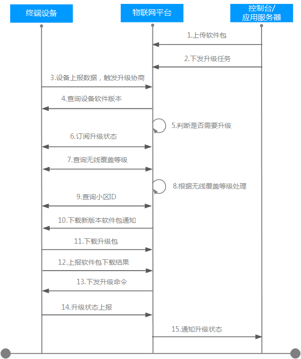

SOTA升级的主要流程为：

（1）	检查设备软件升级能力；

（2）	制作软件升级版本包；

（3）	上传软件升级版本包；

（4）	创建软件升级任务；

具体软件升级操作步骤请参考开发中心—软件升级<https://support.huaweicloud.com/devg-IoT/iot_02_9983.html>。

# 4 下载SDK

目前Agent Tiny SDK的源码还是托管在GITHUB上：<https://github.com/LiteOS/LiteOS>，代码会持续更新。进入网址后选择iot_link分支;

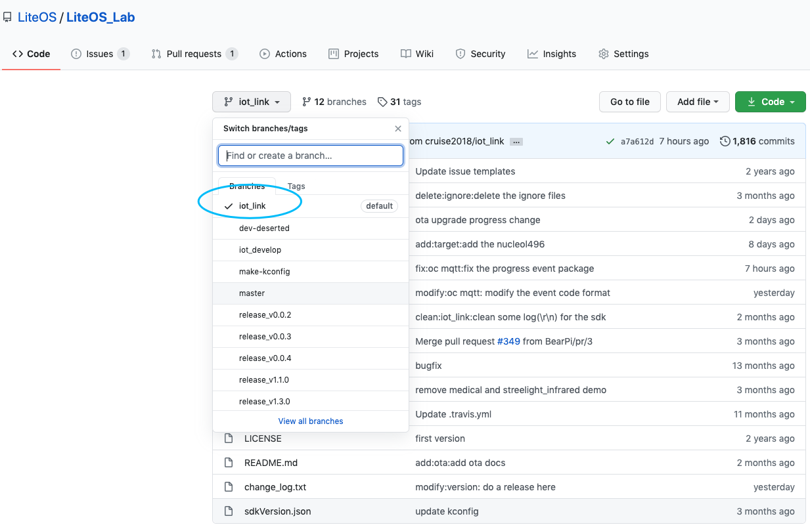

选择Clone并且下载源码压缩包;

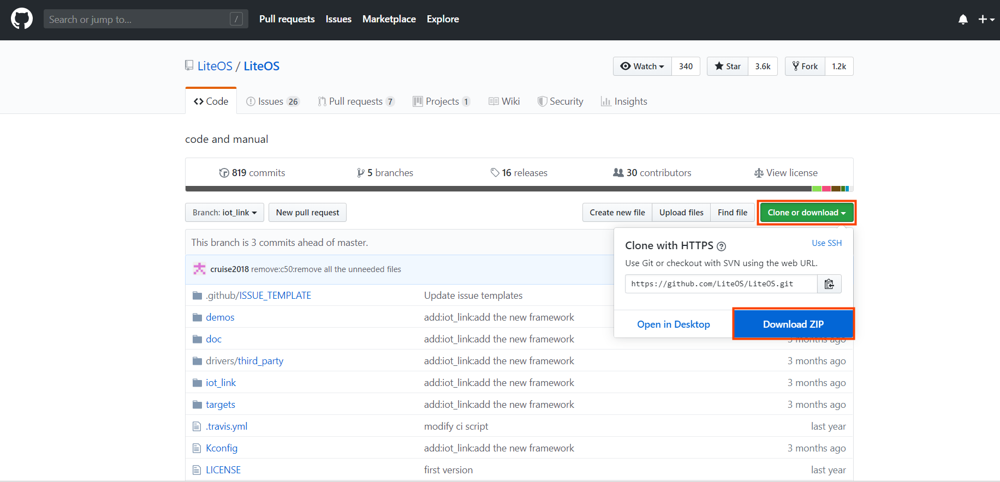

下载后解压获得源码文件夹，Agent Tiny SDK源代码目录说明：

|  一级目录 | 二级目录 | 三级目录 | 说明 |
|:--------|:--------|:---------|------|
|demos|——|——|LwM2M、MQTT、CoAP等协议的demo范例|
|doc|——|——|存放使用文档及API说明等文档|
|drivers/third_party|GigaDevice|——|第三方MCU厂商GD的BSP库|
||ST|——|第三方MCU厂商ST的BSP库|
|iot_link|at|——|AT指令框架实现|
||cJSON|——|cJSON|
||compression_algo|——|压缩算法（LZMA）|
||crc|——|crc校验|
||driver|——|驱动框架|
||fs|——|文件系统，含VFS、SPIffs、RAMfs、KIfs、DEVfs、FATfs|
||inc|——|存放内核内部使用头文件|
||link_log|——|日志|
||link_misc|——|杂项|
||loader|——|应用加载|
||network|coap|CoAP的适配及协议实现|
|||dtls|mbedtls的适配及协议实现|
|||lwm2m|LwM2M的开源协议栈wakaama的适配|
|||mqtt|MQTT的适配及协议实现|
|||tcpip|TCPIP适配及协议栈实现、lwIP驱动、OS适配及协议栈实现、MacOS_socket适配及协议栈实现|
||oc|oc_lwm2m|LwM2M协议适配华为OC|
|||oc_mqtt|MQTT协议适配华为OC|
||os|osal|Agent Tiny SDK的OS适配|
|||os_imp|目前系统适配层适配的操作系统|
||ota|——|OTA升级代码实现|
||queue|——|queue组件的代码实现|
||shell|——|shell组件代码实现|
||stimer|——|stimer组件代码实现|
||upgrade_patch|——|差分算法（HDiffpatch）|
|target|EC20|——|EC20全网通4G IoT通信模组，已完成适配及SDK的AT指令框架的实现|
||GD32VF103V_EVAL|——|GD32VF103V开发板提供MQTT和LwM2M的demo供使用者连接华为OC|
||LINUX|——|适配LINUX平台，通过以太网连接华为OC，提供MQTT及LwM2M的直连DMP及经BS引导连接的demo|
||MACBOOK|——|适配MACOS平台，通过以太网连接华为OC，提供MQTT及LwM2M的直连华为OC及经BS引导连接|
||N720|——|N720 全网通4G IoT通信模组，包含SDK的AT指令框架的实现|
||STM32F429IGTx_FIRE|——|野火STM32F429（ARM Cortex M4)以太网/ESP8266串口WiFi/SIM900A GPRS/NB-IoT BC95四种连接方式的LiteOS SDK端云demo，内部用编译宏区分，其中wifi、gprs、NB-IOT使用LiteOS SDK的AT框架实现|
||STM32L431_BearPi|——|STM32L431_BearPi（ARM Cortex M4)以太网/ESP8266串口WiFi/SIM900A GPRS/NB-IoT BC95四种连接方式的LiteOS SDK端云demo，内部用编译宏区分，其中wifi、gprs、NB-IOT使用LiteOS SDK的AT框架实现|
||STM32L431_EVBM1|——|物联网俱乐部EVB-M1 STM32L431（ARM Cortex M4）ESP8266WiFi/NB-IoT BC95两种|

# 5 集成开发
## 5.1 针对模组厂商
在物联网解决方案中，作为模组厂商的您需要让模组实现MQTTS、LwM2M、CoAP等物联网协议栈及连接平台的能力，您只需要将Agent Tiny SDK集成在现有的模组固件包中，这样模组就具备了接入华为物联网平台的能力。模组逻辑架构图如下：

设备通过AT指令驱动模组即可对接华为物联网平台。为了满足设备一致性要求，华为对AT指令做了统一规划，只有遵循规划的指令，集成的模组才具备认证资格。

因此，对于需要集成Agent Tiny SDK的模组厂商而言，您首先需要了解AT指令规划，再结合SDK系统架构框图，根据自身硬件特点选取需要移植的SDK组件，包括云服务抽象层API，物联组件协议适配和OS适配等。

### 5.1.1 AT指令规划
#### 5.1.1.1 MQTT协议AT指令规划

+ **连接**

设备侧连接云平台发送的AT指令格式为：

    AT+HWOCMQTTCONNECT=”bs”, ”lifetime”, “host”, “port”, “noteid”, “passwd”

各参数解释:

(1)bs: 表示是否经过引导(BS)服务器，0表示直接连接DMP，1表示经过BS服务器接入DMP；

(2)lifetime: 该参数用作MQTT协议的心跳，时间单位为秒；

(3)host: bs是“1”为BS服务器的地址或者域名，bs是“0”为DMP服务器的域名或者地址；

(4)port: BS服务器或者DMP服务器的端口号；

(5)noteid: 设备标识，在云平台添加设备时获取；

(6)passwd: 设备密码，在云平台添加设备时获取。

如果返回+CONNECTED OK，表示设备与云平台连接成功；返回+CONNECTED ERR则代表连接失败。

+ **数据上报**

设备侧发送数据到云平台的AT指令格式为：

    AT+HWOCMQTTSEND=”qos”, “len”, “ascii payload”

各参数解释：

(1)qos: MQTT协议的qos，取值为0/1/2；

(2)len: 待发送数据长度（byte数据长度）；

(3)ascii payload: 待发送数据的ASCII码的16进制数据。

注：设备侧发送的数据务必采用JSON格式，目前DMP对MQTT协议只支持JSON格式，如果发送二进制码流，组需要在云端添加组件解析。例：要发送的数据为：{"msgType":"deviceReq","hasMore":0,"data":[{"serviceId":"Battery","serviceData":{"batteryLevel":56}}]}

将这些字符的ASCII码值用十六进制表示为：

	7b226d736754797065223a22646576696365526571222c226861734d6f7265223a302c226461746122
	3a5b7b22736572766963654964223a2242617474657279222c227365727669636544617461223a7b22
	626174746572794c6576656c223a35367d7d5d7d

设备侧对应的AT指令为：

	AT+HWOCMQTTSEND=0,102,7b226d736754797065223a22646576696365526571222c226861734d6f72
	65223a302c2264617461223a5b7b22736572766963654964223a2242617474657279222c2273657276
	69636544617461223a7b22626174746572794c6576656c223a35367d7d5d7d

如果AT指令发送成功，返回+SEND OK，否则返回+SNED ERR。

+ **命令接收**

模组向设备上报云平台数据的AT指令格式为：

     +HWOCMQTTRECEIVED=”qos”, “len”, “ascii payload”

各参数解释：

(1)qos: MQTT协议的qos，取值为0/1/2；

(2)len: 接收到的数据长度（byte数据长度）；

(3)ascii payload: 转换为ASCII码的16进制数据。

+ **关闭连接**

设备关闭连接云平台的AT指令为：

     AT+HWOCMQTTDISCONNECT
命令发送成功后，返回+DISCONNECT OK，云平台将显示设备离线；失败则返回+DISCONNECT ERR。

#### 5.1.1.2 LwM2M协议AT指令规划

+ **连接**

设备侧连接云平台发送的AT指令格式为：

    AT+ HWOCLWM2MCONNECT=”bsmode”, ” serverip”, “serverport”, “deviceid”, “passwd”

各参数解释：

（1）bsmode: 0表示直连DMP，1表示BS模式连接DMP；

（2）serverip: DMP服务器地址或者BS服务器地址(默认BS) ；

（3）serverport: DMP服务器或者BS服务器的端口号；

（4）deviceid: 设备标识；

（5）passwd: 设备密码。

如果返回+CONNECTED OK，表示连接成功；返回+CONNECTED ERR则代表连接失败。

+ **数据上报**

设备侧发送数据到云平台的AT指令格式为：

    AT+HWOCLWM2MSEND=“len”, “payload”

各参数解释：

（1）len: 待发送数据长度（byte数据长度）；

（2）payload: 待发送给云平台的数据。

返回：+SEND OK代表发送成功；返回+SNED ERR则代表发送失败。

 + **命令接收**

模组向设备上报云平台数据流的AT指令格式为：

	 +HWOCLWM2MRECEIVED=“len”, “payload”

各参数解释：

（1）len: 接收到的数据长度（byte数据长度）；

（2）payload: 待发送给设备的数据。

+ **关闭连接**

设备关闭连接云平台的AT指令为：

	AT+HWOCLWM2MDISCONNECT

命令发送成功后，返回+DISCONNECT OK，云平台将显示设备离线；失败则返回+DISCONNECT ERR。

### 5.1.2 云服务抽象层API
端云互通组件是Agent Tiny SDK中的重要组件，提供端云协同能力和基于MQTT协议和LwM2M协议对接华为云的开放API。

对基于MQTT/ LwM2M协议对接华为云的开发者（基于MQTT/ LwM2M协议或基于支持MQTT/ LwM2M协议的模组，以及内置对接华为云的模组）而言，无需关注对接华为云物联网协议的实现细节，仅仅需要将所选择的物联网协议注册到云服务抽象层（OC AL），再调用OC AL提供的抽象层接口即可。

#### 5.1.2.1 OC-MQTT
OC AL提供的基于MQTT协议抽象层接口代码目录为：…\iot_link\oc\oc_mqtt，具体如下：

|目录|描述|
|:-|:-|
|…/oc_mqtt_al|适配华为OC服务的MQTT抽象层。通过注册机制，最终调用到用户注册的函数|
|…/oc_mqtt_imp/atiny_mqtt|SDK内置的soft类设备适配华为OC服务的MQTT的具体实现。|
|…/oc_mqtt_imp/ec20_oc|SDK内置的ec20模组适配华为OC服务的MQTT的具体实现。可以通过抽象层提供的oc_mqtt_register接口将相关功能注册到SDK中。|

OC AL提供的MQTT协议端云互通API如下：

|接口名|描述|
|:-|:-|
|int oc_mqtt_register(const tag_oc_mqtt_ops *opt)|将已经实现的config/report/deconfig注册到OC MQTT中，注册成功返回0，失败返回-1|
|int oc_mqtt_init()|OC MQTT初始化|
|cJSON *oc_mqtt_json_fmt_report(tag_oc_mqtt_report *report)|将待发送MQTT数据转成cJSON格式|
|cJSON *oc_mqtt_json_fmt_response(tag_oc_mqtt_response *response)|将响应信息转成cJSON格式|
|void *oc_mqtt_config(tag_oc_mqtt_config *param)|设置华为OC MQTT协议连接参数，等待连接建立并保持，如果连接成功，返回非空句柄|
|int oc_mqtt_report(void *handle,char *msg,int len, en_mqtt_al_qos_t qos)|发送MQTT数据到华为OC|
|int oc_mqtt_deconfig(void *handle)|断开连接|

#### 5.1.2.2 OC-LwM2M

OC AL提供的基于LwM2M协议抽象层接口代码目录为：…\iot_link\oc\oc_lwm2m，具体如下：

|目录|描述|
|:-|:-|
|…/oc_lwm2m/oc_lwm2m_al|华为云服务OC LwM2M的抽象层接口及实现。通过注册，最终调用底层的适配函数|
|…/oc_lwm2m_imp/atiny_lwm2m|SDK内置的soft类设备适配华为OC服务的LwM2M的具体实现。通过抽象层提供的oc_lwm2m_register注册函数，将相关功能注册到SDK中|
|…/oc_lwm2m_imp/boudica150|SDK内置的boudica150适配华为OC服务的LwM2M的具体实现。通过抽象层提供的oc_lwm2m_register注册函数，将相关功能注册到SDK中|
|…/oc_lwm2m_imp/oc_lwm2m_imp_demo|demo|

OC AL提供的基于LwM2M协议端云互通API如下：

|接口名|描述|
|:-|:-|
|int oc_lwm2m_register(const char *name,const oc_lwm2m_opt_t *opt);|将已经实现的config/report/deconfig注册到OC LwM2M中，注册成功返回0，失败返回-1|
|int oc_lwm2m_unregister(const char *name);|取消注册|
|int oc_lwm2m_init();|OC LwM2M初始化|
|int oc_lwm2m_config(oc_config_param_t *param);|设置华为OC LwM2M协议连接参数，等待连接建立并保持;返回0成功 否则错误代码|
|int oc_lwm2m_report(char *buf, int len,int timeout);|发送LwM2M数据到华为OC|
|int oc_lwm2m_deconfig(void );|断开连接|

#### 5.1.2.3 OC-CoAP
OC AL提供的基于CoAP协议抽象层接口代码目录为：…\iot_link\oc\oc_coap，具体如下：

|目录|描述|
|:-|:-|
|…/oc_lwm2m/oc_coap_al|华为云服务OC LwM2M的抽象层接口及实现。通过注册，最终调用底层的适配函数|
|…/oc_lwm2m_imp/atiny_coap|SDK内置的soft类设备适配华为OC服务的CoAP的具体实现。通过抽象层提供的oc_coap_register注册函数，将相关功能注册到SDK中|

OC AL提供的基于CoAP协议端云互通API如下：

|接口名|描述|
|:-|:-|
|int oc_coap_register(const char *name,const oc_coap_opt_t *opt);|将已经实现的config/report/deconfig注册到OC CoAP中，注册成功返回0，失败返回-1|
|int oc_coap_init();|OC CoAP初始化|
|void *oc_coap_config(oc_config_param_t *param);|设置华为OC CoAP协议连接参数，等待连接建立并保持，如果连接成功，返回非空句柄。|
|int oc_coap_report(void *handle,char *msg,int len);|发送CoAP数据到华为OC|
|int oc_coap_deconfig(void *handle);|断开连接|

### 5.1.3 物联组件协议层
物联组件协议层目录：…\iot_link\network\。Agent Tiny SDK集成了LwM2M、CoAP、MQTT等物联网标准协议，您可以直接调用已实现协议，或添加自定义协议，将其注册进SDK中。
#### 5.1.3.1. MQTT AL

根据MQTT标准协议，Agent Tiny SDK提供的MQTT服务都是建立在标准的MQTT协议基础上，并提供MQTT协议抽象层接口。适配MQTT的软件结构示意图如下：

    typedef struct
    {
       ///< connect to the server
       void* (* connect)   (mqtt_al_conpara_t *param);
       ///< disconnect from the server
       int    (* disconnect)(void *handle );
       ///< publish a message to the server
       int	   (* publish)    (void *handle, mqtt_al_pubpara_t *msg);
       ///< subscribe a topic to the server
       int    (* subscribe)   (void *handle, mqtt_al_subpara_t *subpara);
       ///< unsubscribe a topic to the server
       int    (* unsubscribe) (void *handle, mqtt_al_unsubpara_t *unsubpara);
       ///< check the mqtt engine status
       en_mqtt_al_connect_state (* check_status) (void *handle);
    }mqtt_al_op_t;
    int mqtt_al_install(mqtt_al_op_t *op);

相关适配接口介绍：

|接口分类|接口名|说明|
|:-|:-|:-|
|MQTT相关接口|void * mqtt_al_connect( mqtt_al_conpara_t *conparam)|请求连接|
||int mqtt_al_disconnect(void *handle)|断开连接|
||int mqtt_al_publish(void *handle, mqtt_al_pubpara_t *pubpara)|发布消息|
||int mqtt_al_subscribe(void *handle, mqtt_al_subpara_t *subpara)|订阅请求|
||int mqtt_al_unsubscribe(void *handle, mqtt_al_unsubpara_t *unsubpara) |取消订阅|
||en_mqtt_al_connect_state mqtt_al_check_status(void *handle)|检查连接状态|

#### 5.1.3.2. LWM2M AL
适配LwM2M的软件结构示意图如下：

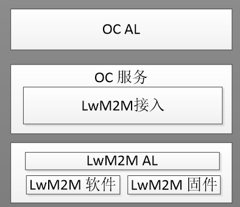

#### 5.1.3.3. COAP AL

适配CoAP的软件结构示意图如下：

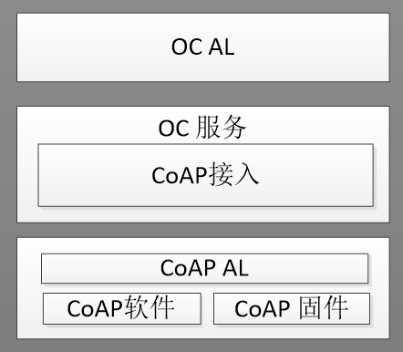

    typedef struct
    {
       ///< coap init, prepare context, session, etc
       int    (* init)     (coap_al_initpara_t *initparam);
       ///< coap deinit
       int    (* deinit)   (void *handle);
       ///< coap add option
       void*  (* add_opt)  (coap_al_optpara_t *optparam);
       ///< new coap request
       void*  (* request)  (coap_al_reqpara_t *reqparam);
       ///< send a request to server
       int	   (* send)     (coap_al_sndpara_t *sndparam);
       ///< recv and handle response from server
       int    (* recv)     (coap_al_rcvpara_t *rcvparam);
    }coap_al_op_t;
    int coap_al_install(coap_al_op_t *op);

相关适配接口介绍：

|接口分类|接口名|说明|
|:-|:-|:-|
|CoAP相关接口|nt coap_al_init(coap_al_initpara_t *initparam);|初始化|
||int coap_al_deinit(void *handle);|取消初始化|
||void *coap_al_add_option(coap_al_optpara_t *optparam);|添加CoAP选项|
||void *coap_al_new_request(coap_al_reqpara_t *reqparam);|创建新的消息请求|
||int coap_al_send(coap_al_sndpara_t *sndparam);|发送消息给服务器|
||int coap_al_recv(coap_al_rcvpara_t *rcvparam);|接收并处理服务器下发的数据|
||int coap_al_install(coap_al_op_t *op);|将协议栈注册到系统中|
||int coap_al_uninstall();|取消注册|

### 5.1.4 基础组件适配
基础组件包括传感器框架、驱动框架、VFS/DEVFS、安全可靠传输、TCP/IP等，您可根据实际需求选择适配。
#### 5.1.4.1 适配TCP/IP

对于Agent Tiny SDK而言，其网络协议栈决定于底层操作系统，使用第三方操作系统时，可以将相关的网络传输接口进行抽象，提供相关的协议栈接口即可。Agent Tiny SDK中调用的所有网络传输的接口，通过注册机制，最终都会调用到用户注册的函数，示意图如下：

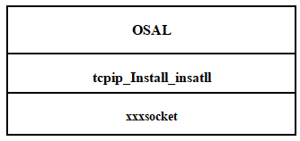

用户可以调用tcpip_sal_install函数进行操作系统注册。
相关的定义如下：

    typedef struct
    {
        const char           *name;    ///< this member reserved now
        int                   domain;  ///< this member to match the tcpip  ops,likes AF_INET and so on
        const tag_tcpip_ops  *ops;     ///< this member used to implement the user's operation
    }tag_tcpip_domain;
    int tcpip_sal_install(const tag_tcpip_domain *domain);

相关适配接口介绍：

|接口分类|接口名|说明|
|:-|:-|:-|
|网络Socket相关接口|int sal_socket(int domain, int type, int protocol)|创建socket连接|
||void osal_free(void *addr)|断开socket连接|
||int sal_recv(int sockfd,void *buf,size_t len,int flags)|通过socket接收数据|
||int sal_send(int sockfd,const void *buf,size_t len,int flags)|通过socket发送数据|

### 5.1.5 OS适配
#### 5.1.5.1 适配OS
对于Agent Tiny SDK而言，其运行依赖操作系统，如果使用第三方的操作系统，则可以将相关的操作系统进行抽象，提供相关的任务创建删除、互斥锁、信号量、内存管理接口即可。Agent Tiny SDK中调用的所有系统相关的接口，通过注册机制，最终都会调用到用户注册的函数，示意图如下：

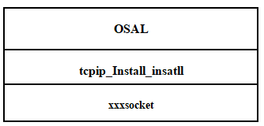

用户可以调用osal_install函数进行注册操作系统服务。
相关的定义如下：

    typedef struct
    {
        const char         *name;  ///< operation system name
        const tag_os_ops   *ops;   ///< system function interface
    }tag_os;
    int osal_install(const tag_os *os); //install the os to the link layer

相关实现可以参考LiteOS以及Linux的适配（文件夹位置LiteOS_Lab-iot_link\iot_link\os\os_imp）。相关适配接口如下：

|相关接口类型|	函数接口|	描述|
|:-|:-|:-|
|任务|	void* osal_task_create(const char *name,int (*task_entry)(void *args),void *args,int stack_size,void *stack,int prior)|	任务创建|
||int osal_task_kill(void *task)	|任务结束|
||void osal_task_exit(void)	|任务推出|
||void osal_task_sleep(int ms)	|任务休眠|
|互斥锁	|int osal_mutex_create(osal_mutex_t *mutex)	|互斥锁创建|
||int osal_mutex_lock(osal_mutex_t mutex)	|互斥锁上锁|
||int osal_mutex_unlock(osal_mutex_t mutex)	|互斥锁解锁|
||int osal_mutex_del(osal_mutex_t mutex)	|互斥锁删除|
|信号量	|int osal_semp_create(osal_semp_t *semp,int limit,int initvalue)|信号量创建|
|信号量创建|int osal_semp_pend(osal_semp_t semp,int timeout)	|信号量挂起|
||int osal_semp_post(osal_semp_t semp)	|信号量发送|
||int  osal_semp_del(osal_semp_t semp)	|信号量删除|
|内存管理|void *osal_malloc(size_t size)	|动态内存分配|
||void  osal_free(void *addr)	|动态内存清空|
||void *osal_zalloc(size_t size)|	动态内存分配|
||void *osal_realloc(void *ptr,size_t newsize)|	动态内存重分配|
||void *osal_calloc(size_t n, size_t size)	|动态内存分配（初始化0）|

具体代码参见osal.c。

## 5.2 集成示例
### 5.2.1 Linux平台MQTT连接华为云demo
Agent Tiny SDK在demo文件夹中提供了MQTT、LwM2M和CoAP的demo供使用，本示例以Linux系统下MQTT协议直连华为IoT云平台来说明完整的对接流程。
#### 5.2.1.1 华为DMP环境

DMP，即设备管理平台，是华为OceanConnect物联网平台对智能设备进行管理的云服务。首先，您需要到华为云上申请账号，连接为https://www.huaweicloud.com/product/iot.html。

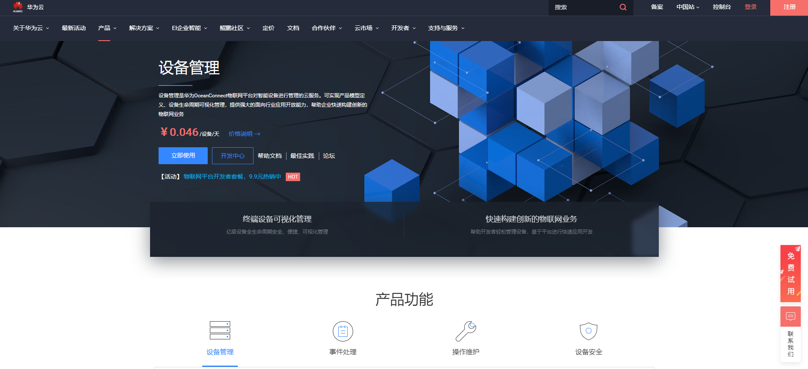

注册登录之后选择产品->IoT物联网->设备接入，联系OceanLink团队人员开启公测环境（包括设备接入、设备管理、设备发放以及全球SIM联接服务）。

本章节介绍SDK示例演示，因此相关的高级功能参考开发者指导页面：
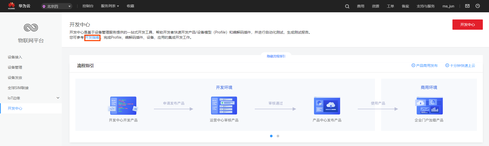

进入之后的界面：
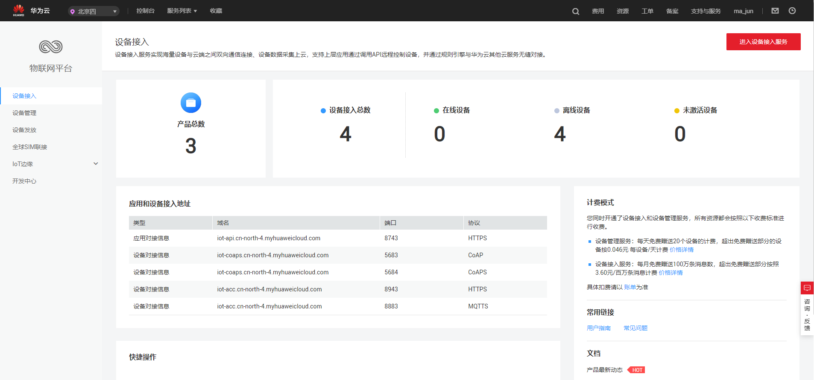

#### 5.2.1.2 进入开发界面并建立项目
选择开发者中心并进入
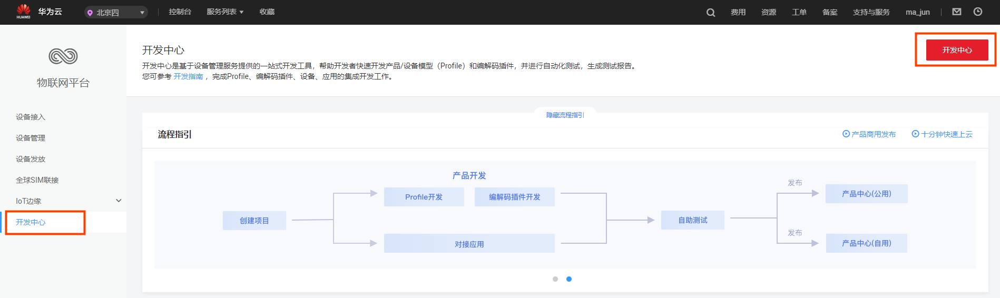

点击我的项目创建自己的相关项目

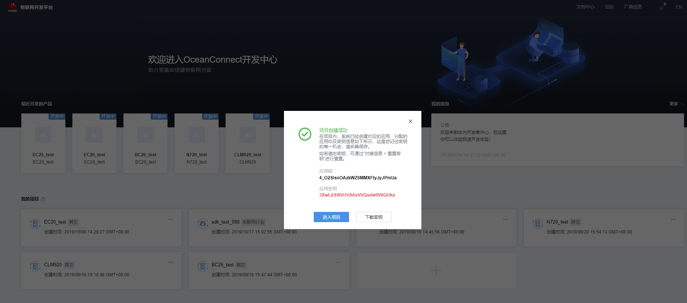

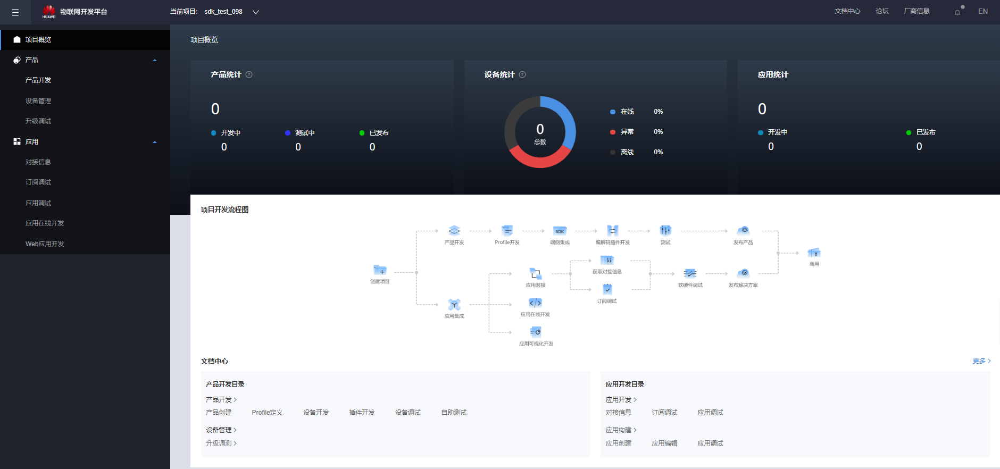

####5.2.1.3 创建产品模型
选择产品开发新建产品，即可跳转到产品模型定义界面。

既可以根据已有的产品进行创建，也可以自定义创建产品，本次采用自定义模式创建。

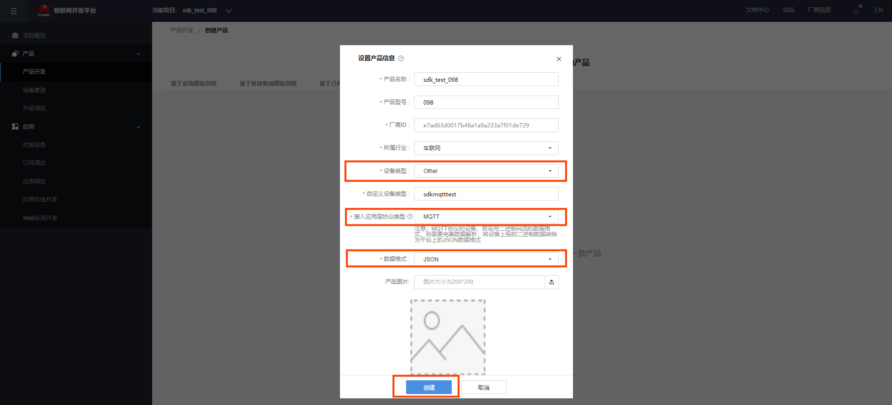

这一步补全了产品的各类信息，下一步是定义产品的属性功能。选择新建服务，开始添加产品的相关特性。
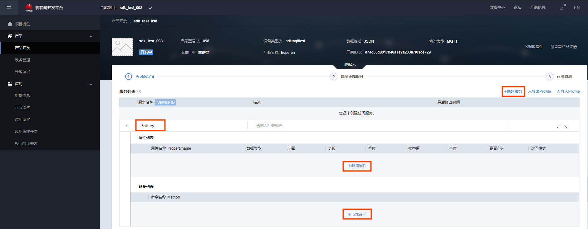

给产品定义属性，用于接收设备向平台上报的数据。属性名为batteryLevel，，类型定义为int型，最大值设置为100，访问模式RWE全部勾选，完成后点击确定。

给产品增加命令，用于平台向设备发送命令。命令名称为cmd，设置下发命令属性名称：ioswitch，属性类型定义为int型，最大值99。通过上报和下发，构成了演示的上行和下行通道。
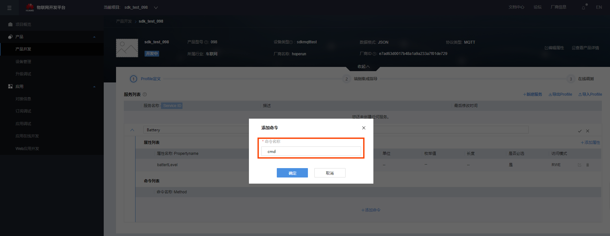

添加完后如图所示：
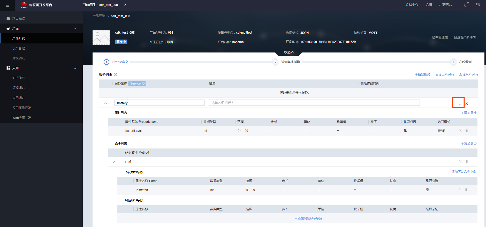

#### 5.2.1.4 创建设备
创建了产品模型之后，需要根据模型创建具体的设备。点击设备管理->添加真实设备，即可进入添加设备界面。

进入界面之后，选择刚才建立的产品模型，进行设备创建。
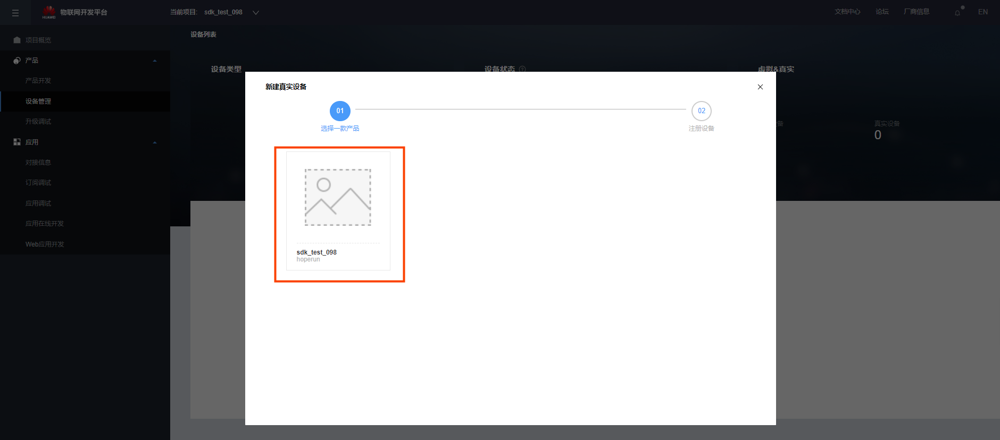
设备标识是识别该设备的唯一标识符，要求唯一，此处为示范，用户使用时以实际命名为准。

此处注意，确认之后自动生成产品设备ID及密钥，请妥善保存，后面设备使用的MQTT三元组（clientID user passwd）都是用这几个信息生成的。
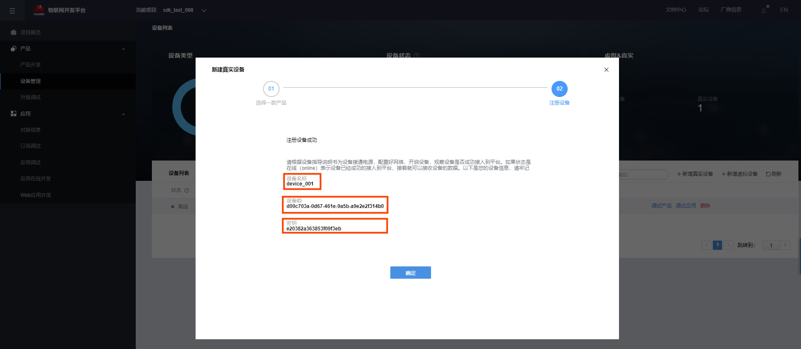
创建完毕之后，即可在设备管理中看到刚刚创建的设备，此时设备状态为离线。

点击对接信息，可以查看设备的对接信息，可以查看设备接入平台对应的IP和端口。
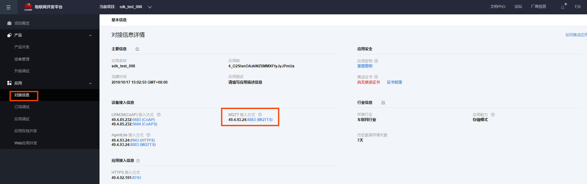
到此为止，平台端环境准备完毕。

#### 5.2.1.5 开发环境
目前Agent Tiny SDK使用的GCC+Makefile的模式，同时所有源代码都开放，理论上是可以适应大部分的开发者环境。Agent Tiny SDK的helloworld运行在Linux下，此处GCC及Makefile安装暂不详细介绍。
#### 5.2.1.6 示例代码分析
以LINUX为例，客户在拿到代码之后，需要准备能运行LINUX的PC，该PC可以连接上网。其默认参与编译的demo为oc_tls_mqtt_demo.c。

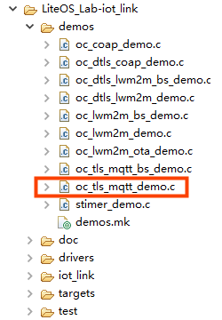

代码中此处，将定义的noteid、deviceid、passwd、ip及port替换成上面获取到的数值。

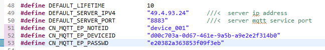

接着，在设备连接的时候，可以使用deviceid，也可以使用noteid，但是需要注意的是auth_type保持一致。

同时注意到，REPORT以及命令的数据，和产品模型中定义的名称务必保持一致。

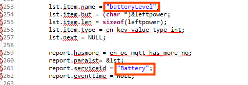

#### 5.2.1.7 编译运行
Agent Tiny SDK下面已经适配了一些工程（target目录下），当准备好GCC编译环境以及Make工具之后，即可进入到对应的工程下进行编译，如果有错误，烦请告知。

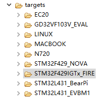

此次选择Linux运行，还需进入target/LINUX/GCC/config.mk中进行修改适配。

保存推出，并make编译生成Huawei_LiteOS.elf。

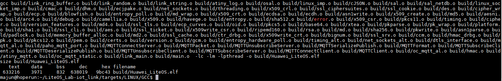
运行Huawei_LiteOS.elf。

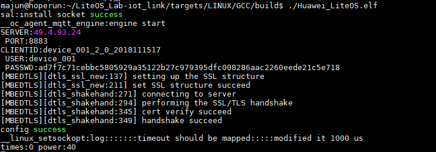
#### 5.2.1.8 平台演示及调试
登录开发者中心，可以看到设备已经上线。

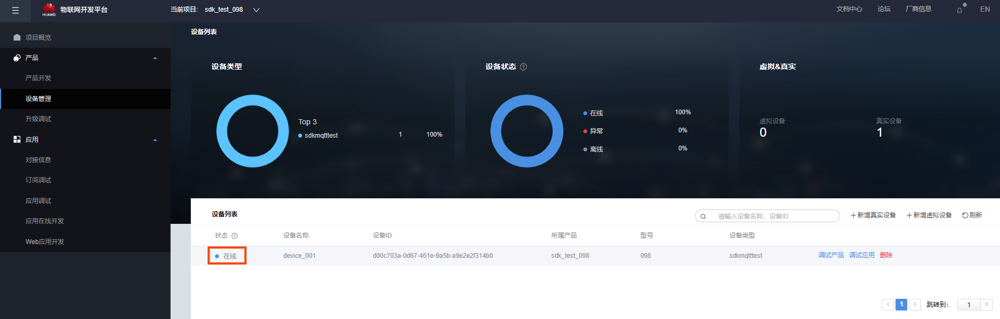

点击调试产品，可以进入平台的设备调试界面。

可以看到所创建的设备已经上报的数据，同时在输入栏中填入数据，即可看到下发的数据。

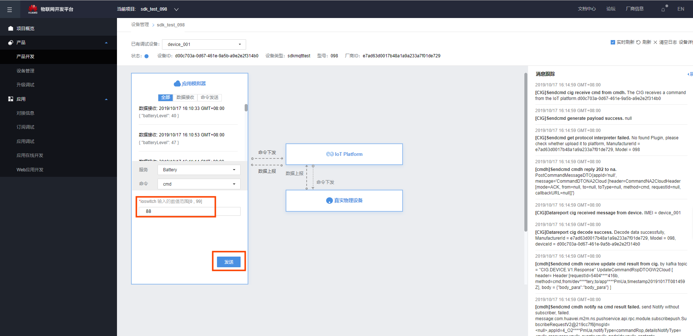

在终端程序可以看到接收到的数据和源码是匹配的。

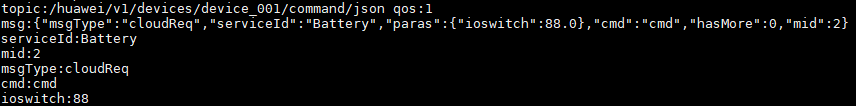
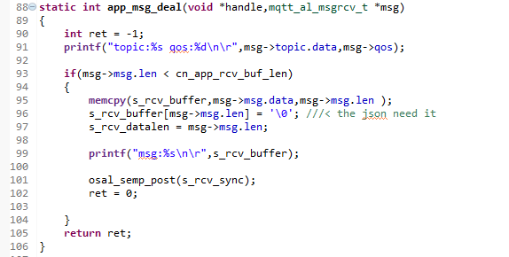

至此，IoT SDK的实例演示完成。

### 5.2.2 基于MQTT协议的模组连接云平台
在Agent Tiny SDK已集成的模组中，以EC20模组为例（代码目录：…\targets\EC20\Src），介绍基于MQTT协议的SDK集成及连接华为云。

EC20模组将云端服务抽象层OC MQTT封装成4个开放的API：连接、数据上报、命令接收和断开连接，与MQTT协议的4个AT指令一一对应。模组连接云平台的API为：

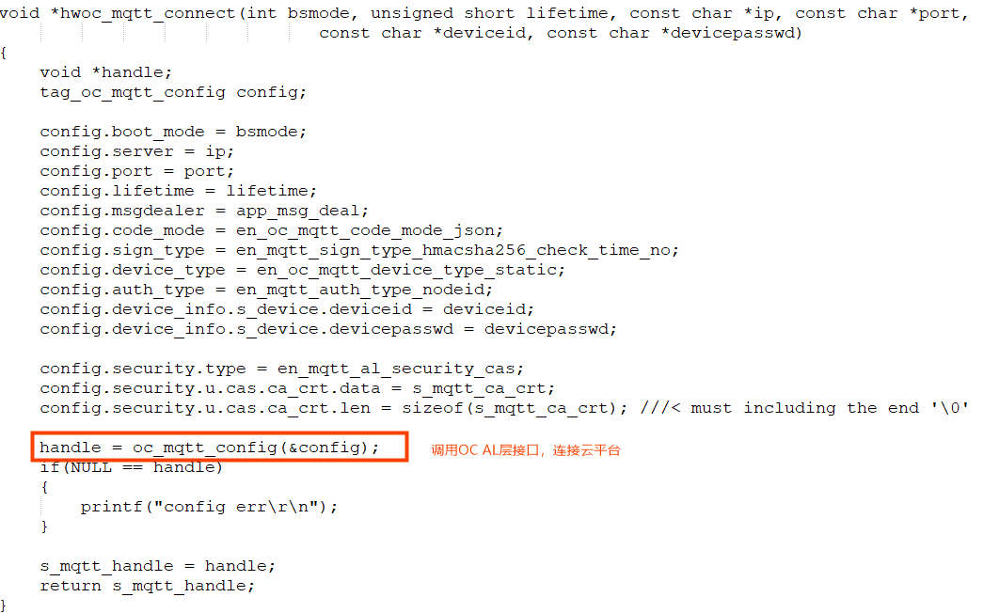
各输入参数解释分别对应连接AT指令中的”bs”，” lifetime”，” host”，” port”，“noteid”，“passwd”。如果连接成功，则会返回非空句柄并赋值给全局量，用作发送或者关闭使用。
模组上报数据至IoT云平台的API为：

各输入参数qos、payload、len分别对应数据上报AT指令中的”qos”，“ascii payload”和”len”。
模组关闭连接IoT云平台的API为：
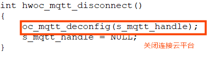

 EC20模组demo运行逻辑（…/targets/EC20/Src/at_demo.c）如下，先进行OS、MQTT协议等组件的初始化工作，再与云平台建立连接。

注意：hwoc_mqtt_connect()内的参数需要根据实际情况修改，IP、端口号在对接信息中查看，设备标识、产品密钥在设备管理中查看。

### 5.2.3 基于LWM2M协议的模组连接云平台
STM32L431_BearPi开发板使用Boudica150的NB-IoT芯片进行通信，以STM32L431_BearPi开发板直连demo为例，最终将调用到oc_lwm2m_demo_main()，目录：…\targets\STM32L431_BearPi\Demos\oc_streetlight_template\oc_streetlight_template.c。

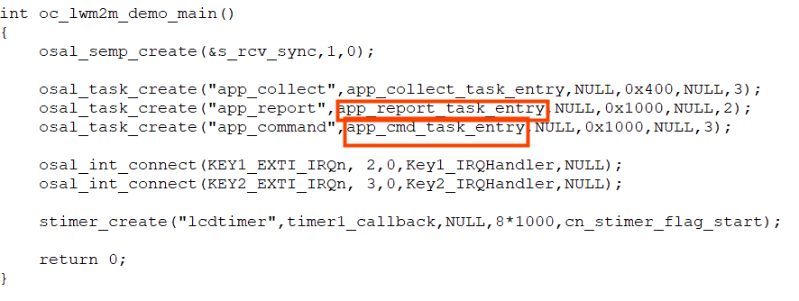

其中app_report_task_entry()为向云平台上报数据任务，app_cmd_task_entry()为处理云平台下发命令任务。

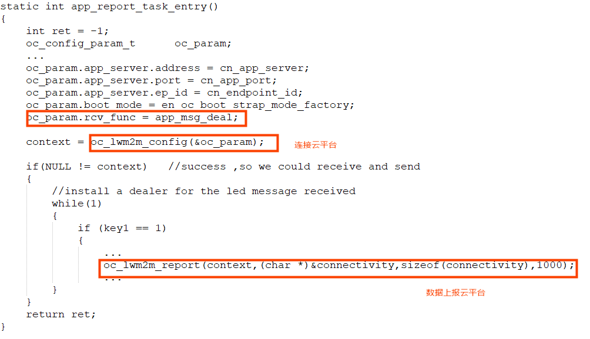

其中app_msg_deal()将云端下发的数据填入全局数组s_rcv_buffer。

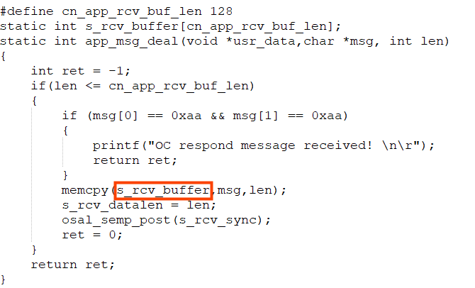

## 5.3 针对设备厂商
作为开发并销售最终设备的厂商，您需要进行设备集成开发，以便让设备具备接入物联网平台的能力。根据设备自身硬件的特点不同，您需要根据自身行业特征及业务情况选择合适的接入方案。
### 5.3.1 配有模组的设备
#### 5.3.1.1 MCU+模组模式
此模式下，设备包含MCU（Micro Controller Unit）和通信模组，其中MCU集成Agent Tiny SDK及产品逻辑，模组作为通信模块，提供通信网络。

如果采用的模组已获得华为认证，则该模组内已集成Agent Tiny SDK，并遵循华为AT指令规划，设备只需通过串口发送AT指令驱动模组，即可完成对接云平台。AT指令规划参考：AT指令规划。
如果采用的模组没有被华为认证，您需要在MCU侧集成Agent Tiny SDK及产品逻辑，模组仅作为通信模块收发数据。MCU侧集成Agent Tiny SDK流程参考模组厂商集成流程。

#### 5.3.1.2 openCPU模式
此模式下，设备只包含通信模组，不需要外加MCU，直接基于模组做二次集成开发，您需要在模组内集成Agent Tiny SDK和产品逻辑，Agent Tiny SDK集成流程参考模组厂商集成流程。

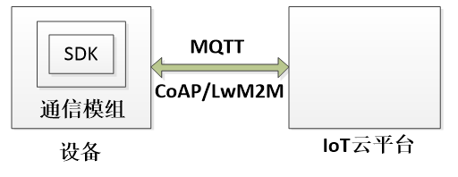

#### 5.3.2 没有模组的设备
如果设备没有模组，你可以通过以太网接入华为云，同样需要在MCU侧集成Agent Tiny SDK，可参考模组厂商集成流程。

