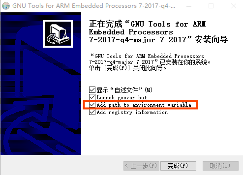
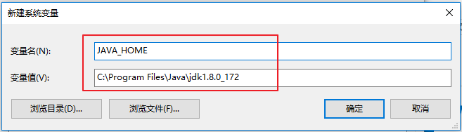
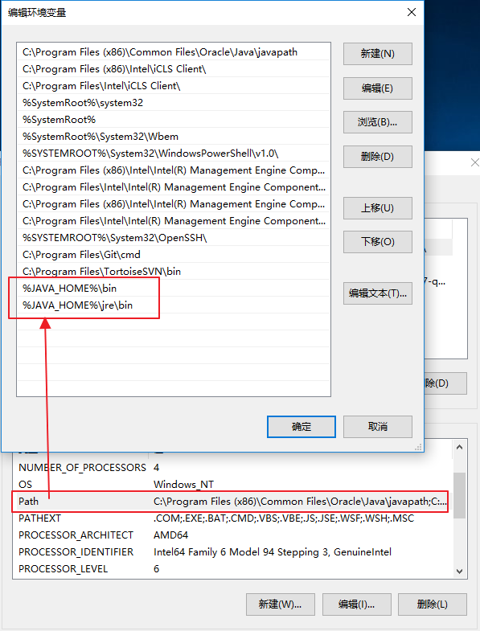
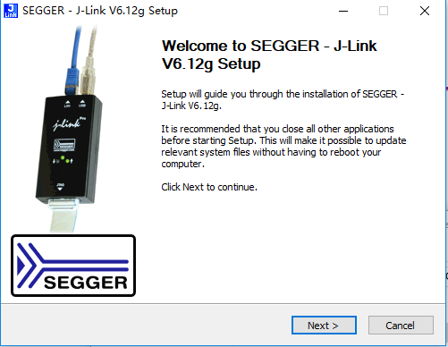
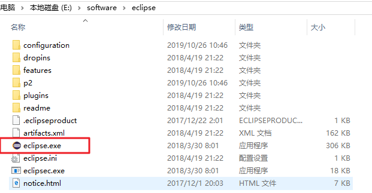
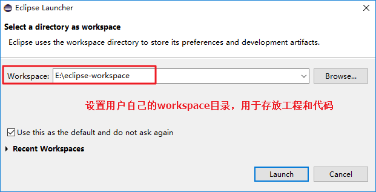
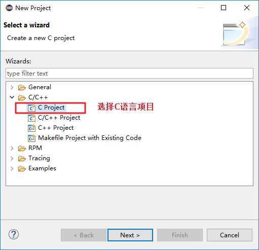
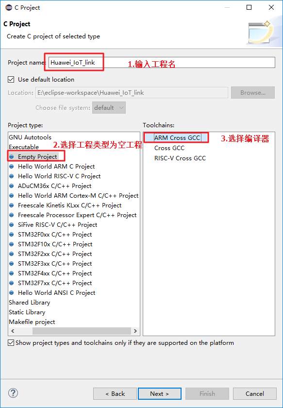
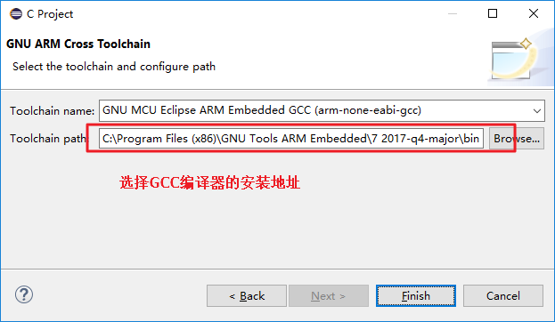
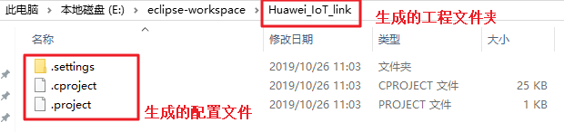

# Huawei Agent Tiny SDK
# Eclipse GCC 开发环境搭建指南

## 目 录
<!-- TOC -->

- [1 环境准备](#1)
    - [1.1 安装GCC 编译器](#1.1)
    - [1.2 安装jdk 运行环境](#1.2)
    - [1.3 安装make 工具](#1.3)
    - [1.4 安装Jlink 驱动程序](#1.4)
    - [1.5 安装Eclipse IDE 环境](#1.5)
- [2 工程创建与配置](#2)
    - [2.1 创建工程](#2.1)
    - [2.2 导入IoT link工程源码](#2.2)
    - [2.3 配置工程](#2.3)
    - [2.4 编译工程](#2.4)
- [3 调试与下载](#3)
    - [3.1 配置Debugging Configura Main](#3.1)
    - [3.2 配置Debugging Configura Debugger](#3.2)
    - [3.2 配置Debugging configuration Common](#3.3)
<!-- /TOC -->

<h1 id="1">1.环境准备</h1>

<h2 id="1.1">1.1 安装GCC 编译器</h2>
首先，安装ARM GCC 编译器” GNU Arm Embedded Toolchain”

下载地址: https://developer.arm.com/open-source/gnu-toolchain/gnu-rm/downloads
 
本文下载的是gcc-arm-none-eabi-7-2017-q4-major-win32-sha2.exe
注意：安装完毕后需要将“Add path to environment variable”勾选上。
 

<h2 id="1.2">1.2 安装jdk 运行环境</h2>
JDK 下载地址:
http://www.oracle.com/technetwork/java/javase/downloads/jdk8-downloads-2133151.html

安装后配置好jdk 的环境变量。

**新增环境变量JAVA_HOME**

 

**修改环境变量Path**

 

<h2 id="1.3">1.3 安装make 工具</h2>

Make 工具用于build 工程，使用Makefile 编译工程。

版本：gnu-mcu-eclipse-build-tools-2.9-20170629-1013-win64-setup.exe

下载地址:
https://github.com/gnu-mcu-eclipse/windows-build-tools/releases/tag/v2.9-20170629-1013

<h2 id="1.4">1.4 安装Jlink 驱动程序</h2>

版本：JLink_Windows_V632e.exe

下载地址：https://www.segger.com/downloads/jlink/#J-LinkSoftwareAndDocumentationPack

<h2 id="1.5">1.5 安装Eclipse IDE 环境</h2>
下载地址: https://github.com/gnu-mcu-eclipse/org.eclipse.epp.packages/releases

将下载的eclipse 直接解压即可完成安装。解压后，打开eclipse 目录，如图双击eclipse.exe 即可运行IDE 环境,建议将该应用程序创建桌面快捷方式，这样方便后续直接在桌面打开IDE环境。

 
设置用户的workspace目录，用于存放工程和代码。

<h1 id="2">2.工程创建与配置</h1>

<h2 id="2.1">2.1 创建工程</h2>
在Eclipse 菜单中选择‘File’->’New’->‘project’，开始创建工程，如下图所示：

 

输入工程名，并选择工程类型为空目录，选择ARM Cross GCC编译器。

 
 
选择GCC编译器的安装地址

 
 
创建完成后会在刚才设置的workspace 目录下生成一个你设置好的工程名的文件夹，本文设置的Huawei\_IoT\_link，故在workspace 目录下生成Huawei\_IoT\_link文件夹，下面会同步生成工程配置文件，如下图所示：

 

 
<h2 id="2.2">2.2 导入IoT link工程源码</h2>
工程源码要求是自带Makefile，可以在gcc 环境下编译的。没有的话需要开发者自己编写工程（包括源码、Makefile、ld 文件等）。本文以IoT link github 开源项目为例，介绍如何导入源码，并在Eclipse 下完成编译。
我们先下载IoT link 源码，（网页直接下载zip 包或者git clone）

下载地址：
https://github.com/LiteOS/LiteOS

我们将下载的整个工程复制到刚才生成的Huawei\_IoT\_link 工程文件夹下，如图所示：

  
复制完成后，回到Eclipse 软件界面，在Project Explorer 中的工程文件夹上点击右键，在弹出来的快捷菜单中点击refresh 按钮刷新工程（或者选中Huawei\_IoT\_link 工程文件夹直接按F5 刷新），可以看到刚才复制进去的源码已经显示在工程窗口，如下图所示：

<h2 id="2.3">2.3 配置工程</h2>

在工程文件夹Huawei\_IoT\_link 上右键，在弹出的快捷菜单中选中Properties。
在弹出的属性窗口左侧选择C/C++ build 选项，按下图所示进行配置：

取消勾选，并且build目录设置为Makefile文件位置，LiteOS的makefile统一存放target目录下。

继续在属性界面选择MCU 选项，并且展开子选项，在子选择中设置ARM ToolchainsPath 和Build Tools Path。
设置GCC编译器的安装路径，根据实际安装路径修改。

 

设置make工具的安装路径，根据自己的安装路径修改。

 

<h2 id="2.4">2.4 编译工程</h2>

完成工程属性配置后，在Huawei\_IoT\_link工程文件夹上右键，在弹出的快捷菜单中点击build project 即可调用工程的Makefile 文件对工程进行编译，相当于支持make 命令；同样的，点击Clean Project 可以清除编译生成的文件（bin 文件和.o 等），相当于make clean命令。
编译成功后，可以看到生成了build 文件夹，有对应的.o 和生成的镜像

 

<h1 id="3">3.调试与下载</h1>
Huawei\_IoT\_link工程文件夹上右键， 在弹出的菜单中选择Debug As ，选择DebugConfiguration，如下图所示：

 

在弹出的Configuration 界面选择“SEGGER J-link Debugging”，右击并选择“New”，新建一个
Debugging Configuration；如下图所示：

 

<h2 id="3.1">3.1 配置Debugging Configura Main</h2>
打开eclipse，点击需要debug 的工程，选择“Debug Configuration...”;
在弹出的Configuration 界面中选择“ SEGGER J-link Debugging ” 下面需要设置的Configuration；

 

1.	点击右边的“Main”选项卡，按照图中进行设置；
<h2 id="3.2">3.2 配置Debugging Configura Debugger</h2>
切换到“Debugger”选项卡，按下图进行配置：

 

<h2 id="3.3">3.3 配置Debugging configuration Common</h2>
切换到“Common”选项卡，按图中所示进行设置：
 
 

设置完成后，点击debug，连接好Jlink 和硬件开发板，就可以在线调试了。

