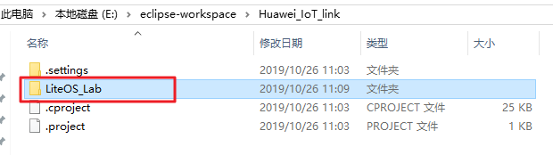
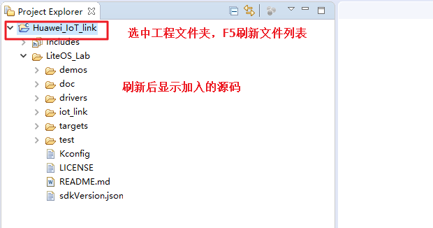
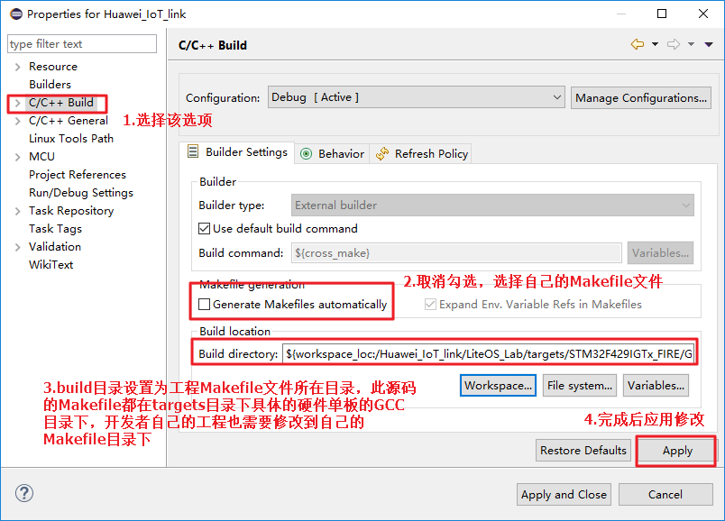
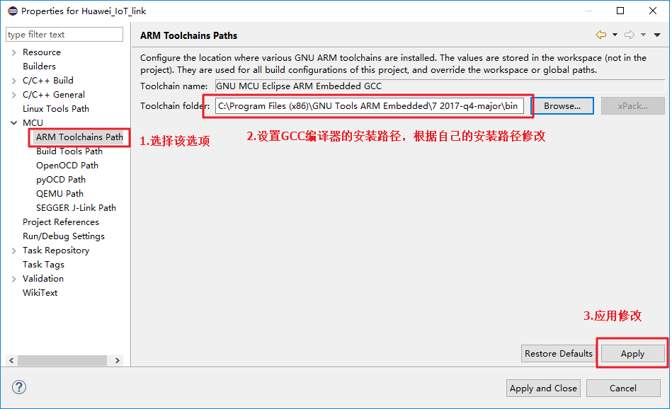
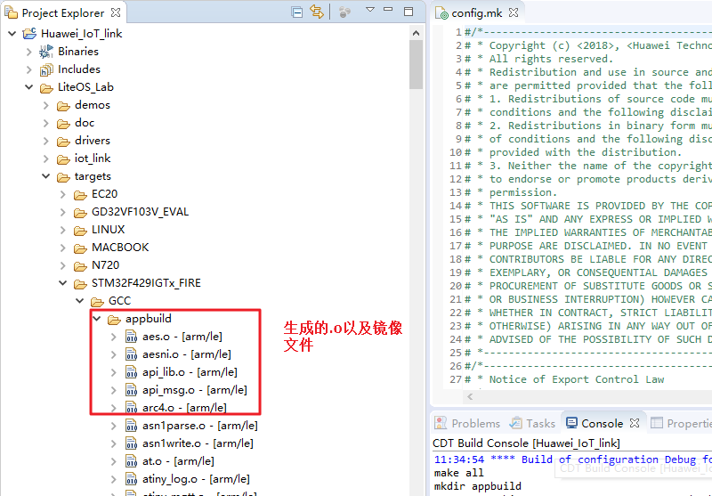
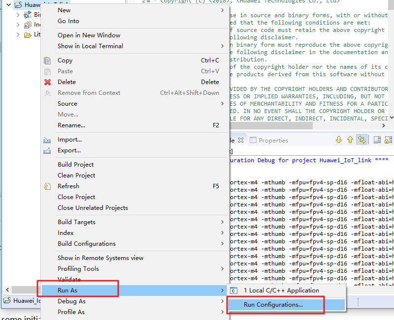
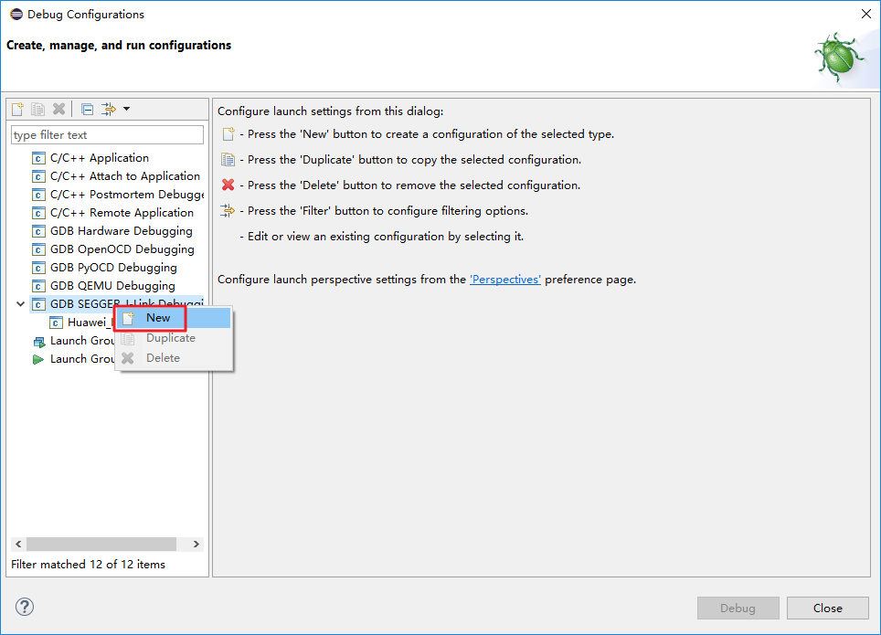
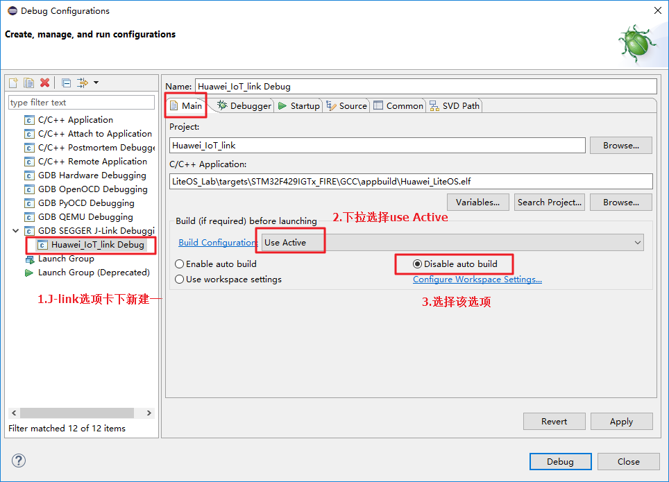
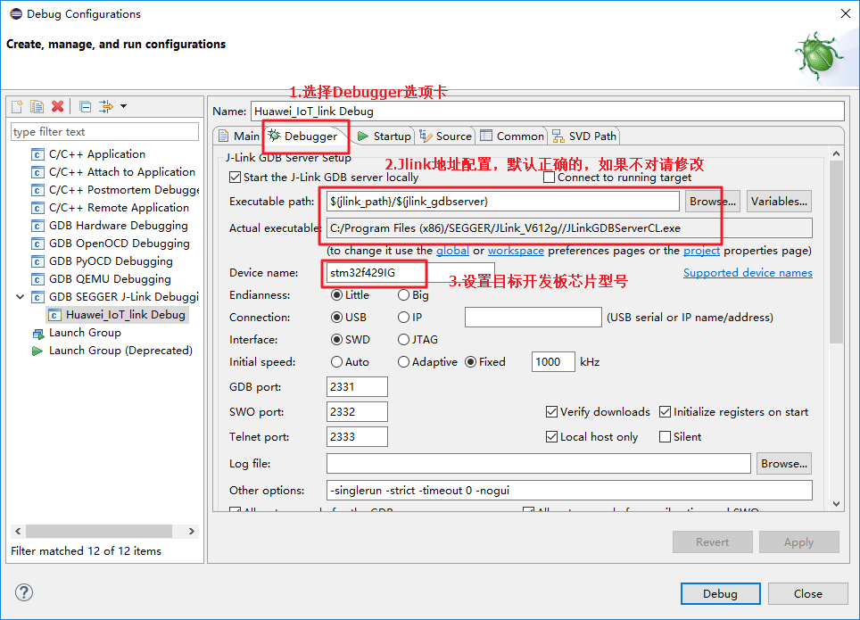
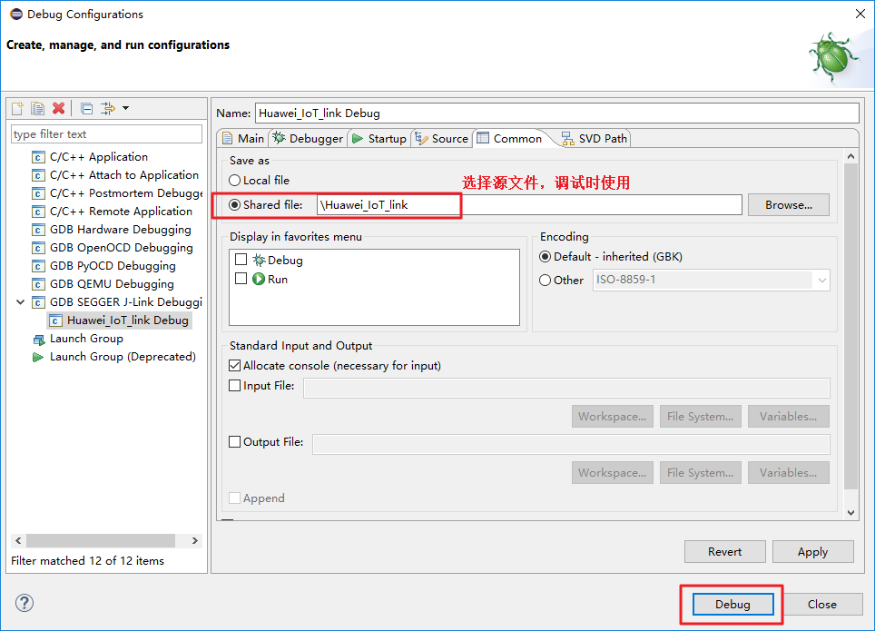

# Huawei Agent Tiny SDK
# SW4STM32(AC6) GCC 开发环境搭建指南

## 目 录
<!-- TOC -->

- [1 环境准备](#1)
    - [1.1 安装jdk 运行环境](#1.1)
    - [1.2 安装Jlink 驱动程序](#1.2)
    - [1.3 安装AC6](#1.3)
- [2 获取LiteOS最新源码](#2) 
- [3 工程创建与配置](#3)
    - [3.1 创建工程](#3.1)
    - [3.2 导入IoT link工程源码](#3.2)
    - [3.3 配置工程](#3.3)
    - [3.4 配置调试器](#3.4)
<!-- /TOC -->
<h1 id="1">1.环境准备</h1>
参考网址：https://github.com/LiteOS/LiteOS_Lab/blob/iot_link/doc/Huawei_IoT_Link_SDK_IDE_Eclipse_Guide.md

<h2 id="1.1">1.1 安装jdk 运行环境</h2>
安装好jdk后，新建环境变量，并添加path路径。安装后可以windows+R，输入cmd进入terminal，输入java -version，查看版本以及安装成功与否。

下载地址： http://www.oracle.com/technetwork/java/javase/downloads/jdk8-downloads-2133151.html

<h2 id="1.2">1.2 安装Jlink 驱动程序</h2>
版本：JLink_Windows_V632e.exe  下载地址如下：https://www.segger.com/downloads/jlink/#JLinkSoftwareAndDocumentationPack 

<h2 id="1.3">1.3 安装AC6环境</h2>
下载最新版本v2.9，即可直接官网https://www.ac6-tools.com/downloads/SW4STM32/install_sw4stm32_win_32bits-v2.9.exe

<h1 id="2">2.获取LiteOS源码</h1>
下载LiteOS最新源码，并解压到指定文件夹。下载地址：https://github.com/LiteOS/LiteOS_Lab

<h1 id="2">3.工程创建与配置</h1>

<h2 id="3.1">3.1 创建工程</h2>
在软件中，点击File → New → C project，开始创建工程，具体如下所示。

_GCC/chen_AC6_01.png)

自定义工程名字，选择创建空项目，以及Ac6 STM32 MCU GCC。

_GCC/chen_AC6_02.png)

之后选择开发板，选择对应系列到具体开发板，具体如下所示，可以看到同一系列的一类开发板。

_GCC/chen_AC6_03.png)

如果找不到，点击新建开发板。本文使用的是STM32F429IGTx的野火开发板，采用创建新开发板方式。

_GCC/chen_AC6_04.png)

根据需要创建开发板并选择具体的调试接口，本文使用JTAG，注意所选ＭＣＵ名称。

_GCC/chen_AC6_05.png)

接下来点击ＯＫ，可以看见开发板的详细信息，包括系列名，以及RAM、ROM的起始地址以及具体大小。

_GCC/chen_AC6_06.png)

由于后续将采用LiteOS的启动文件，此处勾选不生成启动文件。

_GCC/chen_AC6_07.png)

生成的具体目录情况如下所示，除了Includes文件夹，其余文件夹为空。

_GCC/chen_AC6_08.png)

<h2 id="3.2">3.2 导入IoT link工程源码</h2>
之后在Src文件夹下，新建目录，具体操作如下所示，命名为Huawei_Lab_IoT_link，同时将其链接到LiteOS源码所在文件夹。

_GCC/chen_AC6_09.png)

_GCC/chen_AC6_10.png)

_GCC/chen_AC6_11.png)

点击Finish完成创建，打开Src下的Huawei_Lab_IoT_link文件夹，可以看见完整的工程目录。

_GCC/chen_AC6_12.png)

<h2 id="3.3">3.3 配置工程</h2>
之后点击工具栏中Project下的Properties选项，选择C/C++ build，选择修改Build directory，将makefile generation 勾选取消，选择已有的Makefile文件，选择为LiteOS源码下D:\LiteOS\Huawei_IoT_link\LiteOS_Lab-iot_link\targets\STM32F429IGTx_FIRE\GCC文件（上述为我的链接文件路径）。

_GCC/chen_AC6_13.png)

_GCC/chen_AC6_14.png)

_GCC/chen_AC6_15.png)

之后clean项目，然后选择工具栏的project选项中的build project当出现如下所示的内容时，说明make成功。
_GCC/chen_AC6_16.png)

_GCC/chen_AC6_17.png)

<h2 id="3.4">3.4 配置调试器</h2>

_GCC/chen_AC6_18.png)

_GCC/chen_AC6_19.png)

_GCC/chen_AC6_20.png)

_GCC/chen_AC6_21.png)

接下来新建Jlink调试器，，进行如图所示的配置，选择debugger选项中添加设备名称为stm32f429IG。勾选Disable auto build。

_GCC/chen_AC6_22.png)

_GCC/chen_AC6_23.png)

之后在Executable中选择，所安装的GNU目录项的bin文件夹下的arm-none-eabi-gdb.exe文件。之后在Common选项下选择Shared file。之后编译项目即可。
_GCC/chen_AC6_24.png)

 
<h2 id="3.2">3.2 导入IoT link工程源码</h2>
工程源码要求是自带Makefile，可以在gcc 环境下编译的。没有的话需要开发者自己编写工程（包括源码、Makefile、ld 文件等）。本文以IoT link github 开源项目为例，介绍如何导入源码，并在Eclipse 下完成编译。
我们先下载IoT link 源码，（网页直接下载zip 包或者git clone）

下载地址：
https://github.com/LiteOS/LiteOS

我们将下载的整个工程复制到刚才生成的Huawei\_IoT\_link 工程文件夹下，如图所示：

  
复制完成后，回到Eclipse 软件界面，在Project Explorer 中的工程文件夹上点击右键，在弹出来的快捷菜单中点击refresh 按钮刷新工程（或者选中Huawei\_IoT\_link 工程文件夹直接按F5 刷新），可以看到刚才复制进去的源码已经显示在工程窗口，如下图所示：

<h2 id="2.3">2.3 配置工程</h2>

在工程文件夹Huawei\_IoT\_link 上右键，在弹出的快捷菜单中选中Properties。
在弹出的属性窗口左侧选择C/C++ build 选项，按下图所示进行配置：

取消勾选，并且build目录设置为Makefile文件位置，LiteOS的makefile统一存放target目录下。

继续在属性界面选择MCU 选项，并且展开子选项，在子选择中设置ARM ToolchainsPath 和Build Tools Path。
设置GCC编译器的安装路径，根据实际安装路径修改。

 

设置make工具的安装路径，根据自己的安装路径修改。

 

<h2 id="2.4">2.4 编译工程</h2>

完成工程属性配置后，在Huawei\_IoT\_link工程文件夹上右键，在弹出的快捷菜单中点击build project 即可调用工程的Makefile 文件对工程进行编译，相当于支持make 命令；同样的，点击Clean Project 可以清除编译生成的文件（bin 文件和.o 等），相当于make clean命令。
编译成功后，可以看到生成了build 文件夹，有对应的.o 和生成的镜像

 

<h1 id="3">3.调试与下载</h1>
Huawei\_IoT\_link工程文件夹上右键， 在弹出的菜单中选择Debug As ，选择DebugConfiguration，如下图所示：

 

在弹出的Configuration 界面选择“SEGGER J-link Debugging”，右击并选择“New”，新建一个
Debugging Configuration；如下图所示：

 

<h2 id="3.1">3.1 配置Debugging Configura Main</h2>
打开eclipse，点击需要debug 的工程，选择“Debug Configuration...”;
在弹出的Configuration 界面中选择“ SEGGER J-link Debugging ” 下面需要设置的Configuration；

 

1.	点击右边的“Main”选项卡，按照图中进行设置；
<h2 id="3.2">3.2 配置Debugging Configura Debugger</h2>
切换到“Debugger”选项卡，按下图进行配置：

 

<h2 id="3.3">3.3 配置Debugging configuration Common</h2>
切换到“Common”选项卡，按图中所示进行设置：
 
 

设置完成后，点击debug，连接好Jlink 和硬件开发板，就可以在线调试了。

