# 端云互通组件-LwM2M开发指南

<h1 id="00">目 录</h1>
<!-- TOC -->

- [1、 前言](#1)
- [2、 Agent Tiny SDK简介](#2)
- [3、 接入物联网平台流程](#3)
- [4、 直连接入实例](#4)
	-  [4.1、 平台侧开发](#4.1)
	-  [4.2、 设备侧开发](#4.2)
	-  [4.3、 调测](#4.3)
- [5、 经BS接入实例](#5)
	-  [5.1、 平台侧开发](#5.1)
	-  [5.2、 设备侧开发](#5.2)
	-  [5.3、 调测](#5.3)

<!-- /TOC -->

<h1 id="1">1 前言 </h1>
本文档主要通过实例讲述如何通过Agent Tiny SDK的端云互通组件，使用LwM2M协议快速接入华为物联网平台。

<h1 id="2">2、Agent Tiny SDK简介 </h1>
Agent Tiny是部署在具备广域网能力、对功耗/存储/计算资源有苛刻限制的终端设备上的轻量级互联互通中间件，您只需调用API接口，便可实现设备快速接入到物联网平台以及数据上报和命令接收等功能。
Agent Tiny SDK是Huawei Agent Tiny软件开发工具包（Software Development Kit），通过Agent Tiny SDK端云互通组件，简单快速地实现与华为物联网平台安全可靠连接，可以大大减少开发周期，
快速构建IoT产品。端云互通组件可以采用MQTT、CoAP和LwM2W协议接入物联网平台。

**IOT SDK 架构图**


<h1 id="3">3、接入物联网平台流程 </h1>
本章分别从 IoT 平台侧和端侧阐述通过端云互通组件接入物联网平台的开发流程，旨在帮助开发者在 IoT 设备上集成端云互通组件，进行IoT应用开发和调测。
端云互通组件接入华为 OceanConnect IoT 云平台默认采用的是以太网方式（即以太网口驱动+LwIP网络协议栈+LwM2M协议+Agent Tiny SDK 对接云平台），
同时也支持WIFI、GSM、NB-IoT等无线方式。OceanConnect 即华为IoT联接管理平台（IoT Connection Management Platform）是面向运营商和企业/行业领域的统一开放云平台，
支持SIM和非SIM场景的各种联接和联接管理。通过开放的APIs，向上集成各种行业应用，向下接入各种传感器、终端和网关，帮助运营商和企业/行业客户实现多种行业终端的快速接入，
多种行业应用的快速集成。华为IoT联接管理平台提供安全可控的全联接管理，使能行业革新，构建IoT生态（本章中提到的IoT平台指OceanConnect）。

平台对接信息
<a name="table50324903"></a>
<table>
<thead align="left">
<tr id="row25383117">
<th class="cellrowborder" valign="top" width="50%" id="mcps1.2.4.1.1"><p id="p42766607"><a name="p42766607"></a><a name="p42766607"></a>平台环境</p>
</th>
<th class="cellrowborder" valign="top" width="50%" id="mcps1.2.4.1.2"><p id="p41543166"><a name="p41543166"></a><a name="p41543166"></a>获取途径</p>
</th>
</tr>
</thead>
<tbody>
</tr>
<tr id="ZH-CN_TOPIC_0187644975__row6123185510311">
<td class="cellrowborder" valign="top" width="23.5%" headers="mcps1.3.1.3.1.3.1.1 "><p id="ZH-CN_TOPIC_0187644975__p9546314173216">开发中心（测试环境）</p> </td> 
<td class="cellrowborder" valign="top" width="76.5%" headers="mcps1.3.1.3.1.3.1.2 "><p id="ZH-CN_TOPIC_0187644975__p165451514203216">进入
<a href="https://console.huaweicloud.com/iotOceanLink/?region=cn-north-4#/iotdmp/spMenu/developCenter" target="_blank" rel="noopener noreferrer">开发中心</a>
的具体项目中，在<span class="menucascade" id="ZH-CN_TOPIC_0187644975__menucascade46887184244">“<span class="uicontrol" id="ZH-CN_TOPIC_0187644975__uicontrol1768871812247">应用</span>
 &gt; <span class="uicontrol" id="ZH-CN_TOPIC_0187644975__uicontrol8749162652420">对接信息</span>”</span>页面查看
<span class="wintitle" id="ZH-CN_TOPIC_0187644975__wintitle1717816578243">“设备接入信息”</span>和<span class="wintitle" id="ZH-CN_TOPIC_0187644975__wintitle1549261152518">“应用接入信息”</span>。</p>
 <p id="ZH-CN_TOPIC_0187644975__p396214214311"><span>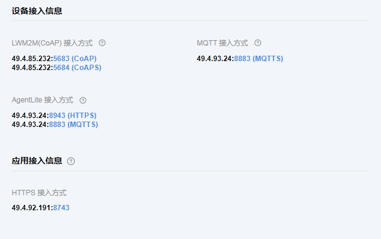</span></p> </td> 
</tr> 
<tr id="ZH-CN_TOPIC_0187644975__row6123755113111">
<td class="cellrowborder" valign="top" width="23.5%" headers="mcps1.3.1.3.1.3.1.1 "><p id="ZH-CN_TOPIC_0187644975__p1954231433214">设备管理服务（商用环境）</p> </td> 
<td class="cellrowborder" valign="top" width="76.5%" headers="mcps1.3.1.3.1.3.1.2 "><p id="ZH-CN_TOPIC_0187644975__p354121418324">在物联网平台的
<a href="https://console.huaweicloud.com/iotOceanLink/?region=cn-north-4#/iotdmp/spMenu/deviceAccess" target="_blank" rel="noopener noreferrer">管理控制台</a>
，选择设备接入，在<span class="wintitle" id="ZH-CN_TOPIC_0187644975__wintitle1149533404613">“设备和应用接入信息”</span>下可查看设备和应用的接入地址信息。
</p> <p id="ZH-CN_TOPIC_0187644975__p16401113174917"><span>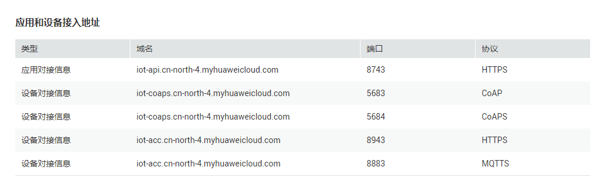</span></p> </td> 
</tr> 
</tbody>
</table>

设备接入云端可分为直连接入和BS引导接入，如下示意图

**图 1**  直连接入物联网平台示意图
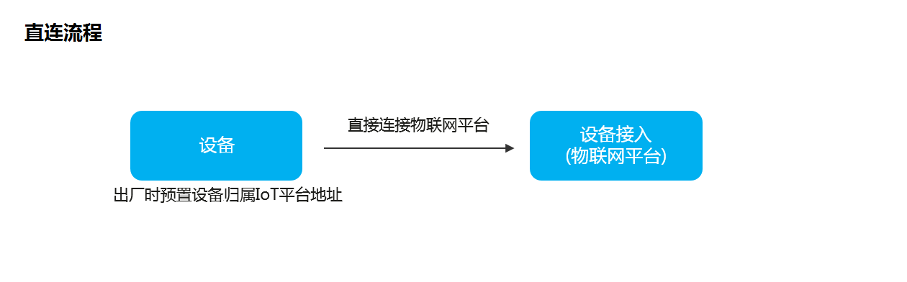

**图 2**  BS引导接入物联网平台示意图
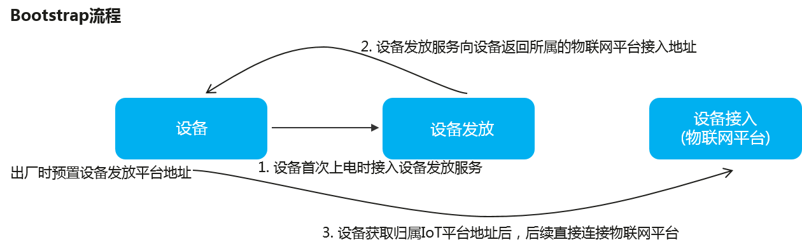


<h1 id="4">4、直连接入实例</h1>
<h3 id="（参考）端云互通组件以太网接入实例.md">（参考）端云互通组件以太网接入实例</h3>
-   硬件设备：野火STM32F429开发板，调试下载器（J-Link、ST-Link等）、网线、路由器、USB转串口线。

> **说明：**   
>本章以野火STM32F429IG开发板为例进行介绍，板子的详细资料可以从[http://www.firebbs.cn/forum.php](http://www.firebbs.cn/forum.php)下载。  

1.  STM32F429IG\_FIRE开发板外设


**图 1** 直连模式下整体配置流程
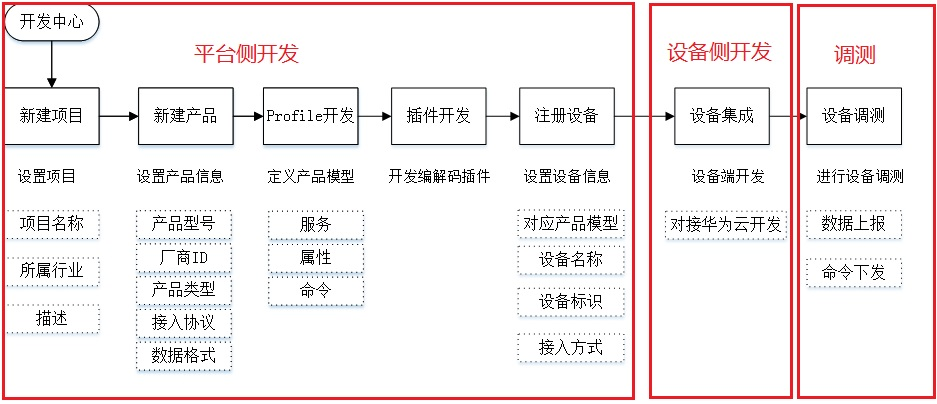


<h4 id="4.1">4.1、平台侧开发 </h4>
使用“开发中心”完成平台侧的开发。开发中心是基于设备管理服务提供的一站式开发工具，帮助开发者快速开发产品（Profile、编解码插件）
，并进行自动化测试，生成测试报告。平台侧配置流程包括：新建项目，新建产品、开发profile，开发编解码插件，注册设备。

<h5 id="环境准备.md">1、环境准备</h5>
在开发之前，需要提前获取如下信息：

-   [开发中心](https://iot-dev.huaweicloud.com)的访问账号/密码，需要向OceanConnect IoT平台申请

<h5 id="新建项目.md">2、新建项目</h5>

项目是物联网平台提供物联网应用和设备的调测空间，可以根据场景的不同创建不同项目空间分别调测。
在基于开发中心进行物联网开发时，需要根据行业属性创建独立的项目，并在该项目空间内开发物联网产品和应用。

创建项目时，物联网平台会分配一个应用ID（接口调用时参数名为appId）作为项目的唯一标识。若应用服务器需要调用物联网平台的API接口进行一些业务处理，
请求中必须携带appId以接入对应的项目空间，鉴权接口携带在Body中，其他接口的appId的值一般携带在Header中。
创建项目后，可以在项目中查看应用服务器和设备的接入地址和端口信息，方便您快速对接应用服务器和设备。
项目被删除后项目内的所有资源，如设备、产品、订阅数据在平台中的信息会被全部删除，并且不可恢复，请谨慎操作。

1.  登录物联网平台。
2.  进入开发者中心，在我的项目中点击“新建项目”。

**图 1**  新建项目<a name="fig43098736"></a>  
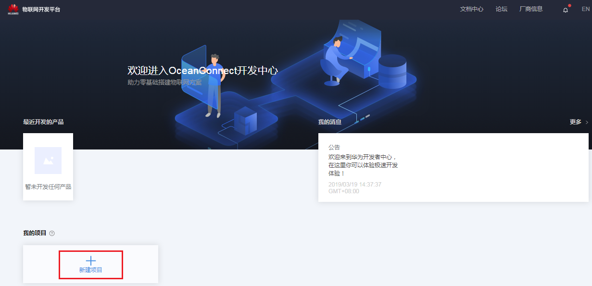

3.  在新弹出窗口中，配置项目信息，点击“确定”。

配置示例如下图，点击“确定”后，IoT平台会返回项目对应的应用ID和应用密钥，请妥善保存应用密钥，以便于应用服务器接入平台时使用。如果遗忘密钥，需要通过“对接信息”-\>"重置密钥”进行重置。

**图 2**  配置项目<a name="fig46257266"></a>  


> **说明：**   
>如上配置仅为参考举例，具体配置请以现网需求为准。  

**图 3**  项目创建成功<a name="fig24567157"></a>  


<h5 id="产品开发.md">3、产品开发</h5>
在物联网平台中，某一类具有相同能力或特征的设备的合集被称为一款产品。产品包含Profile（产品模型）、编解码插件、测试报告等资源，
其中产品信息被记录在Profile中。产品的Profile文件用来描述设备类型和设备服务能力。它定义了设备具备的服务能力，每个服务具备的属性、
命令以及命令参数。

在一个项目里最多可以创建20个产品。产品开发最重要的是开发Profile，Profile用于描述设备具备的能力和特性。定义Profile，即在物联网平台构建一款设备的抽象模型，使平台理解该款设备支持的服务、属性、命令等信息。如果设备上报的数据是二进制码流格式，就需要开发对应的编解码插件，用于物联网平台完成二进制格式和JSON格式的转换。
删除产品后，该产品下的Profile、编解码插件等资源将被清空，请谨慎操作。

<p id="ZH-CN_TOPIC_0187472760__p09938311724">开发中心上提供了多种创建产品的方法。</p> 
<div class="tablenoborder">

<table cellpadding="4" cellspacing="0" summary="" id="ZH-CN_TOPIC_0187472760__table1236984215818" frame="border" border="1" rules="all">
<thead align="left">
<tr id="ZH-CN_TOPIC_0187472760__row6369194285816">
<th class="cellrowborder" valign="top" width="26.240000000000002%" id="mcps1.3.3.3.1.3.1.1"><p id="ZH-CN_TOPIC_0187472760__p1369542155813">方式</p> </th> 
<th class="cellrowborder" valign="top" width="73.76%" id="mcps1.3.3.3.1.3.1.2"><p id="ZH-CN_TOPIC_0187472760__p1036974210583">描述</p> </th> 
</tr> 
</thead> 
<tbody>
<tr id="ZH-CN_TOPIC_0187472760__row10369164215812">
<td class="cellrowborder" valign="top" width="26.240000000000002%" headers="mcps1.3.3.3.1.3.1.1 "><p id="ZH-CN_TOPIC_0187472760__p23698423584">基于系统模板创建</p> </td> 
<td class="cellrowborder" valign="top" width="73.76%" headers="mcps1.3.3.3.1.3.1.2 "><p id="ZH-CN_TOPIC_0187472760__p1536911428588">开发中心提供了多种产品模板，这些模板涉及多个领域。模板中提供了已经编辑好的Profile文件，可以根据自己的需要对Profile中的字段进行修改和增删。有的模板同时提供了开发好的编解码插件，用户也可以进行修改。</p> </td> 
</tr> 
<tr id="ZH-CN_TOPIC_0187472760__row16233102720599">
<td class="cellrowborder" valign="top" width="26.240000000000002%" headers="mcps1.3.3.3.1.3.1.1 "><p id="ZH-CN_TOPIC_0187472760__p223412718599">基于快速集成模板创建</p> </td> 
<td class="cellrowborder" valign="top" width="73.76%" headers="mcps1.3.3.3.1.3.1.2 "><p id="ZH-CN_TOPIC_0187472760__p10234112710594">类似系统模板，快速集成也是提供了一些产品模板，这些模板适用快速体验平台的集成对接，或者适用一些研讨或培训的学习场合。</p> </td> 
</tr> 
<tr id="ZH-CN_TOPIC_0187472760__row13557204715912">
<td class="cellrowborder" valign="top" width="26.240000000000002%" headers="mcps1.3.3.3.1.3.1.1 "><p id="ZH-CN_TOPIC_0187472760__p8557747195914">基于已有产品创建</p> </td> 
<td class="cellrowborder" valign="top" width="73.76%" headers="mcps1.3.3.3.1.3.1.2 "><p id="ZH-CN_TOPIC_0187472760__p4557247185913">可以基于已有的产品进行克隆，创建新的产品。</p> </td> 
</tr> 
<tr id="ZH-CN_TOPIC_0187472760__row15692321003">
<td class="cellrowborder" valign="top" width="26.240000000000002%" headers="mcps1.3.3.3.1.3.1.1 "><p id="ZH-CN_TOPIC_0187472760__p26921621107">本地导入产品创建</p> </td> 
<td class="cellrowborder" valign="top" width="73.76%" headers="mcps1.3.3.3.1.3.1.2 "><p id="ZH-CN_TOPIC_0187472760__p11692112606">将本地写好的Profile文件上传到平台，开发一个新产品。</p> </td> 
</tr> 
<tr id="ZH-CN_TOPIC_0187472760__row20324151916017">
<td class="cellrowborder" valign="top" width="26.240000000000002%" headers="mcps1.3.3.3.1.3.1.1 "><p id="ZH-CN_TOPIC_0187472760__p10324119307">自定义产品</p> </td> 
<td class="cellrowborder" valign="top" width="73.76%" headers="mcps1.3.3.3.1.3.1.2 "><p id="ZH-CN_TOPIC_0187472760__p137262531418">可以从零自定义构建产品。</p> </td> 
</tr> 
</tbody> 
</table> 

1.  登录IoT平台的开发者中心。
2.  进入项目-\>选择“产品开发”-\>点击“新建产品”-\>选择“自定义产品”-\>点击“自定义产品”。

IoT平台提供了产品的Profile模板库，开发者可以根据自己需要，选择合适的模板直接使用。如果在模板库中未找到需要的Profile，再自己定义，示例如下。

**图 1**  创建Profile文件<a name="fig8361117"></a>  
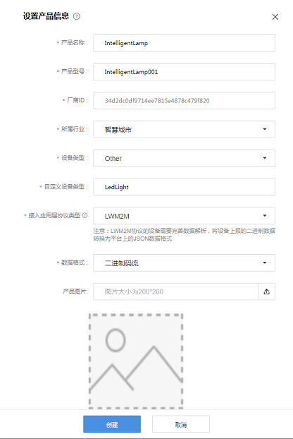

> **说明：**   
>如上配置仅为参考举例，具体配置请以现网需求为准。  

3.  选择新创建的产品，点击“新建服务”，配置设备的服务能力。

可参考“产品开发”-\>“添加”-\>“基于系统模板创建”中的产品进行配置。例如新建一个名为LightControl的服务，包含一种属性light（灯亮LUX数）和一种命令（设置灯亮on或者灭off）

**图 2**  新建LightControl服务<a name="fig41058489"></a>  
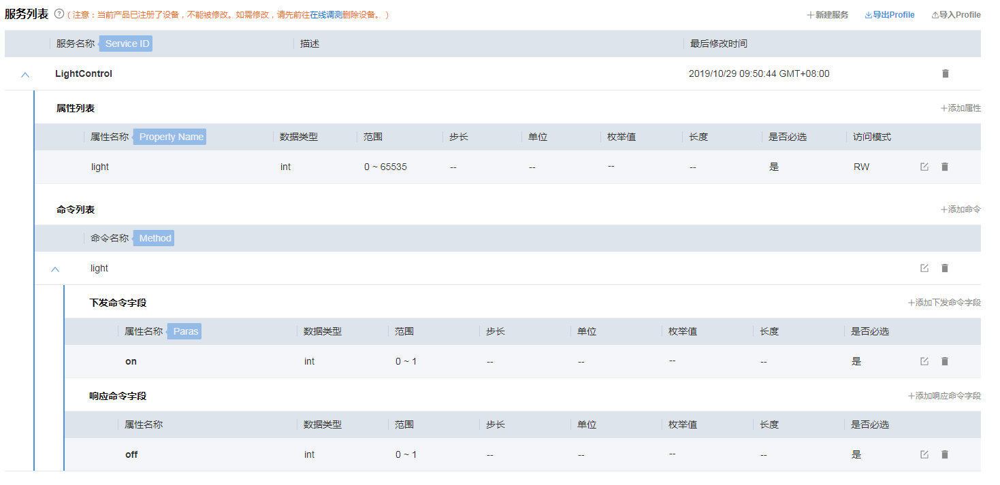

4.  （可选）开发者中心提供了Profile文件的导出功能。

选择“产品开发”-\>选择已创建的产品-\>点击右上角“导出Profile”，可以对线上开发的Profile文件进行导出。

**图 3**  导出Profile文件<a name="fig53067697"></a>  
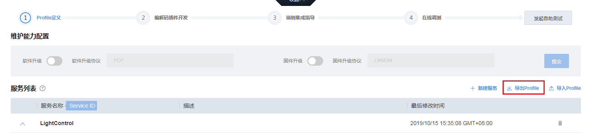


<h5 id="开发编解码插件.md">4、开发编解码插件</h5>
IoT设备和IoT平台之间采用LwM2M协议通信，LwM2M消息的数据为应用层数据，应用层数据的格式由设备厂商自行定义。由于IoT设备对省电要求较高，所以应用层数据一般采用二进制格式。IoT平台在对应用层数据进行协议解析时，会转换成统一的json格式，以方便应用服务器使用。要实现二进制消息与json格式消息的转换，IoT平台需要使用编解码插件。

1.  选择“产品开发”-\>选择已创建的产品-\>选择“编解码插件开发”，选择“在线编解码插件编辑器”。

**图 1**  创建插件<a name="fig27941066"></a>  
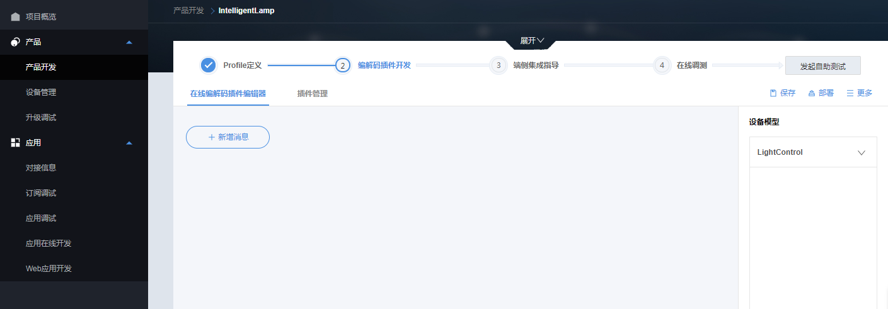

2.  点击“新增消息”，配置二进制码流和Profile属性/命令/命令响应的映射关系。

**图 2**  开发插件（新增数据上报消息）<a name="fig51445036"></a>  
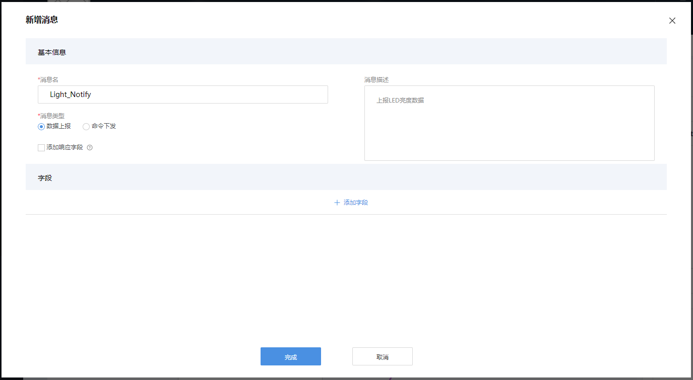

**图 3**  开发插件（添加字段）<a name="fig40408868"></a>  
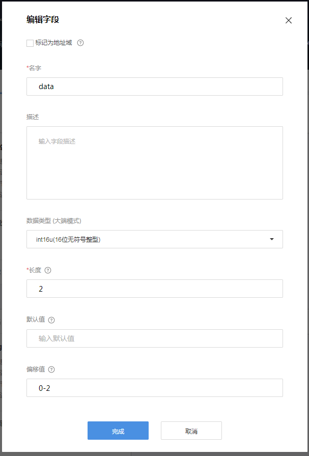

**图 4**  开发插件（添加字段）<a name="fig40408868"></a>  
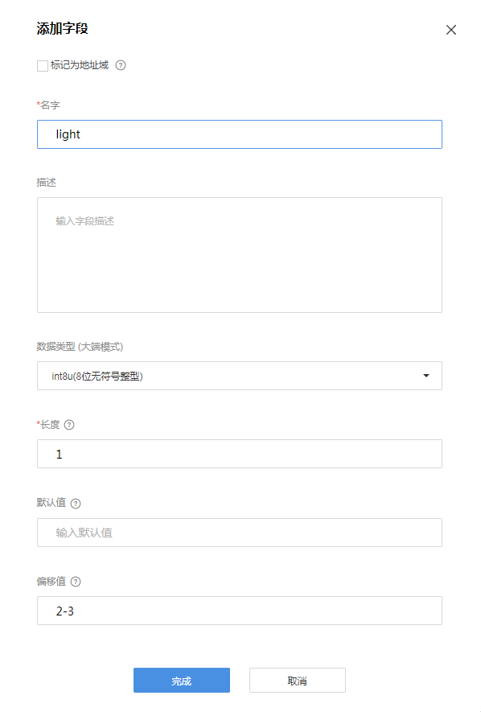

**图 5**  开发插件（新建命令下发消息）<a name="fig4851111218718"></a>  
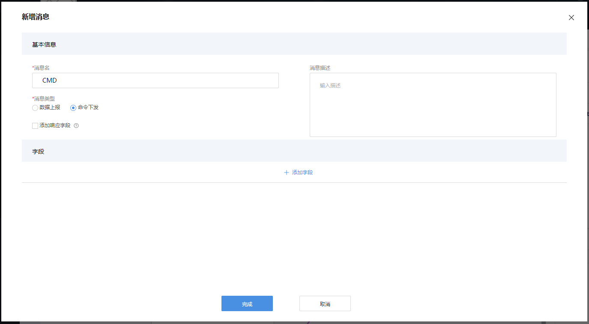

**图 6**  开发插件（添加字段）<a name="fig12652191383"></a>  
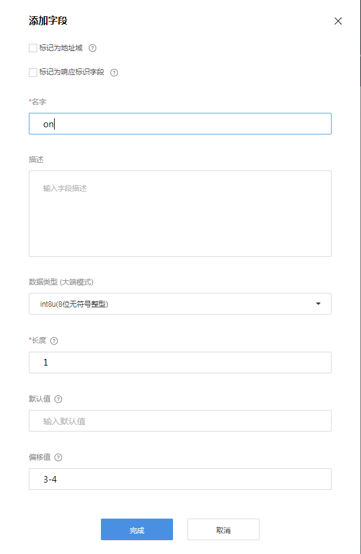

编解码插件的开发，即定义：

-   Profile文件定义的属性/响应在设备上报的二进制码流中的位置，以便于平台对设备上报数据和命令响应进行解码。
-   Profile文件定义的命令在平台下发的二进制码流中的位置，以便于平台对下发命令进行编码。

**图 7**  二进制码流和Profile文件的映射关系<a name="fig18601706"></a>  
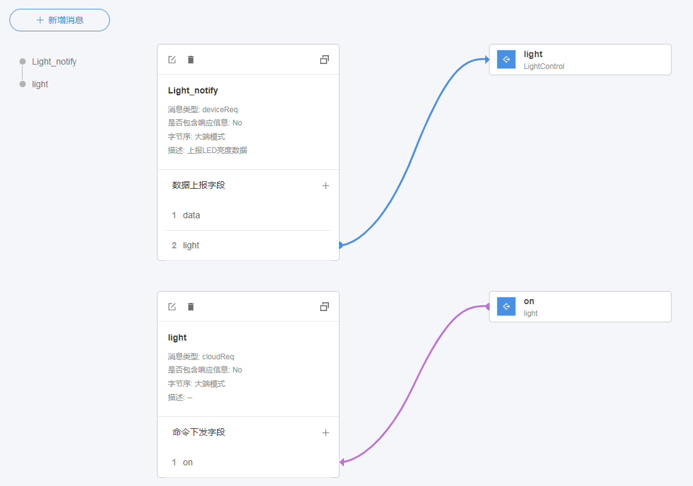

3.  点击右上角“部署”。

点击部署后，需要先“保存”插件，之后才开始部署。部署需要等待时间小于60s。

**图 8**  保存插件<a name="fig36784309"></a>  
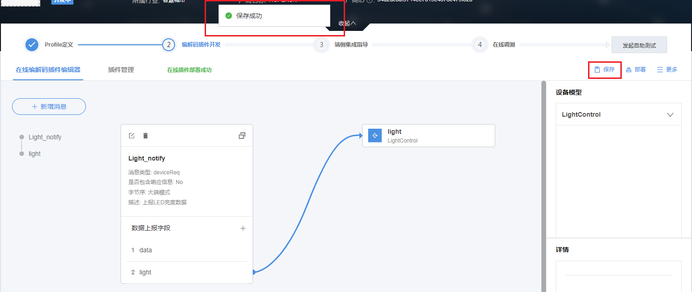

**图 9**  部署插件<a name="fig18380518"></a>  
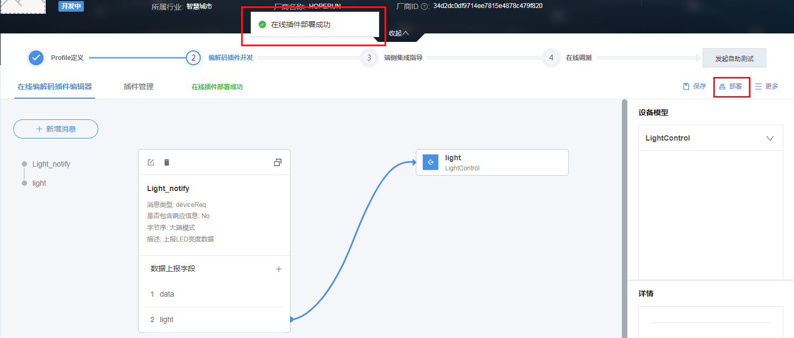

4.  （可选）开发者中心提供了编解码插件的下载功能。

选择“产品开发”-\>选择已创建的产品-\>选择“编解码插件开发”，选择“插件管理”，点击“下载”可以对线上开发的编解码插件进行导出。


<h5 id="添加设备.md">5、添加真实&虚拟设备</h5>
平台通过接入真实&虚拟的设备，对开发的应用和设备进行在线调测，并进行统一的设备管理。

1.  选择“设备管理”-\>“添加真实设备”-\>选择已创建的产品-\>输入设备名称和设备标识，并根据业务需求选择是否加密设备。最后点击“确定”。

**图 1**  注册设备信息<a name="fig094004411363"></a>  
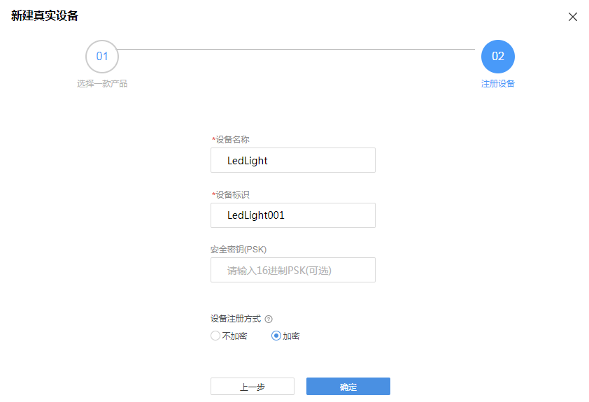

添加设备后，IoT平台会返回设备ID和PSK码，请妥善保存。新添加的设备状态为“离线”。

**图 2**  注册设备<a name="fig86891238143614"></a>  
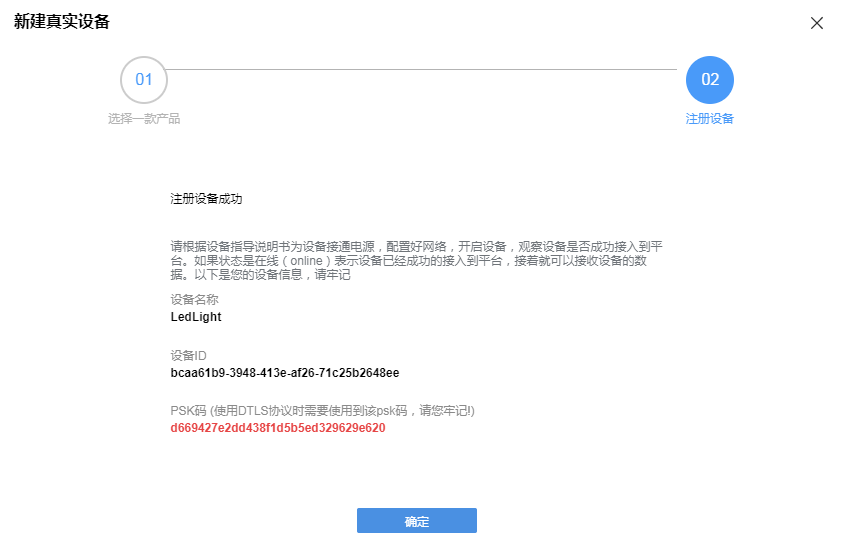

<h4 id="4.2">4.2、设备侧开发 </h4>
直连模式设备侧开发包括: 配置Demo中对接云端设备的信息、编译、运行SDK、数据上报任务与命令下发调测。

<h5 id="">设备侧开发环境准备</h5>
在开发之前，需要提前进行如下操作：

- 搭建好Eclipse开发工具软件环境
- 使用网线将野火STM32F429开发板接入互联网并使用USB转串口线连接开发版的串口1与PC
- 获取端云互通组件代码：[https://github.com/LiteOS/LiteOS/tree/iot_link](https://github.com/LiteOS/LiteOS/tree/iot_link)


<h5 id="接入IoT平台.md">配置Demo中对接云端设备的信息</h5>
1.  开发板的网口通过网线连接到路由器。
2.  设置本地IP。

在net\_driver.c中修改device接入的局域网的IP地址值。目前demo程序采用的是静态IP地址的方式，如果需要使用DHCP方式，请在main.c中顶部头文件包含之后定义USE\_DHCP宏即可。

	```
	
		void net_init(void) 
		{
		 	/* IP addresses initialization */ 
	     	IP_ADDRESS[0] = 192; 
	     	IP_ADDRESS[1] = 168; 
	     	IP_ADDRESS[2] = 0; 
	     	IP_ADDRESS[3] = 115; 
	     	NETMASK_ADDRESS[0] = 255; 
	     	NETMASK_ADDRESS[1] = 255; 
	     	NETMASK_ADDRESS[2] = 255; 
	     	NETMASK_ADDRESS[3] = 0; 
	     	GATEWAY_ADDRESS[0] = 192; 
	     	GATEWAY_ADDRESS[1] = 168; 
	     	GATEWAY_ADDRESS[2] = 0; 
	     	GATEWAY_ADDRESS[3] = 1;
	 	}
	```

接口net\_init\(\)的作用是完成lwip协议相关的初始化。net\_driver.c位于 LiteOS-iot\_link/targets/STM32F429IGTx\_FIRE/Src。

3.  网口的mac地址修改。

在eth.c中将MAC\_ADDR0\~MAC\_ADDR5修改成真实的mac地址值保证不重复。

	```
	
		static int8_t eth_init(struct netif* netif) 
		{
			HAL_StatusTypeDef hal_eth_init_status; 
	    	MACAddr[0] = 0x00; 
	    	MACAddr[1] = 0x80; 
	    	MACAddr[2] = 0xE1; 
	    	MACAddr[3] = 0x00; 
	    	MACAddr[4] = 0x00; 
	    	MACAddr[5] = 0x00;
		} 
	```

> **注意：**   
>接口eth\_init\(\)将在步骤2中的net\_init\(\)中被调用。eth.c位于 LiteOS-iot\_link/targets/STM32F429IGTx\_FIRE/Src。  

4.  设置云平台IP以及设备EP Name和PSK。

根据开发中心添加的设备信息修改oc\_dtls\_lwm2m\_demo.c中参数。

	```
		
		/**/#define cn_endpoint_id        "LedLight001"
		/**/#define cn_app_server         "49.4.85.232"
		/**/#define cn_app_port           "5684"
		const unsigned char  s_app_psk[]={0xd6,0x69,0x42,0x7e,0x2d,0xd4,0x38,0xf1,0xd5,0xb5,0xed,0x32,0x96,0x29,0xe6,0x20};
	
	```

oc\_dtls\_lwm2m\_demo.c位于 LiteOS-iot\_link/demos。

5.  编译并运行程序。

config.mk位于 LiteOS-iot\_link/targets/STM32F429IGTx_FIRE/GCC。

修改配置参数为：

	```
	
		CONFIG_OS_TYPE := "liteos"
	
		CONFIG_ARCH_CPU_TYPE := "armv7-m"


		CONFIG_SHELL_ENABLE := y
	
		CONFIG_STIMER_ENABLE := y
	
		CONFIG_DRIVER_ENABLE := y
	
		CONFIG_AT_ENABLE     := y
	
		CONFIG_CJSON_ENABLE := y
	
		CONFIG_TCPIP_ENABLE := y
		CONFIG_TCPIP_TYPE := "lwip_socket"
	
		CONFIG_DTLS_ENABLE   := y
		CONFIG_DTLS_TYPE     := "mbedtls_psk"
	
		CONFIG_MQTT_ENABLE   := n
		CONFIG_MQTT_TYPE     := "lite_mqtt"
	
		CONFIG_LWM2M_ENABLE   := y
		CONFIG_LWM2M_TYPE     := "wakaama_lwm2m"
	
		CONFIG_COAP_ENABLE   := n
		CONFIG_COAP_TYPE     := "lite_coap"
	
		CONFIG_OC_COAP_ENABLE := n
		CONFIG_OC_COAP_TYPE   := "soft"
	
		CONFIG_OC_MQTT_ENABLE := n
		CONFIG_OC_MQTT_TYPE   := "soft"
	
		CONFIG_OC_LWM2M_ENABLE := y
		CONFIG_OC_LWM2M_TYPE   := "soft"
	
		CONFIG_OTA_ENABLE      := n
		CONFIG_PCP_ENABLE      := n


		CONFIG_DEMO_ENABLE := y
	
		CONFIG_DEMO_TYPE   := "oc_dtls_lwm2m_demo"
	
		include $(TOP_DIR)/iot_link/iot.mk
	```


6.  查看设备状态。

登录IoT平台开发者中心，选择“设备管理”，在设备列表中查看对应设备的状态。如果状态为“在线”，则表示设备已经成功接入IoT平台。

**图 1**  查看设备状态<a name="fig17343259182620"></a>  
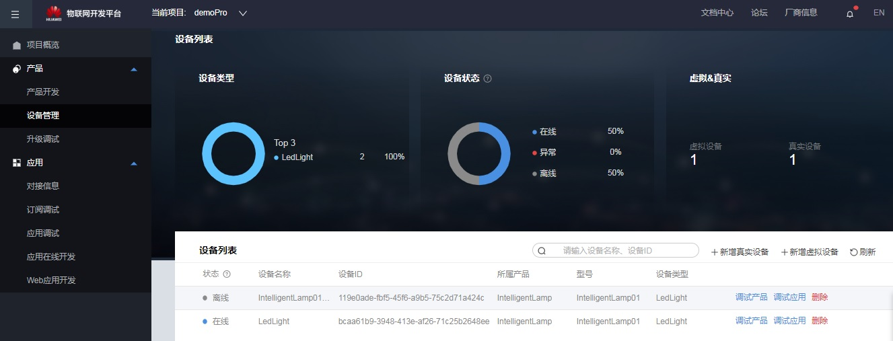

<h4 id="4.3">4.3、调测 </h4>
<h5 id="数据上报.md">数据上报</h5>
对于开发者来说，只需在app\_report\_task\_entry\(\)中将其传递给数据上报结构体 light 即可。具体调测过程如下：

1.  设备侧执行app\_report\_task\_entry函数，使设备上报数据。

oc\_lwm2m\_demo\_dtls.c中的函数app\_report\_task\_entry如下：

	```
	
		static int app_report_task_entry()
		{
			int ret = -1;
			int lux = 0;
			oc_config_param_t      oc_param;
			app_light_intensity_t  light;
	
			memset(&oc_param,0,sizeof(oc_param));
	
			oc_param.app_server.address = cn_app_server;
			oc_param.app_server.port = cn_app_port;
			oc_param.app_server.ep_id = cn_endpoint_id;
			oc_param.app_server.psk = (char *)s_app_psk;
			oc_param.app_server.psk_len = sizeof(s_app_psk);
			oc_param.app_server.psk_id = cn_endpoint_id;
	
			oc_param.boot_mode = en_oc_boot_strap_mode_factory;
			oc_param.rcv_func = app_msg_deal;
	
			ret = oc_lwm2m_config(&oc_param);
	
			if(ret == 0)   //success ,so we could receive and send
			{
	    		//install a dealer for the led message received
	    		while(1) //--TODO ,you could add your own code here
	    		{
	        		lux++;
	        		lux= lux%10000;
	        		light.msgid = cn_app_light;
	        		light.intensity = htons(lux);
	        		oc_lwm2m_report((char *)&light,sizeof(light),1000); ///< report the light message
	        		osal_task_sleep(10*1000);
	    		}
			}
	
			return ret;
		}
	```

oc\_dtls\_lwm2m\_demo.c位于 LiteOS-iot\_link/demos。

2.  查看设备状态

登录IoT平台的开发者中心，在“设备管理”界面的设备列表中，选择上报数据的设备，查看“历史数据”，验证设备数据上报的情况。

**图 1**  使用端云互通组件的IoT设备数据上报业务流程<a name="fig179076307444"></a>  


**图 2**  查看数据上报结果<a name="fig13872847174416"></a>  
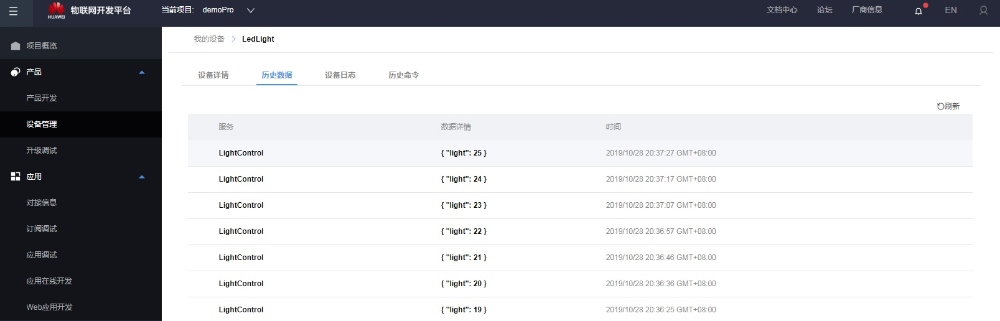


<h5 id="命令下发.md">命令下发</h5>
命令下发一般分为两种形式：立即下发和缓存下发。

-   **立即下发：** IoT平台立即发送收到的命令，如果设备不在线或者设备没收到指令则下发失败。立即下发适合对命令实时性有要求的场景，比如路灯开关灯，燃气表开关阀。使用立即下发时，应用服务器需要自己保证命令下发的时机。

**图 1**  命令立即下发流程<a name="fig47270993"></a>  


-   **缓存下发：** 平台收到命令后放入队列。在设备上线的时候，平台依次下发命令队列中的命令。缓存下发适合对命令实时性要求不高的场景，比如配置水表的参数。缓存下发平台根据设备的省电模式进行不同处理。

**图 2**  命令缓存下发流程<a name="fig33707270"></a>  


应用服务器向IoT平台下发命令时，携带参数expireTime（简称TTL，表示最大缓存时间）。如果不带expireTime，则默认expireTime为48小时。

expireTime=0：命令立即下发。

expireTime\>0：命令缓存下发。

端云互通组件场景命令下发的调测过程，命令下发步骤如下：

1.  登录IoT平台的开发者中心。开发者中心的账号和密码需要向IoT平台服务商申请。
2.  在“设备管理”界面的设备列表中，点击接收命令的设备，点击“调试产品”。在弹出应用模拟器界面中选择“命令发送”，配置下发给设备的命令参数。

**图 3**  命令下发<a name="fig35602328"></a>  


3.  在“设备管理”界面的设备列表中，点击接收命令的设备-\>“历史命令”，查看“状态”栏的显示。

**图 4**  命令下发状态<a name="fig29598981"></a>  
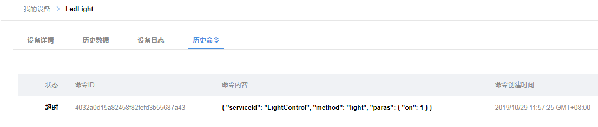

状态说明如下：

-   **超期：** 表示命令在IoT平台缓存时间超期，未向设备下发。
-   **成功：** 表示IoT平台已经将命令下发给设备，且收到设备上报的命令执行结果。
-   **失败：** 表示编解码插件解析为空，或执行结果响应里面有“ERROR CODE”等。
-   **超时：** 表示IoT平台等待ACK响应超时。
-   **取消：** 表示应用侧已经取消命令下发。
-   **等待：** 表示命令在IoT平台缓存，还未下发给设备。
-   **已发送：** 表示IoT平台已经将命令下发给设备。
-   **已送达：** 表示IoT平台已经将命令下发给设备，且收到设备返回的ACK消息。

<h1 id="5">5、经 BS 接入实例 </h1>
<h3 id="（参考）LINUX设备平台接入实例.md">（参考）LINUX设备平台接入实例</h3>
**图 1** 引导模式整体配置流程图
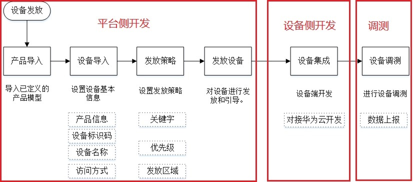

<h4 id="5.1">5.1、平台侧开发 </h4>
BS引导模式平台侧开发包括：产品导入，设备导入，配置发放策略，发放设备。

<h5 id="环境准备.md"> 1 环境准备</h5>
在开发之前，需要提前获取如下信息：

-   [物联网平台](https://console.huaweicloud.com/iotOceanLink/?region=cn-north-4#/iotdmp/spMenu/iodps)的访问账号/密码，需要向OceanConnect IoT平台申请

<h5 id="产品导入.md"> 2 产品导入</h5>
产品导入用于导入用户已开发和定义的产品模型。产品模型是指接入平台的设备的类型，产品信息包括产品名称、厂商、协议等信息。

如果使用设备接入和设备管理服务，需要提前在开发中心完成产品模型定义并发布到产品中心，选择“从产品中心导入”。
如果仅使用设备接入服务，则选择“创建产品”。创建产品仅支持创建MQTT协议产品。

1.  登录IoT云平台。IoT云平台的访问账号和密码需要向IoT平台服务商申请。
2.  进入设备发放服务，点击“从产品中心导入”。

**图 1**  产品导入<a name="fig43098736"></a>  
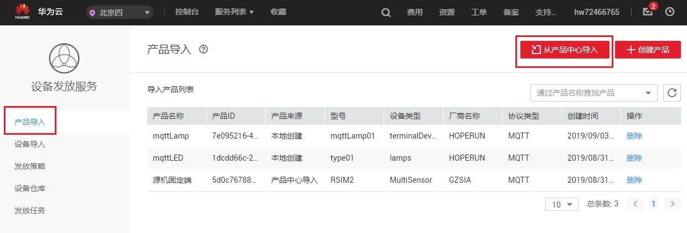

3.  在新弹出界面中，产品名称输入“EVB”,协议类型选择“LwM2M”，点击“搜索”，在搜索结果列表中选择产品点击“导入”。

**图 2**  选择产品<a name="fig46257266"></a>  
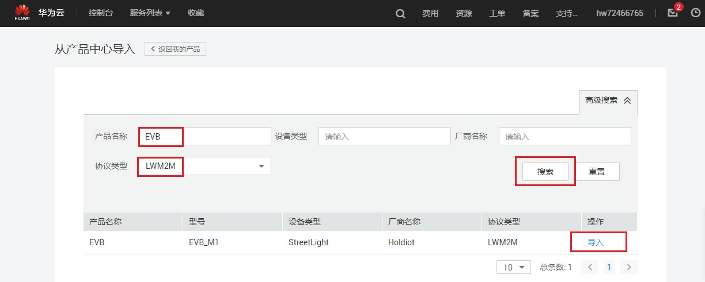

> **说明：**   
>如上产品选择仅为参考举例，具体配置请以实际产品模型为准。  

**图 3**  产品导入成功<a name="fig24567157"></a>  


<h5 id="设备导入.md"> 3 设备导入</h5>
设备导入用于将设备基本信息导入设备发放平台中，用于后续发放至不同的物联网平台，支持批量导入和单个导入。设备导入成功后，可在设备仓库中查看设备的详细信息。

1.  登录IoT平台的开发者中心。
2.  进入设备发放服务页面，选择“设备导入”，点击页面右上角“单个导入”。

**图 1**  设备导入<a name="fig8361117"></a>  
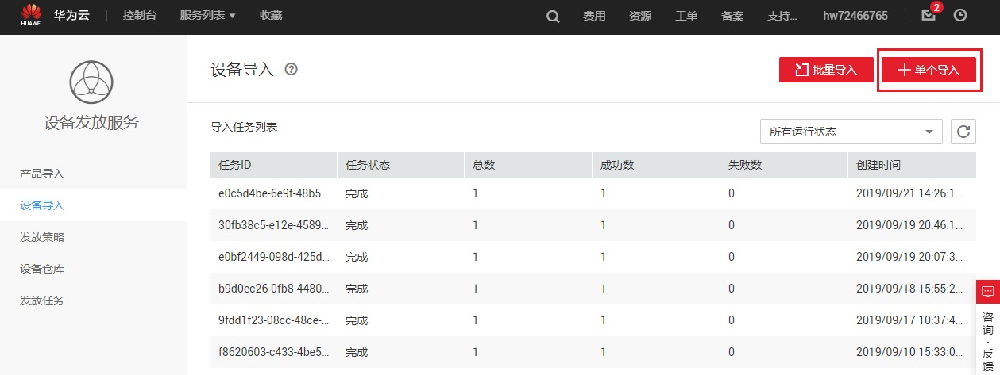

3.  在配置设备基本信息界面中，产品信息选择上一步导入的产品、设置好设置设备标识码、设备名称、访问方式选择“IP”，点击“确认导入”

**图 2**  配置设备基本信息<a name="fig41058489"></a>  
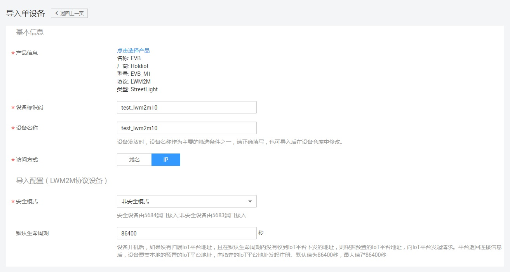

> **说明：**   
>如上配置仅为参考举例，具体配置请以现网需求为准。  

<h5 id="配置发放策略.md"> 4 配置发放策略</h5>
发放策略用于控制设备按照指定策略或规则发放至不同的物联网平台。当前支持按照设备名称中的关键字设置发放示例，最多可添加20个发放实例。

1.  在设备发放服务页面选择“发放策略”，点击“设备名称筛选”，添加实例。

**图 1**  添加实例<a name="fig27941066"></a>  
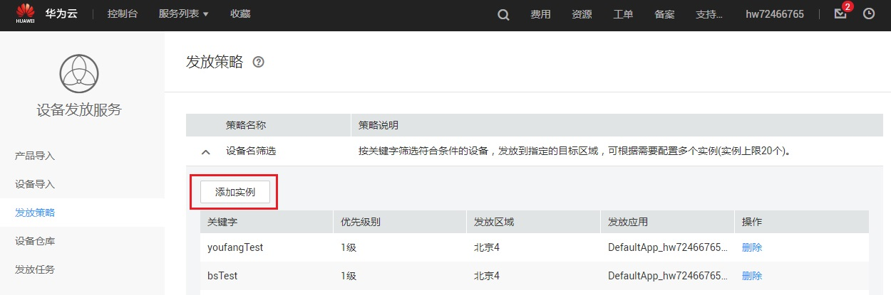

2.  在添加实例配置框内填写关键字，关键字为设备导入中的设备名称、选择发放区域、点击“确定”。

**图 2**  配置发放策略<a name="fig51445036"></a>  
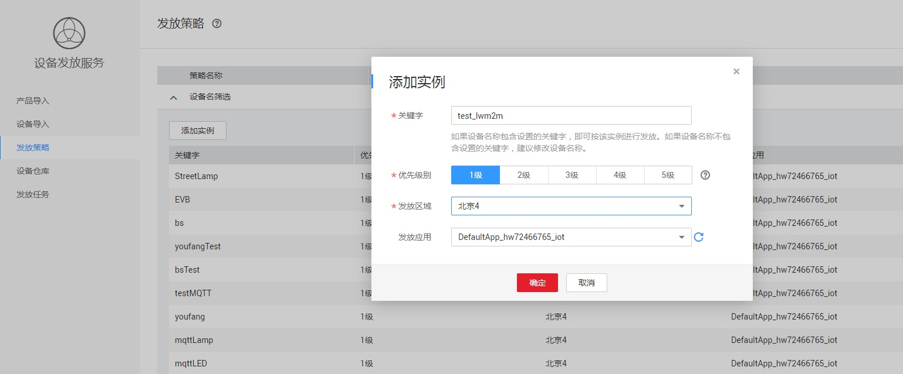

<h5 id="发放设备.md"> 5 发放设备</h5>
发放设备会将设备发放到指定站点的物联网平台（设备接入），对于首次发放的设备，设备上电后会自动引导设备接入指定的物联网平台。

1.  选择“设备仓库”，在设备列表选择要发放的设备，点击“发放设备”，弹出对话框点击“确定”，点击“立即启动”。

**图 1**  发放设备<a name="fig094004411363"></a>  
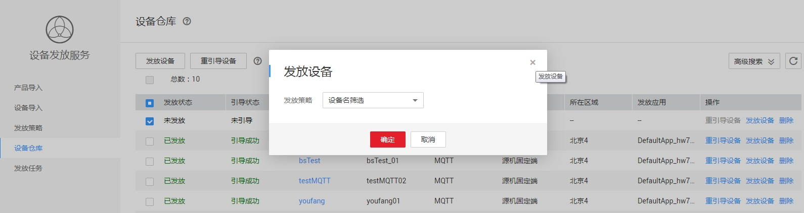

**图 2**  立即启动<a name="fig86891238143614"></a>  


<h4 id="5.2">5.2、设备侧开发 </h4>
BS引导模式设备侧开发包括: 配置Demo中对接云端设备的信息、编译、运行SDK、数据上报功能调测。

<h5 id="">设备侧开发环境准备</h5>
在开发之前，需要提前进行如下操作：

- 在虚拟机中搭建好Ubuntu操作系统
- 获取端云互通组件代码：[https://github.com/LiteOS/LiteOS/tree/iot_link](https://github.com/LiteOS/LiteOS/tree/iot_link)


<h5 id="接入IoT平台.md">配置Demo中对接云端设备的信息</h5>
1.  将组件代码源文件复制到Ubuntu用户目录下

**图 1**  复制组件代码源文件到用户目录<a name="fig86891238143614"></a>  


2.  在Demo源文件中设置云平台IP以及设备EP Name。

oc\_lwm2m\_bs\_demo.c位于 LiteOS-iot\_link/demos。

这些参数将作为入参传入oc\_lwm2m\_config\(\)以对LiteOS端云互通组件进行初始化。EP Name就是在云平台上注册设备时开发者设定的验证码，必须保证是唯一的；oc\_lwm2m\_bs\_demo.c中示例如下：

	```
	
		//#define cn_app_server         "iot-bs.cn-north-4.myhuaweicloud.com"
		\#define cn_app_server         "119.3.251.30"
		\#define cn_endpoint_id        "test_lwm2m10"
		\#define cn_app_port           "5683"
	```

3.  修改编译配置文件。

config.mk位于 LiteOS-iot\_link/targets/LINUX/GCC。

参考如下配置：

	```
	
		CONFIG_OS_TYPE := "linux"
	
		CONFIG_ARCH_CPU_TYPE := "x86-64"
	
		CONFIG_SHELL_ENABLE := n
	
		CONFIG_STIMER_ENABLE := y
	
		CONFIG_DRIVER_ENABLE := n
	
		CONFIG_AT_ENABLE     := n
		CONFIG_CJSON_ENABLE := y
	
		CONFIG_TCPIP_ENABLE := y
		CONFIG_TCPIP_TYPE := "linux_socket"
	
		CONFIG_DTLS_ENABLE   := n
		CONFIG_DTLS_TYPE     := "mbedtls_psk"
	
		CONFIG_MQTT_ENABLE   := n
		CONFIG_MQTT_TYPE     := "lite_mqtt"
	
		CONFIG_LWM2M_ENABLE   := y
		CONFIG_LWM2M_TYPE     := "wakaama_lwm2m"
	
		CONFIG_COAP_ENABLE   := n
		CONFIG_COAP_TYPE     := "lite_coap"
	
		CONFIG_OC_COAP_ENABLE := n
		CONFIG_OC_COAP_TYPE   := "soft"
	
		CONFIG_OC_MQTT_ENABLE := n
		CONFIG_OC_MQTT_TYPE   := "soft"
	
		CONFIG_OC_LWM2M_ENABLE := y
		CONFIG_OC_LWM2M_TYPE   := "soft"
	
		CONFIG_OTA_ENABLE      := n
		CONFIG_PCP_ENABLE      := n
	
		CONFIG_DEMO_ENABLE := y
		CONFIG_DEMO_TYPE   := "oc_lwm2m_bs_demo"
	
		include $(TOP_DIR)/iot_link/iot.mk
	```
4. 编译并运行。

进入到LiteOS-iot\_link/targets/LINUX/GCC目录下执行“make”命令,编译成功后会在当前文件夹下生成"build"目录，输入“./build/Huawei_LiteOS.elf”运行。

**图 1**  执行“make”命令<a name="fig86891238143614"></a>  
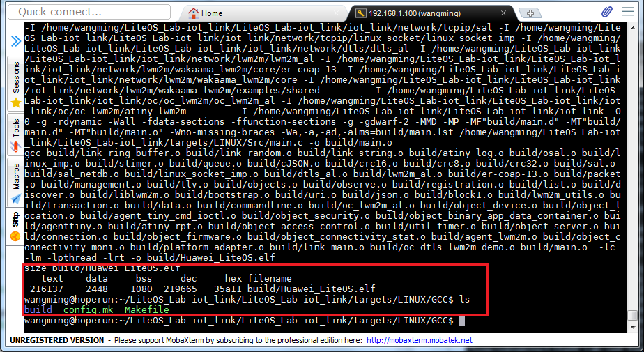

**图 2**  运行程序<a name="fig86891238143614"></a>  
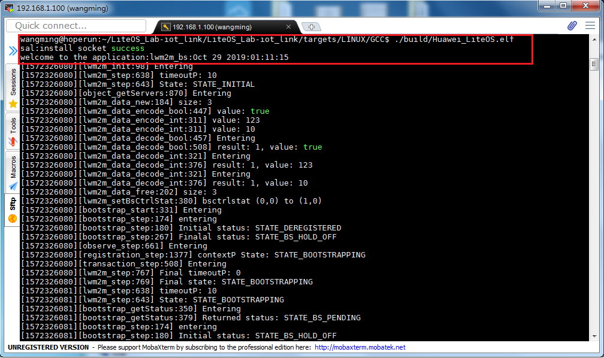

**图 3**  接入云平台<a name="fig86891238143614"></a>  
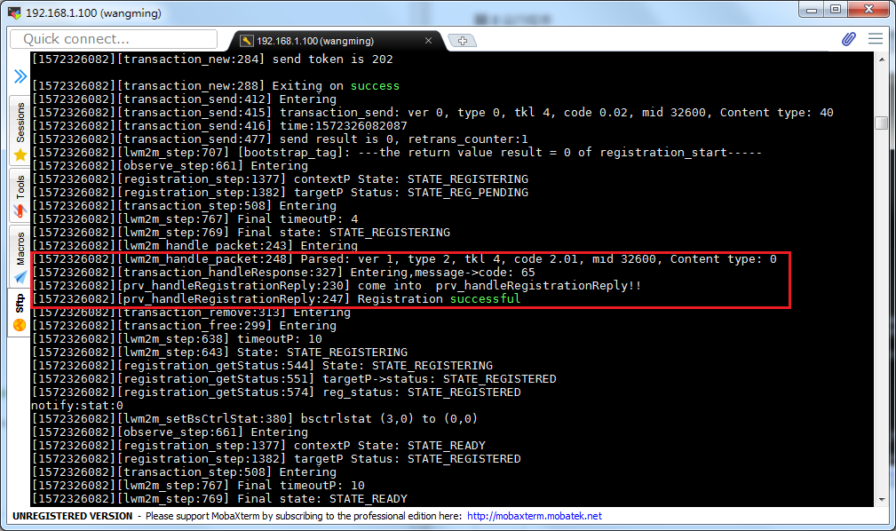


5.  查看设备状态。

登录IoT平台进入设备管理服务，选择“所有设备”，在设备列表中查看对应设备的状态。如果状态为“在线”，则表示设备已经成功接入IoT平台。

**图 1**  查看设备状态<a name="fig17343259182620"></a>  
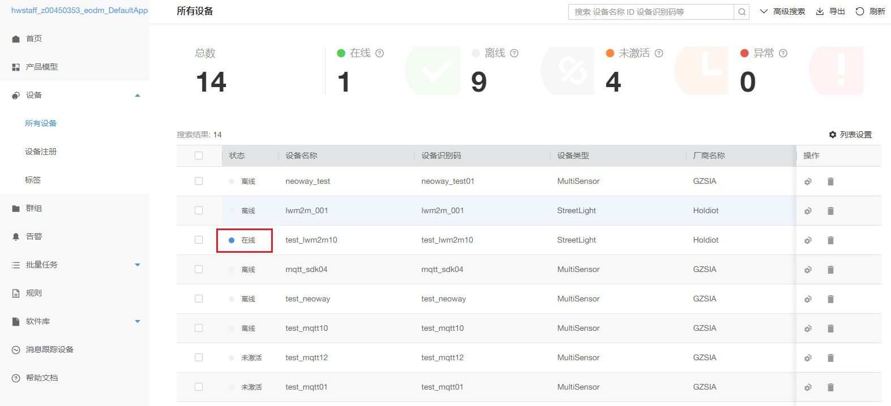

<h4 id="5.3">5.3、调测 </h4>
<h5 id="数据上报.md">数据上报</h5>
对于开发者来说，只需在app\_report\_task\_entry\(\)中将其传递给数据上报结构体 light 即可。具体调测过程如下：

1.  设备侧执行app\_report\_task\_entry函数，使设备上报数据。

oc\_lwm2m\_bs\_demo.c中的函数app\_data\_report如下：

	```
	
		static int app_report_task_entry()
		{
			int ret = -1;
			int lux = 0;
	
			oc_config_param_t      oc_param;
			app_light_intensity_t  light;
	
			memset(&oc_param,0,sizeof(oc_param));
	
			oc_param.app_server.ep_id = cn_endpoint_id;


    		oc_param.boot_server.address = cn_app_server;
    		oc_param.boot_server.port = cn_app_port;
    		oc_param.boot_server.ep_id = cn_endpoint_id;
    
    		oc_param.boot_mode = en_oc_boot_strap_mode_client_initialize;
    		oc_param.rcv_func = app_msg_deal;
    
    		while(1) //--TODO ,you could add your own code here
    		{
        		if(NULL == s_lwm2m_context)
        		{
            		oc_lwm2m_config(&oc_param);
        		}
        		else if(s_lwm2m_reconnect)
        		{
            		s_lwm2m_reconnect = 0;
    
            		oc_lwm2m_deconfig();
    
    
            		oc_lwm2m_config(&oc_param);
    
        		}
        		else
        		{
            		lux++;
            		lux= lux%10000;
    
            		light.msgid = cn_app_light;
            		light.intensity = htons(lux);
            		oc_lwm2m_report((char *)&light,sizeof(light),1000); ///< report the light message
        		}
    
        		osal_task_sleep(10*1000);
    
    		}
    
    		return ret;
    	}
    ```

oc\_lwm2m\_bs\_demo.c位于 LiteOS-iot\_link/demos。

2.  查看设备状态

登录IoT平台进入设备管理服务，选择“所有设备”，在设备列表中，点击上报数据的设备，查看设备信息”，验证设备数据上报的情况。

**图 1**  查看数据上报结果<a name="fig13872847174416"></a>  
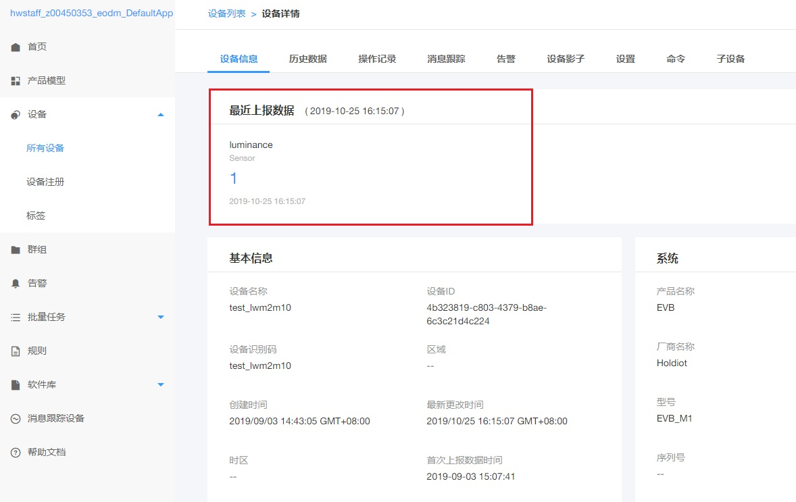
