# 端云互通组件-MQTT开发指南

## 目 录
<!-- TOC -->

- [1 前言](#1)
- [2 SDK简介](#2)
- [3 接入物联网平台流程](#3)
- [4 直连接入实例](#4)
	-  [4.1 平台侧开发](#4.1)
	-  [4.2 设备侧开发](#4.2)
	-  [4.3 调测](#4.3)
- [5 经BS接入实例](#5)
	-  [5.1 平台侧开发](#5.1)
	-  [5.2 设备侧开发](#5.2)
	-  [5.3 调测](#5.3)
<!-- /TOC -->

<h1 id="1">1.前言</h1>

  本文档主要通过实例讲述如何通过Agent Tiny SDK的端云互通组件，使用MQTT协议快速接入华为物联网平台。

<h1 id="2">2.SDK简介</h1>

Agent Tiny是部署在具备广域网能力、对功耗/存储/计算资源有苛刻限制的终端设备上的轻量级互联互通中间件，您只需调用API接口，便可实现设备快速接入到物联网平台以及数据上报和命令接收等功能。

Agent Tiny SDK是Huawei Agent Tiny软件开发工具包（Software Development Kit），通过Agent Tiny SDK端云互通组件，简单快速地实现与华为物联网平台安全可靠连接，可以大大减少开发周期，快速构建IoT产品。端云互通组件可以采用MQTT、CoAP和LWM2W协议接入物联网平台。

**Agent Tiny SDK的全景图**

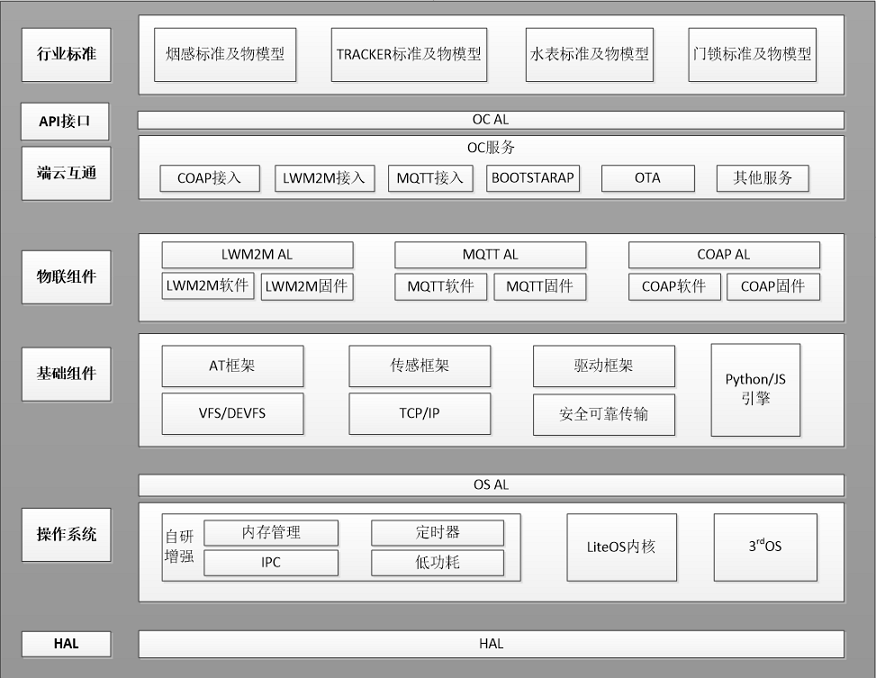

<h1 id="3">3.接入物联网平台流程</h1>

根据设备中的接入地址，可以将接入物联网平台分为两种模式：

- 直接接入物联网平台模式

- 通过设备发放服务接入物联网平台模式

两种接入方式的对比：

**直连接入物联网平台示意图**

**通过设备发放服务接入物联网平台示意图**

<h1 id="4">4.直连接入实例</h1>
本章节以野火STM32F429IG开发板通过以太网直接接入物联网平台为例，详细讲述接入流程。总体操作流程参考下图

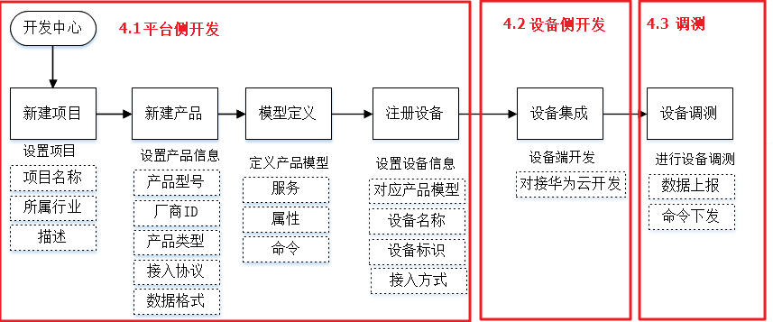

> **说明：**   
>野火STM32F429IG开发板的详细资料可以从[http://www.firebbs.cn/forum.php](http://www.firebbs.cn/forum.php)下载。  

产品模型参考

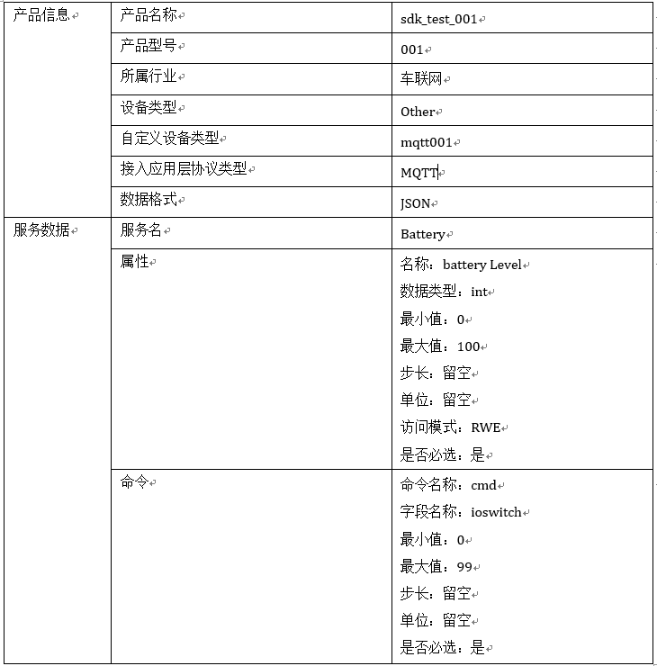

设备信息参考

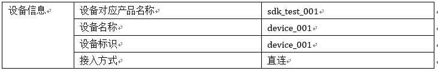

<h2 id="4.1">4.1 平台侧开发</h2>

进入[开发中心](https://iot-dev.huaweicloud.com)，根据上图，依次在开发中心中新建项目->新建产品->定义产品模型->注册设备。

**新建项目**

选择开发者中心并进入
 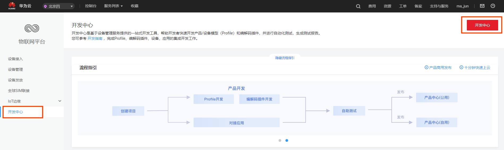

点击“我的项目”中“+”，创建自己的项目
 
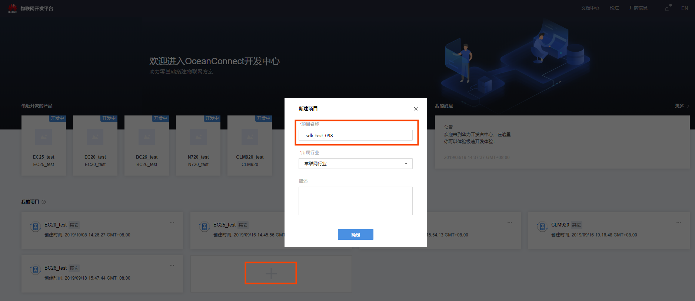

输入项目信息后点击“确定”
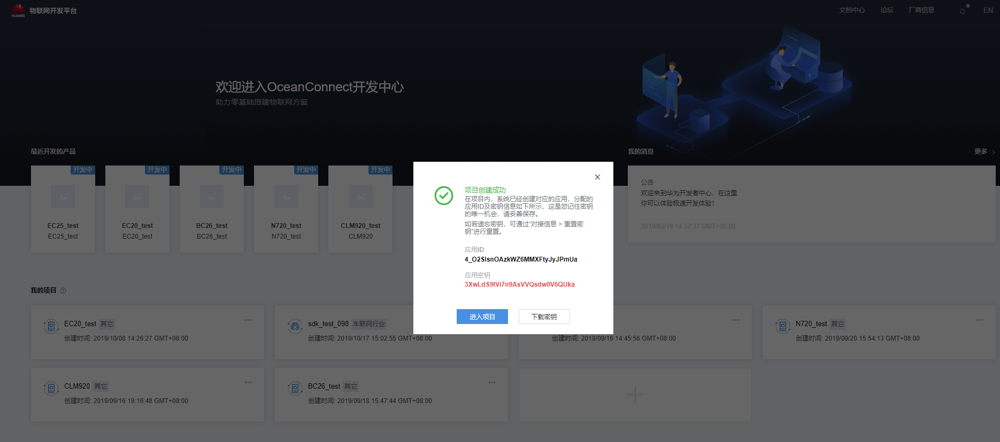

点击“进入项目”
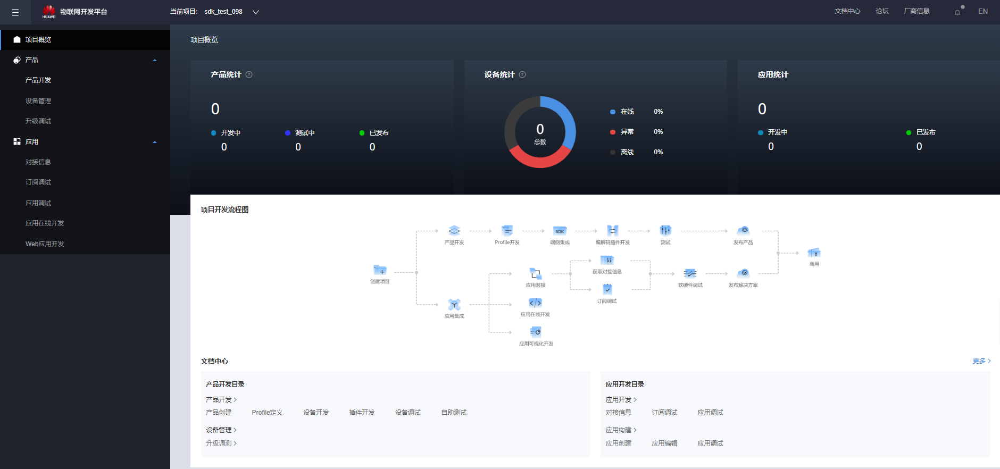
 
**新建产品**

选择产品开发新建产品，即可跳转到产品模型定义界面

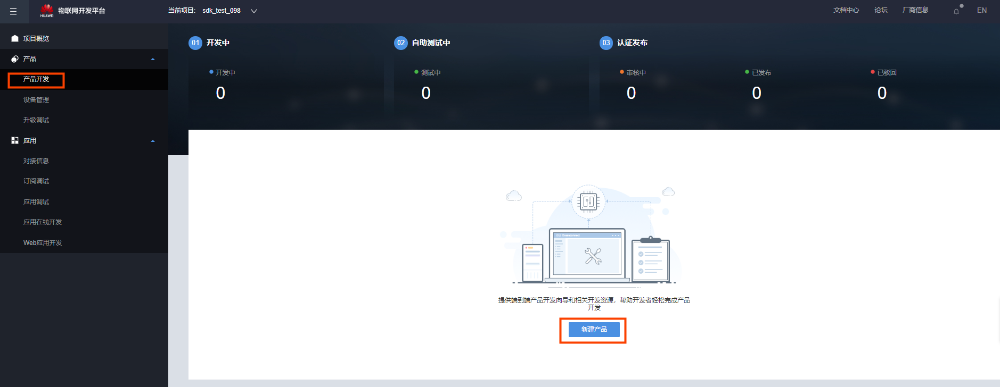
 
选择自定义产品方式创建产品
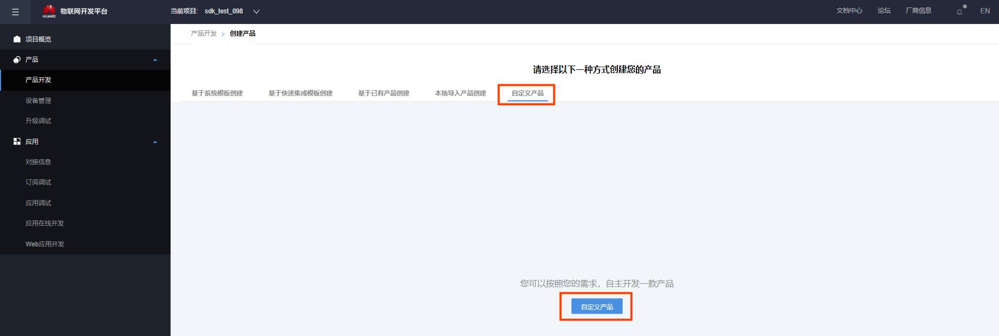

补全产品的各类信息，点击“创建”，提示创建成功后点击“确定”，前往产品开发
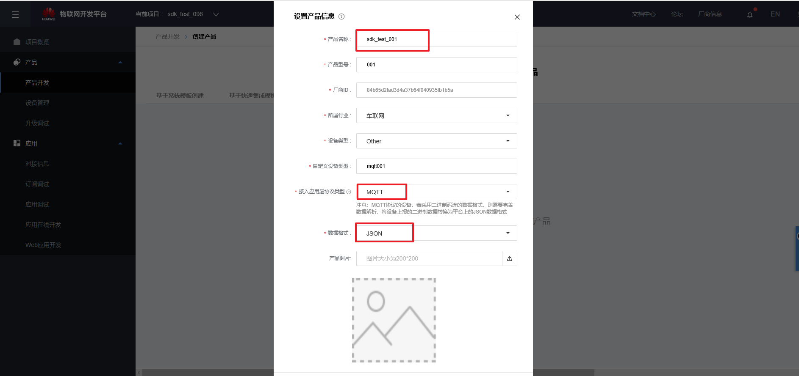
 
**定义产品模型**

选择新建服务，开始添加产品的相关特性

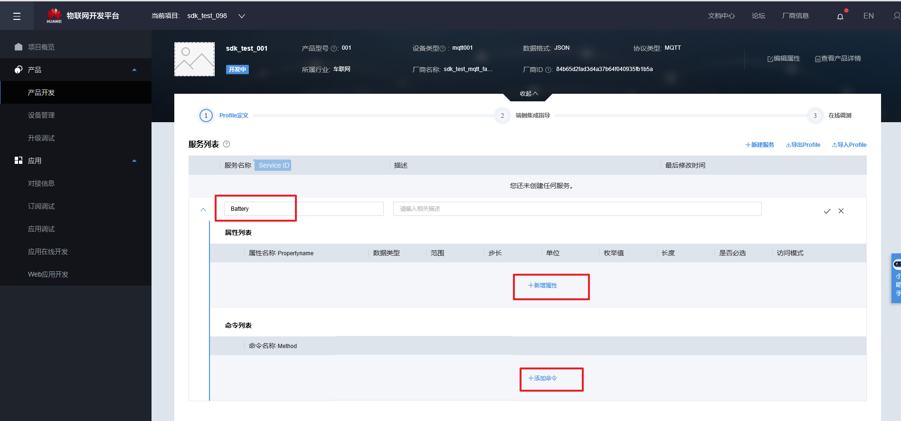

给产品定义一个属性：batteryLevel，用于设备向平台上报，定义为int型，最大值设置为100，访问模式RWE全部勾选，完成后点击确定；

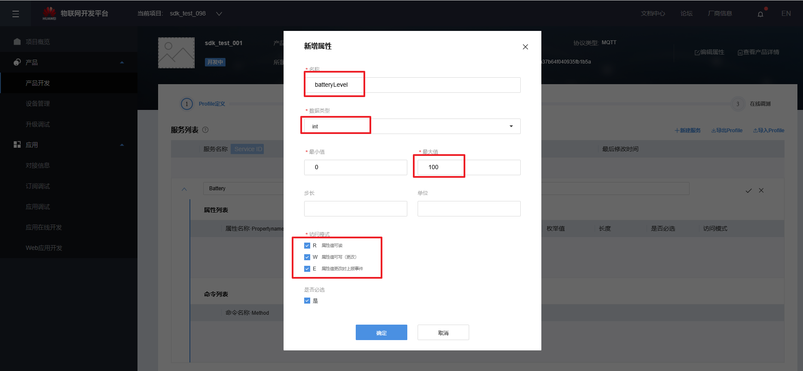

给产品增加一个命令：cmd，设置下发命令属性名称：ioswitch，用于平台向设备发送命令，定义为int型，最大值99。通过上报和下发，构成了我们演示的上行和下行通道。
 
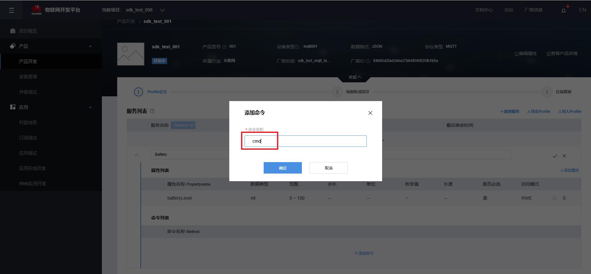

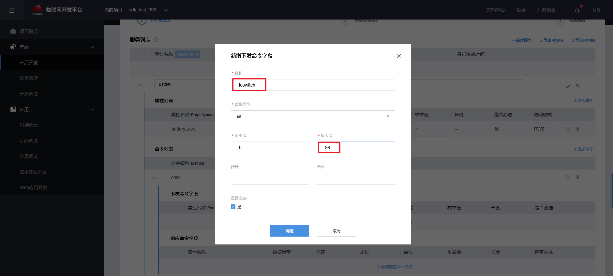 

添加完后保存：

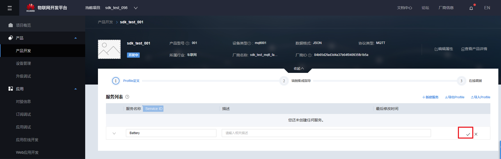 
 
**创建设备**

创建了产品模型之后，我们需要根据模型创建具体的设备。点击设备管理->添加真实设备，即可进入添加设备界面。

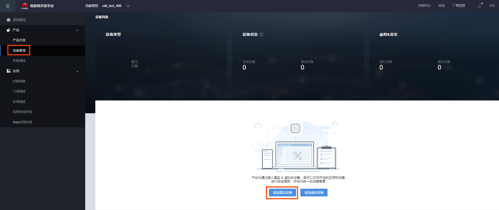 
 
进入界面之后，选择我们刚才建立的产品模型“sdk\_test\_001”，进行设备创建。
设备标识(nodeid)是识别该设备的唯一标识符，要求唯一，此处为示范，用户使用时以实际命名为准。

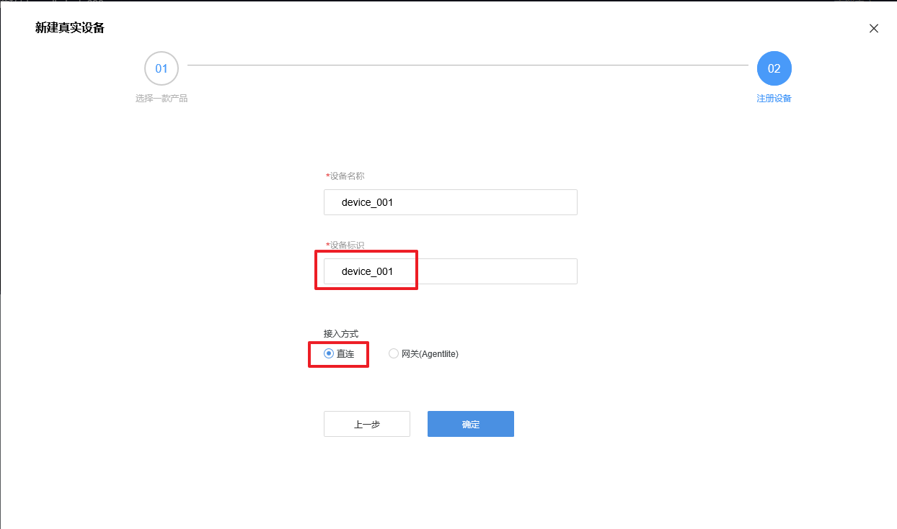 
 
此处注意，确认之后自动生成产品设备ID（deviceid）及密钥（password），请记录下设备标识(nodeid)、设备ID（deviceid）及密钥（password），这三个信息主要用于对接华为云时的设备鉴权。

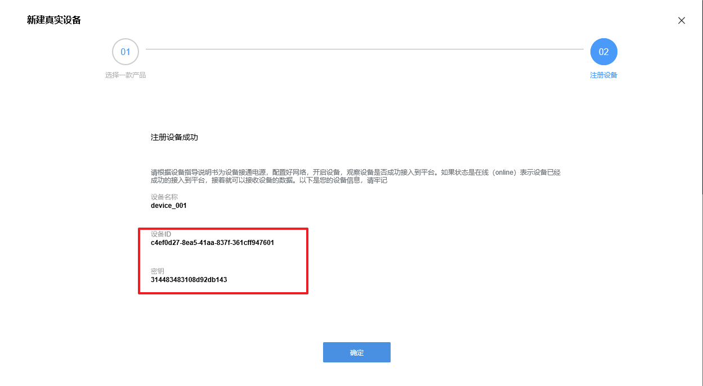 
 
创建完毕之后，即可在设备管理中看到刚刚创建的设备，此时设备状态为离线。
 
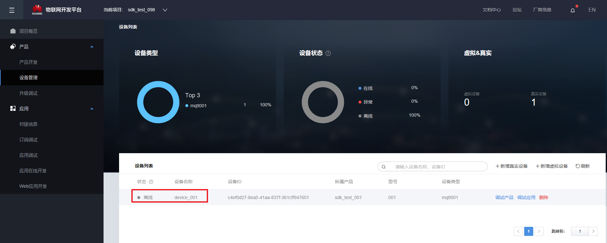 

到此为止，平台侧开发完毕。

<h2 id="4.2">4.2 设备侧开发</h2>

设备侧开发前准备

- [下载SDK源码](https://github.com/LiteOS/LiteOS/tree/iot_link)。
- 获取接入信息(进入[开发中心](https://iot-dev.huaweicloud.com)的“sdk\_test\_098”项目中，在“应用 > 对接信息”页面查看“设备接入信息”中的“MQTT接入方式”)
- 硬件设备：野火STM32F429IG开发板，调试下载器（J-Link）、网线、USB转串口等。
- 软件:IDE(包含GCC编译器，JDK运行环境，make工具，Jlink驱动、Eclipse IDE)，串口工具(QCOM_V1.6)

> **说明：**   
>SDK采用的是GCC+MakeFile模式，用户可以根据自己的IDE开发环境灵活适配。  

**IDE开发环境安装配置**

参考[开发环境搭建指南](./Huawei_IoT_Link_SDK_IDE_Eclipse_Guide.md)，搭建设备端侧开发环境。

**修改mk文件**

集成开发环境搭建好后，修改targets\STM32F429IGTx_FIRE\config.mk

	CONFIG_OS_TYPE := "liteos"
	CONFIG_ARCH_CPU_TYPE := "armv7-m"
	CONFIG_SHELL_ENABLE := y
	CONFIG_STIMER_ENABLE := y
	CONFIG_DRIVER_ENABLE := y
	CONFIG_AT_ENABLE     := y
	CONFIG_CJSON_ENABLE := y
	CONFIG_TCPIP_ENABLE := y
	CONFIG_TCPIP_TYPE := "lwip_socket"
	CONFIG_DTLS_ENABLE   := y
	CONFIG_DTLS_TYPE     := "mbedtls_cert"
	CONFIG_MQTT_ENABLE   := y
	CONFIG_MQTT_TYPE     := "paho_mqtt"
	CONFIG_OC_MQTT_ENABLE := y
	CONFIG_OC_MQTT_TYPE   := "soft"
	CONFIG_DEMO_ENABLE := y
	CONFIG_DEMO_TYPE   := "oc_tls_mqtt_demo"      ### 产品逻辑 ###

**修改接入信息**

参考如下内容，修改demos/oc_tls_mqtt_demo.c

	#define DEFAULT_LIFETIME            10
	#define DEFAULT_SERVER_IPV4         "49.4.93.24"     						//物联网平台MQTT接入地址
	#define DEFAULT_SERVER_PORT         "8883"           						//物联网平台MQTT接入端口
	#define CN_MQTT_EP_NOTEID           "device_001"       						//平台侧新建的设备标识码
	#define CN_MQTT_EP_DEVICEID         "c4ef0d27-8ea5-41aa-837f-361cff947601"  //平台侧设备创建成功后提供的设备ID
	#define CN_MQTT_EP_PASSWD           "314483483108d92db143"					//平台侧设备创建成功后提供的密钥

**编译运行**

修改完成，编译然后debug。

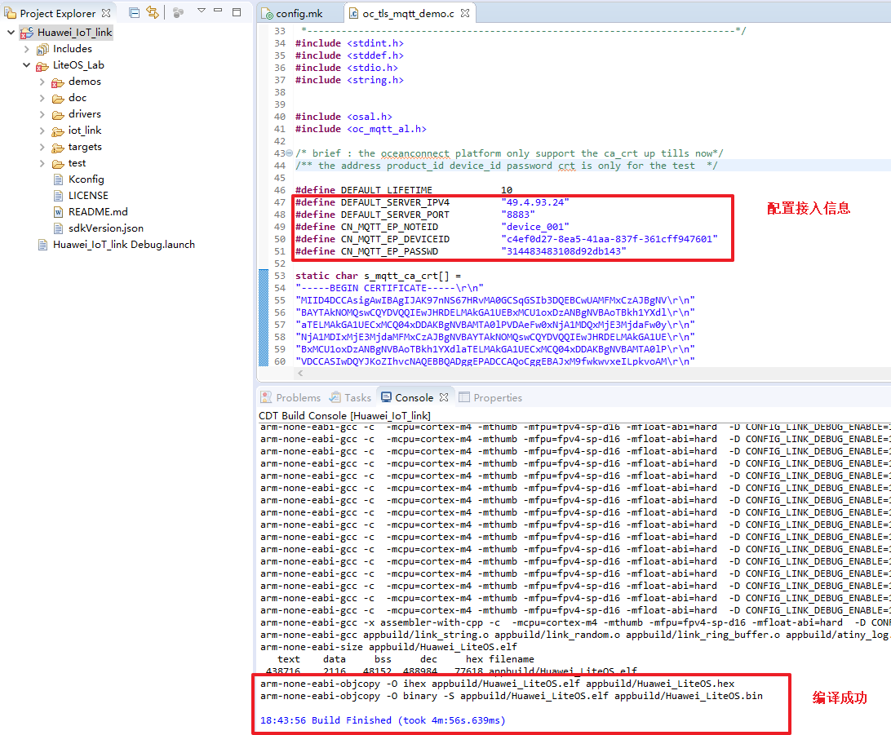

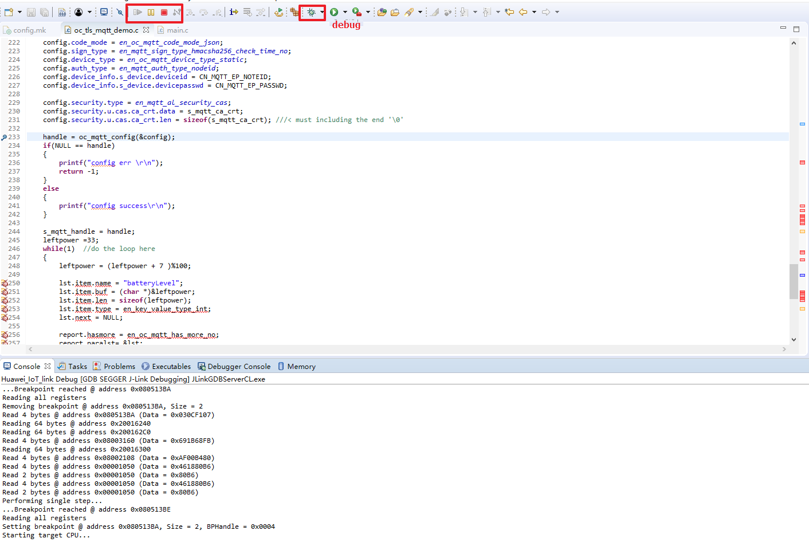

<h2 id="4.3">4.3 调测</h2>

通过串口工具，可以看到设备已经和物联网平台建立连接。

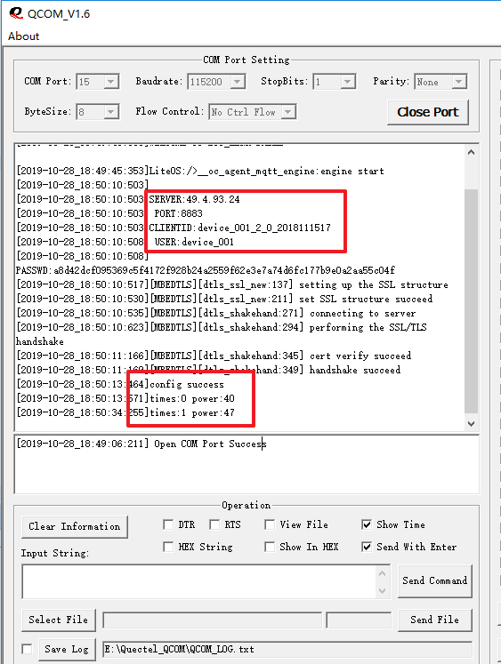

登录开发平台->“sdk\_test\_098”项目 ->设备管理，可以看到我们的设备已经上线，点击调试产品，可以进入我们平台的设备调试界面。
 
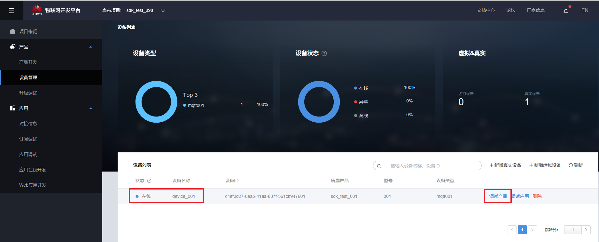

可以看到所创建的设备已经上报的数据

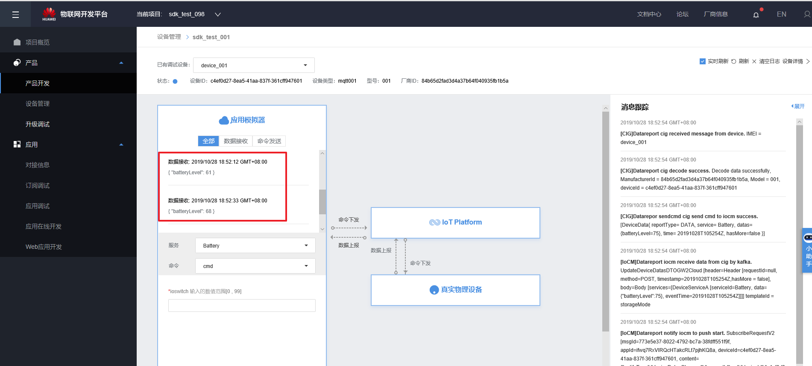
 
输入ioswitch值88，点击“发送”。

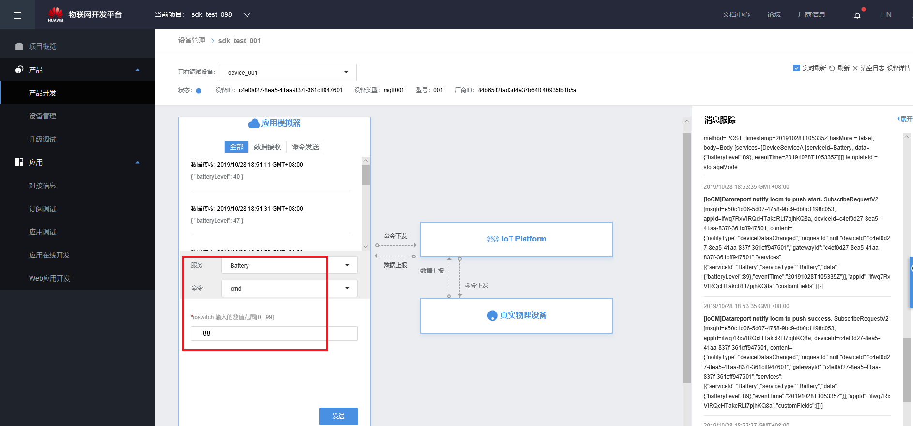

在串口工具可以看到接收到的命令

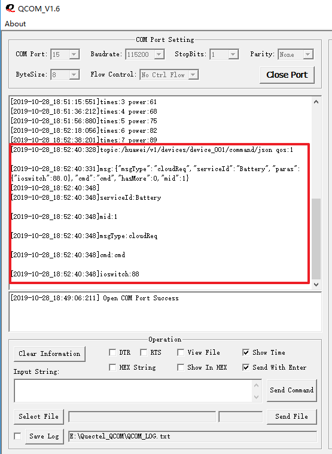

到此调测完成。

<h1 id="5">5 经BS接入实例</h1>
 本章节以LINUX平台通过以太网经BS接入物联网平台为例，详细讲述接入流程。总体操作流程参考下图

设备发放服务信息参考下表

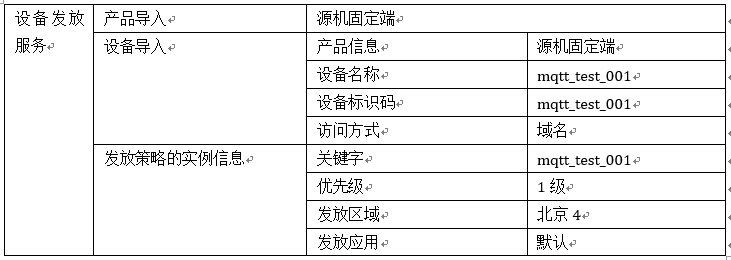

<h2 id="5.1">5.1 平台侧开发</h2>

进入[物联网平台](https://console.huaweicloud.com/iotOceanLink/?region=cn-north-4#/iotdmp/spMenu/iodps)，选择设备发放->进入设备发放服务。根据上图，依次在设备发放服务中产品导入->设备导入->发放策略->发放设备。设备导入成功后，记住设备标识(nodeid)，设备id（deviceid）和密钥（password），这三个信息主要用于对接华为云时的设备鉴权。
具体操作参考如下。

**进入设备发放平台**

在物联网平台选择“设备发放”，公测期间需要申请公测权限，可在设备发放页面选择申请公测权限并填写相关信息，申请权限通过后，点击“进入设备发放服务”。
 
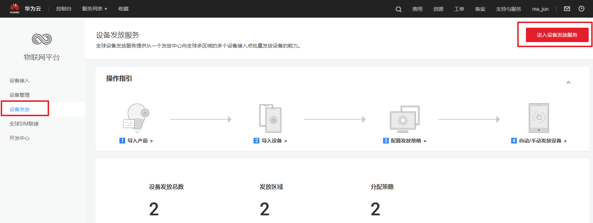

**导入产品**

在设备发放服务页面选择“产品导入”->从产品中心导入->选择最后一个源机固定端
 
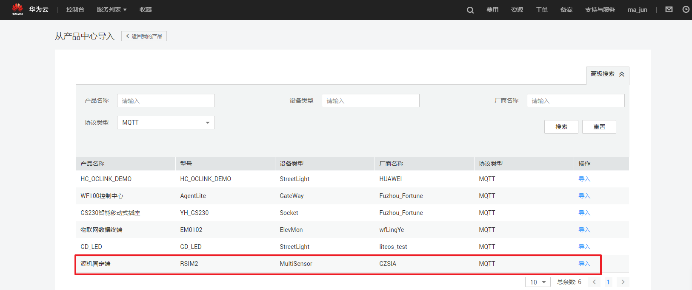
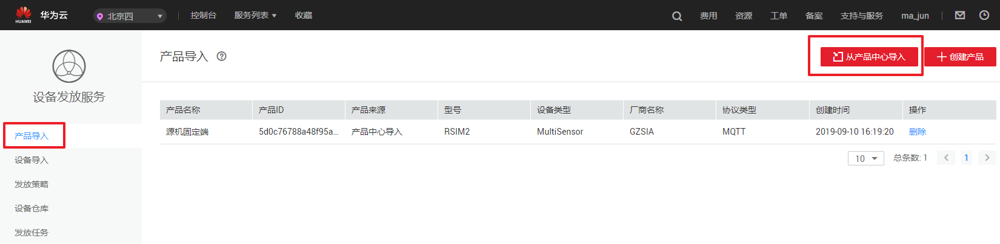
 
**设备导入**

设备发放服务页面选择“设备导入”->点击页面右上角“单个导入”->弹出导入设备基本信息配置，产品信息选择上一步导入的产品、设置设备标识码、设备名称、访问方式选择“域名”
 
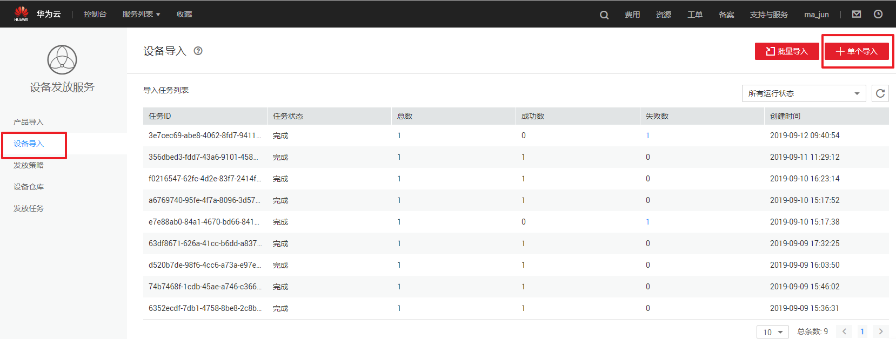
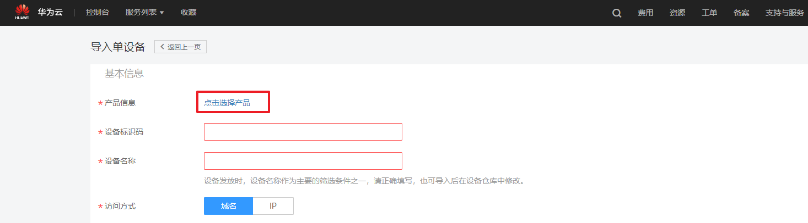
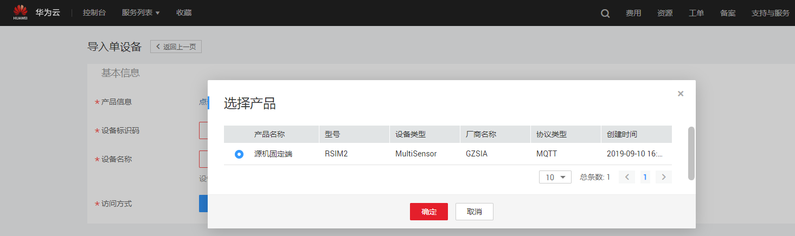
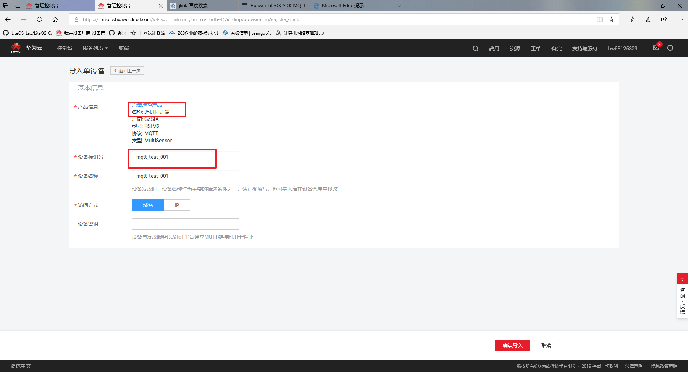 

**配置发放策略**

在设备发放服务页面选择“发放策略”->点击“设备名称筛选”->添加实例->在添加实例配置框内填写关键字，关键字为设备导入中的设备名称、选择发放区域、点击“确定”。
 
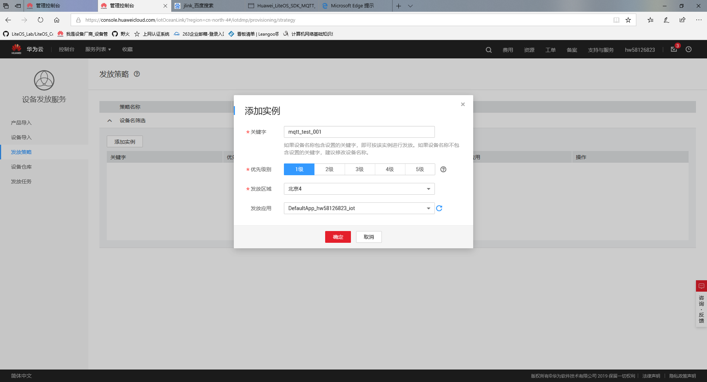
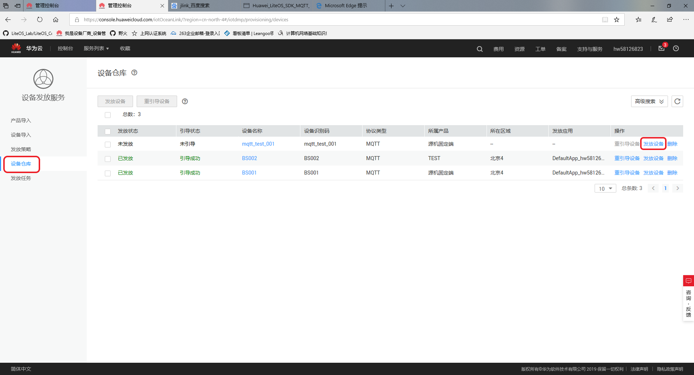

**发放设备**

选择“设备仓库”->选择“发放设备”->弹出对话框点击“确定”->立即启动
 
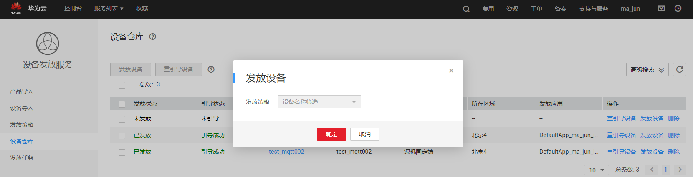
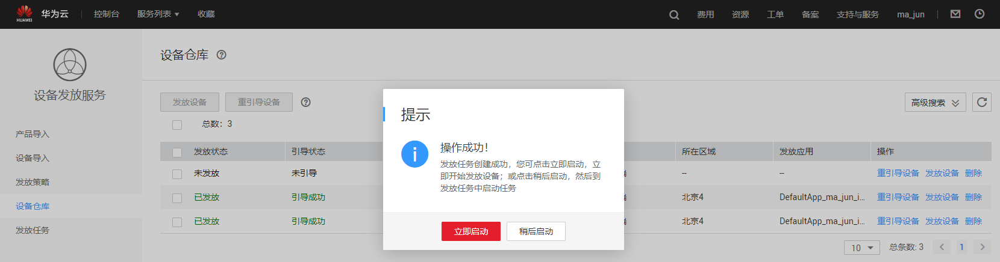

启动后，发放状态为已发放
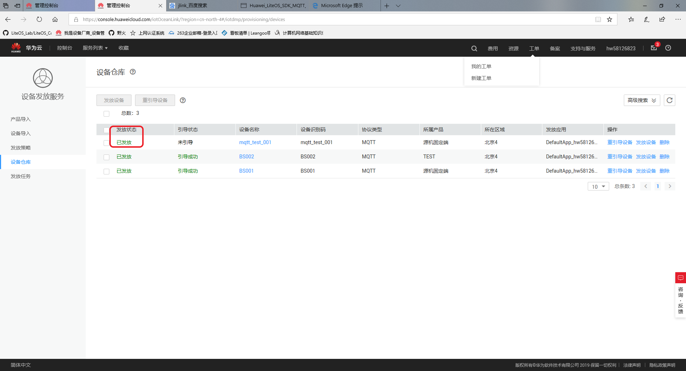

<h2 id="5.2">5.2 设备侧开发</h2>

设备侧开发前准备

- [下载SDK源码](https://github.com/LiteOS/LiteOS/tree/iot_link)。
- 获取接入信息(进入[物联网平台](https://console.huaweicloud.com/iotOceanLink/?region=cn-north-4#/iotdmp/spMenu/iodps)，在“设备发放 > 设备引导对接信息”页面查看“接入信息”中的“MQTT接入方式”)
- Linux平台(准备好GCC编译环境以及Make工具) 

**上传源码到linux平台**

源码目录如下

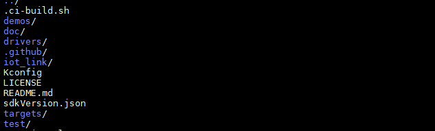 

**修改mk文件**

参考如下内容，修改targets/LINUX/GCC/config.mk

	CONFIG_OS_TYPE := "linux"
	CONFIG_ARCH_CPU_TYPE := "x86-64"
	CONFIG_SHELL_ENABLE := n
	CONFIG_STIMER_ENABLE := y
	CONFIG_DRIVER_ENABLE := n
	CONFIG_AT_ENABLE     := n
	CONFIG_CJSON_ENABLE := y
	CONFIG_TCPIP_ENABLE := y
	CONFIG_TCPIP_TYPE := "linux_socket"
	CONFIG_DTLS_ENABLE   := y
	CONFIG_DTLS_TYPE     := "mbedtls_cert"
	CONFIG_MQTT_ENABLE   := y
	CONFIG_MQTT_TYPE     := "paho_mqtt"
	CONFIG_OC_MQTT_ENABLE := y
	CONFIG_OC_MQTT_TYPE   := "soft"
	CONFIG_DEMO_ENABLE := y
	CONFIG_DEMO_TYPE   := "oc_tls_mqtt_bs_demo"			### 产品逻辑 ###

**修改接入信息**

修改demos/oc\_tls\_mqtt\_bs\_demo.c的对接信息

	#define BS_SERVER_ADDRESS           "iot-bs.cn-north-4.myhuaweicloud.com"  //设备发放服务提供的MQTT对接地址
	#define BS_SERVER_PORT              "8883"          						//设备发放服务提供的MQTT对接端口
	#define DEMO_WITH_BOOTSTRAP_NODEID  "mqtt_test_001"							//设备发放时导入设备的设备标识码
	#define DEMO_WITH_BOOTSTRAP_PASSWORD "ecc8dca5dfe4686bc71b"					//设备发放时导入设备成功后提供的密钥

**make编译生成Huawei_LiteOS.elf**
 
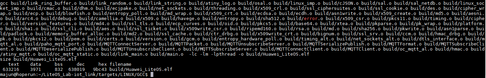 

**运行Huawei_LiteOS.elf**

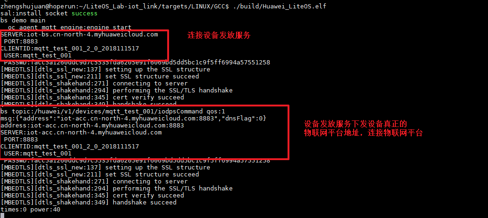 

<h2 id="5.3">5.3 调测</h2>

在设备发放服务中选择“设备仓库”，查看设备的引导状态为“引导成功”

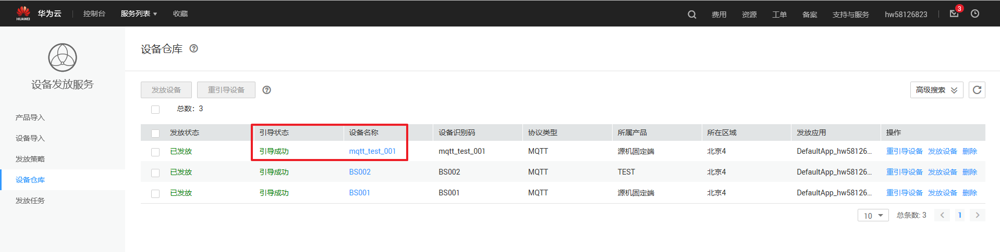
 
登录[设备管理服务](https://console.huaweicloud.com/iot/?region=cn-north-4#/iotdmp/spMenu/deviceManage)，选择“设备管理”，进入设备管理服务

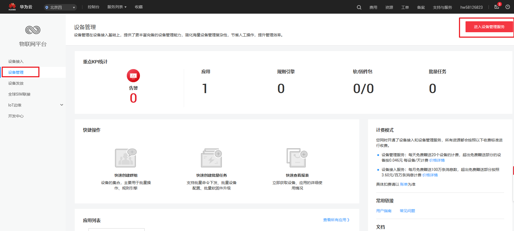

点击下图左下角图标，选择设备-所有设备，可以看到设备状态为“在线”
 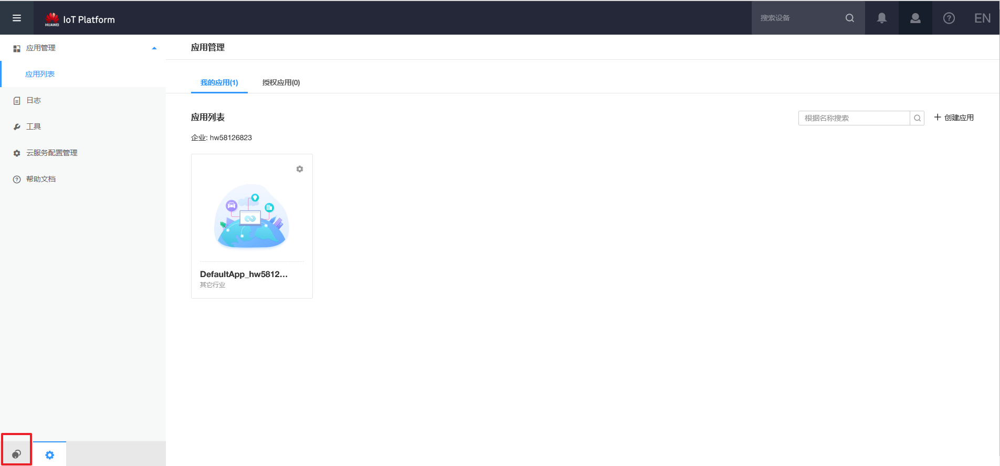
 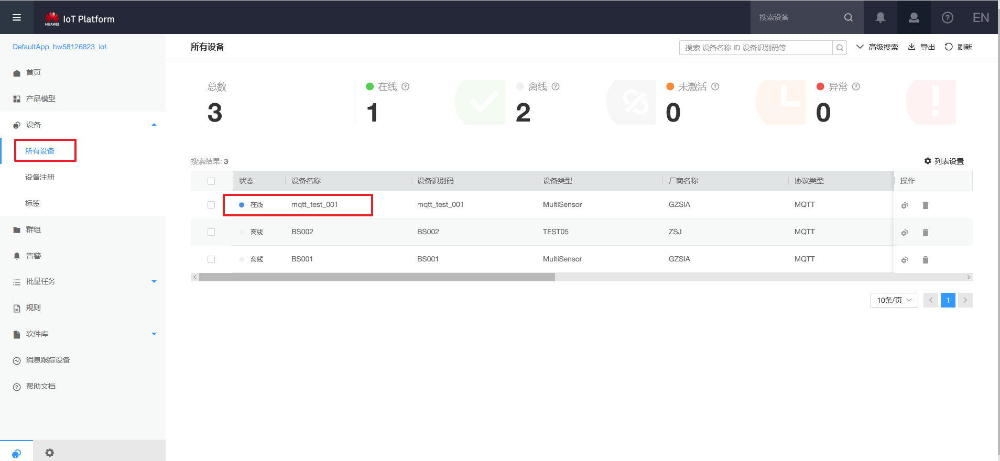 

点击设备名称，进入设备详情页面
 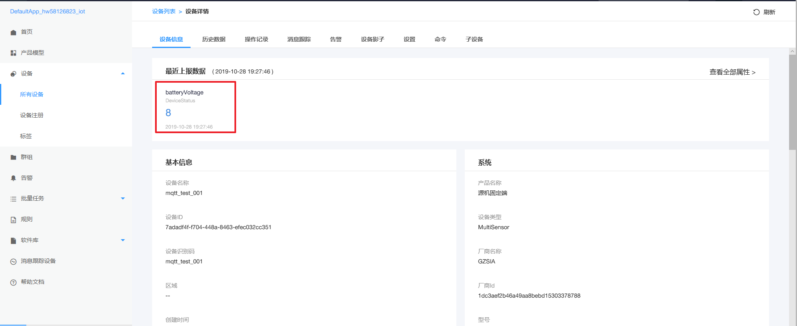

到此调测完成。

