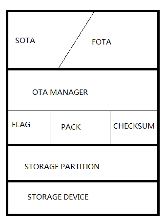
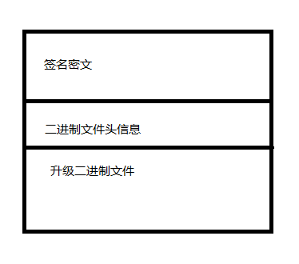

# Table of Contents

1.  [概述](#orgd5407db)
2.  [升级文件二进制文件结构](#org98af6df)
3.  [存储器接口](#orga1b2737)
4.  [OTA管理接口](#org0858161)
5.  [签名验证](#org0a38c46)
6.  [Loader](#orgdef2ade)
7.  [FOTA / SOTA](#org4d3947c)
8.  [编译](#org8f1a0de)
9.  [新平台适配](#org6b28673)

# 概述

在应用升级过程中，无线下载更新（OTA）是一种常用，且方便的升级方式。Liteos采用的OTA升级方案基于LwM2M协议，实现了固件升级（FOTA）和软件升级（SOTA）两种升级方案。用户可根据自己的开发环境选择合适的升级方式。
OTA功能代码结构如下图：

# 升级文件二进制文件结构

如图所示，升级压缩包中二进制文件如下图所示，FOTA与SOTA采用相同的固件格式。

-   签名校验值：长度256字节，对剩余文件进行hash计算后，并进行sha256加密后得到的签名密文。

-   二进制信息：预留长度32字节，升级文件是全量升级文件或增量升级文件等信息。
-   升级文件内容：经压缩后的升级文件，升级文件使用hdiffpatch算法对新、旧镜像进行运算生成的差分包，并使用lzma算法进行压缩。

# 存储器接口

存储器结构代码位于iot\_link/sotrage目录下。存储器结构被划分为两部分，分别定义为存储设备（storage.c）与设备分区（partition.c）。
存储设备定义的是系统中使用的不同类型存储器及接口，如内部flash，spi flash 或 nandflash等，所使用结构体如下：

    
    typedef struct {
      int id;
      char *name;
      uint32_t size;
    
      void (*init)();
      int (*read)(void *buf, int32_t len, uint32_t offset);
      int (*write)(const uint8_t *buf, int32_t len, uint32_t offset);
      int (*erase)(uint32_t offset, int32_t len);
      int (*erase_write)(const void *buf, int32_t len, uint32_t offset);
    }storage_device;

设备分区定义了用户划分的分区信息，如下所示：

    
    typedef struct _partition {
      uint8_t dev_id;
      char *name;
      uint32_t start_addr;
      uint32_t size;
    }storage_partition;

设备分区定义了一组外部使用的接口，系统中可以使用这组接口进行相应的读写等操作。

    
    int storage_partition_read(int part_id, uint8_t *buf, uint32_t len, uint32_t offset);
    int storage_partition_write(int part_id, uint8_t *buf, uint32_t len, uint32_t offset);
    int storage_partition_erase_write(int part_id, uint8_t *buf, uint32_t len, uint32_t offset);
    int storage_partition_erase(int part_id, uint32_t offset, uint32_t len);

# OTA管理接口

系统中的OTA接口分为三个部分，OTA镜像接口、OTA包管理接口，OTA签名校验接口。

-   OTA镜像接口：

OTA镜像接口包括了OTA标志镜像和OTA二进制镜像。其中OTA标志存储了升级版本号、升级文件大小、当前OTA状态及OTA升级结果等信息，其结构如下：

    #pragma pack(1)
    typedef struct
    {
        uint8_t  ver[CN_OTA_VERSION_LEN];
        uint32_t ver_code;
        uint32_t file_size;   ///< the new bin file size
        uint32_t blk_size;    ///< the new bin block size
        uint32_t blk_num;     ///< the new bin block num
        uint32_t blk_cur;
        uint32_t file_off;    ///< the current offet to write
        uint32_t cur_state;   ///< defined by en_ota_status_t
        uint32_t ret_upgrade; ///< the upgrade,filled by the loader
        uint32_t updater;     ///< fota or sota
    
        uint32_t crc;         ///< all the ota information computed
    }ota_flag_t;
    #pragma pack()

在loader和app中维护的同一份OTA标志，APP中会根据下载进度更改cur\_state值，在loader中完成升级后会重置cur\_state值并填充升级结果到ret\_upgrade中，在进入app后将该结果上报至服务器。
外部可调用以下接口进行OTA镜像读写操作：

    int ota_storage_bin_read(int offset, void *buf, int len);
    int ota_storage_bin_write(int offset, void *msg, int len);
    int ota_storage_flag_read(ota_flag_t *flag);
    int ota_storage_flag_write(ota_flag_t *flag);

-   ota\_pack实现对接FOTA功能的接口封装。该文件内实现了以下接口：

    struct pack_storage_device_api_tag_s
    {
        int (*write_software)(pack_storage_device_api_s *thi, uint32_t offset, const uint8_t *buffer, uint32_t len);
        int (*write_software_end)(pack_storage_device_api_s *thi, pack_download_result_e result, uint32_t total_len);
        int (*active_software)(pack_storage_device_api_s *thi);
    };

-   Ota\_checksum实现了升级包签名验证接口。系统中可调用下面接口获取签名校验结果：

    int ota_pack_get_signature_verify_result(int sign_len, int file_len);

若用户使用自己的公私钥对，可在此处更改prv\_public\_key为对应的公钥key值。

# 签名验证

OTA升级包签名验证在下载完成后，发送执行升级命令阶段时执行。

收到执行命令后，系统首先将调用签名校验接口进行二进制文件签名校验，只有在验签通过后，才会执行后续的升级流程，否则会退出升级流程并上报升级失败到服务器。

SOTA在接收到EN\_PCP\_MSG\_EXCUTEUPDATE命令后，位于pcp.c文件中pcp\_handle\_msg函数。
FOTA流程的签名校验放在了ota\_pack\_man\_software\_write\_end函数中。

# Loader

进入Loader后会在ota\_detection函数中读取OTA标志，检测当前OTA状态。若为UPDATING状态，则执行升级，否则跳转至APP。

增量升级过程首先会读取升级文件内容并解析出新、旧镜像大小及所使用的压缩插件等信息。

随后调用以下接口：

    hpatch_BOOL patch_decompress_with_cache(const hpatch_TStreamOutput* out_newData,
    const hpatch_TStreamInput*  oldData,
    const hpatch_TStreamInput*  compressedDiff,
    hpatch_TDecompress* decompressPlugin,
    TByte* temp_cache,TByte* temp_cache_end)

执行还原差分镜像。
其中接口参数out\_newData、oldData、compressedDiff，需要由用户定义并实现对应的镜像读写接口。

# FOTA / SOTA

FOTA和SOTA都是基于LwM2M协议实现的升级方案，区别是基于不同的对象。

FOTA使用的是协议中定义的固件对象升级方案，基于对象5实现。

SOTA使用自定义对象19，并使用了PCP协议作为数据传输协议。因此，在使用SOTA时需要将config.mk中的CONFIG\_PCP\_ENABLE选项使能并使用oc\_lwm2m\_ota\_demo。

# 编译

实现OTA功能需要编译Loader镜像和App镜像。需要对编译选项进行修改：

-   Loader和App镜像大小定义在链接脚本中，当定义的镜像空间不足以容纳生成的镜像时，需要适当的调整其大小。Loader和app的链接脚本分别是os\_loader.ld和os\_loader.ld，在其中更改MEMORY中的FLASH大小，即可调节对应镜像空间。
-   在Makefile文件中，将cfg\_seperate\_load\_mode值改为yes，使编译系统通过链接脚本构建目标文件。
-   Config.mk中，需要修改以下值：

    CONFIG_MQTT_ENABLE    := n     // config中默认使用的时mqtt，需将其关闭
    CONFIG_LWM2M_ENABLE  := y   // 使能lwm2m并选择使用的lwm2m实现类型
    CONFIG_LWM2M_TYPE     := "wakaama_raw"
    CONFIG_OC_LWM2M_ENABLE := y  // 使能lwm2m的oc接口
    CONFIG_OC_LWM2M_TYPE   := "atiny_lwm2m_raw"
    CONFIG_OTA_ENABLE       := y
    CONFIG_PCP_ENABLE      := y  // 若使用SOTA，需使能该选项
    CONFIG_DEMO_TYPE   := "oc_lwm2m_ota_demo"  // 并使用该DEMO进行SOTA功能验证

-   编译loader：在GCC目录下的config.mk文件中，将CONFIG\_LOADER\_ENABLE和CONFIG\_OTA\_ENABLE的值改为y，进行loader镜像编译。
-   编译APP：在config.mk文件中，将CONFIG\_LOADER\_ENABLE值改为n，同时需要使能CONFIG\_PCP\_ENABLE和CONFIG\_OTA\_ENABLE选项，进行App镜像编译。

# 新平台适配

若用户需要在新平台上使用OTA升级功能，需要完成以下工作：

-   完成存储器的定义。

用户需定义所使用的存储器类型接口及分区信息，并使用以下接口将其注册到系统中：

    
    int storage_dev_install(storage_device *dev, uint32_t max_num);
    int storage_partition_init(storage_partition *part, int32_t max_num)；

-   完成OTA镜像接口的定义。

用户需定义ota\_storage\_t中flag镜像与bin镜像的读写接口，并通过下面接口进行注册：

    int ota_storage_install(const ota_storage_t *device);

对于FOTA系统，需要同时适配hal\_get\_ota\_opt函数，填充并返回ota\_opt\_s的read\_flash和write\_flash接口。

-   对于loader，需完成ota\_detection函数，实现ota状态检查及镜像的升级功能。
-   在config.mk中定义CONFIG\_LOADER\_ENABLE值为y，进行Loader镜像的编译。将改值改为n，进行APP镜像的编译。
-   在Makefile文件中将cfg\_seperate\_load\_mode赋值为yes，以使用对应的链接脚本来构建对应的执行文件。

