# IoT MQTT开发指南

## 开发流程简介

​     本文主要介绍使用MQTT方式对接华为IoT平台。

​	使用的方案为：目标板为STM32L431BearPI（带E53扩展板）; TCPIP功能由开发板的ESP8266提供；MQTT使用Paho-Client-Embeded;IoT对接接口采用V5版本接口;Demo选择target的MQTTdemo。

​	 整个开发分为两个部分：云端开发、设备侧开发。云端开发包括创建产品、创建设备；设备侧开发包括根据方案配置功能、编译烧录、调试。

## 云端开发

### 创建产品模型

​	     产品模型其实就是用户设备的抽象。用编程术语来解释就是产品模型是Class，设备是对象。关于产品模型的介绍以及如何创建产品模型可以参考[创建产品](https://support.huaweicloud.com/usermanual-iothub/iot_01_0054.html)。

​		本文最后创建的产品模型如下:

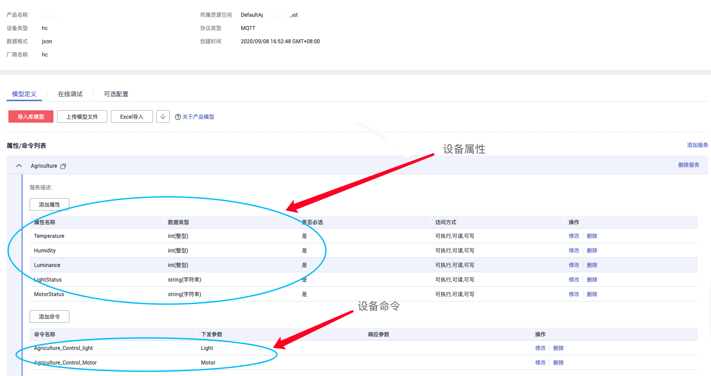

​			设备属性包括：温度、湿度、光照强度、LED状态、Motor状态。设备命令包括两条：控制LED  ON/OFF,控制Motor ON/OFF。

### 创建设备

​		当产品模型创建完毕之后，我们可以创建基于该产品模型的设备。设备-->注册设备。根据对话框填写对应的信息。本文为了方便创建的设备标识为demoTest,秘钥为012345678(该设备已经删除，请勿连接)。结果如下：

​		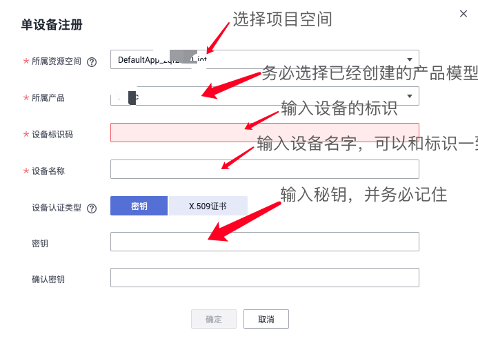

​			注册成功之后如下:

​	

​		至此，我们已经注册了端侧设备，并可以在我们的设备-->所有设备中看到我们新注册的设备。

## 设备端开发

​		设备端的开发主要包括配置工程、编译烧录、调试几个步骤。下文基于此逐一进行介绍。

### 工程配置

​		由于SDK是一个全栈的软件，包含所有的代码，因此我们需要告知编译器哪些文件需要编译、怎么编译这些文件，这个工作主要是由menuconfig完成。关于工程配置指导可以参考[工程配置示范](../../tools/kconfig/Readme.md)。

​		进入到target/STM32L431_BearPi目录下，输入menuconfig(macos或者linux输入menuconfig.py)即可进入到配置界面。

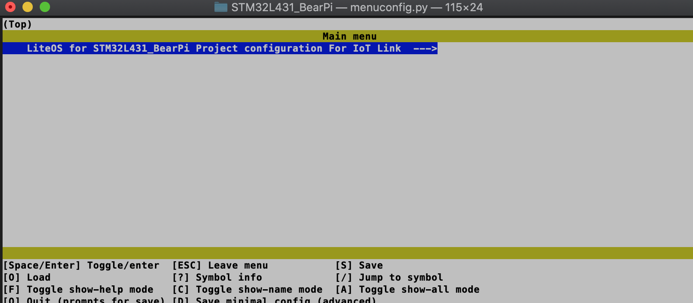

确认进入SDK的配置。

#### 开发板的串口以及DEMO选择

​	   设置AT串口波特率和模组匹配；设置设备ID和秘钥，其和在IoT平台上创建设备时候的设置一致。

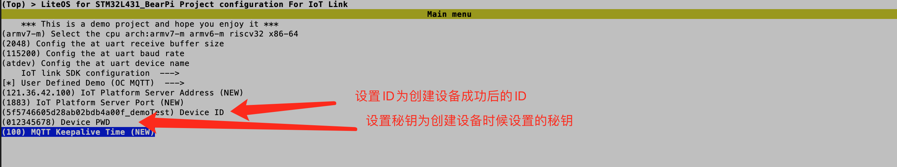

#### TCPIP配置

​	在Network下，选择TCPIP功能，并设置esp8266模式，并设置热点的SSID和PWD。

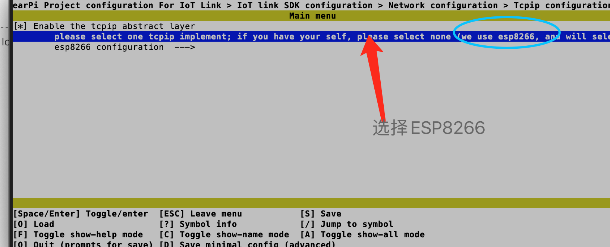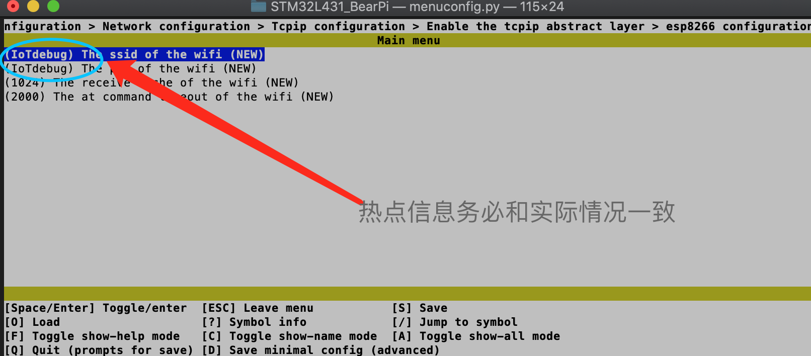

#### 配置SSL

​		配置MBEDTLS的主要原因是，IoT平台生成MQTT的三元组的时候需要使用到HMAC算法。使能TLS并选择mbedtls并配置为CERT模式。

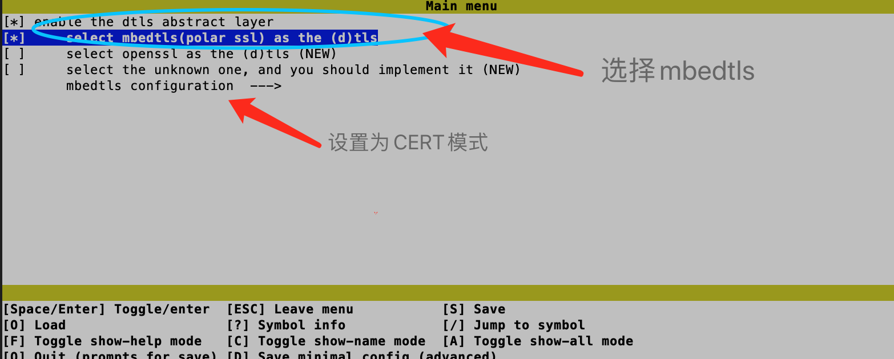

#### 配置MQTT协议

​	在Network菜单下使能MQTT。此处配置的MQTT为标准MQTT协议。

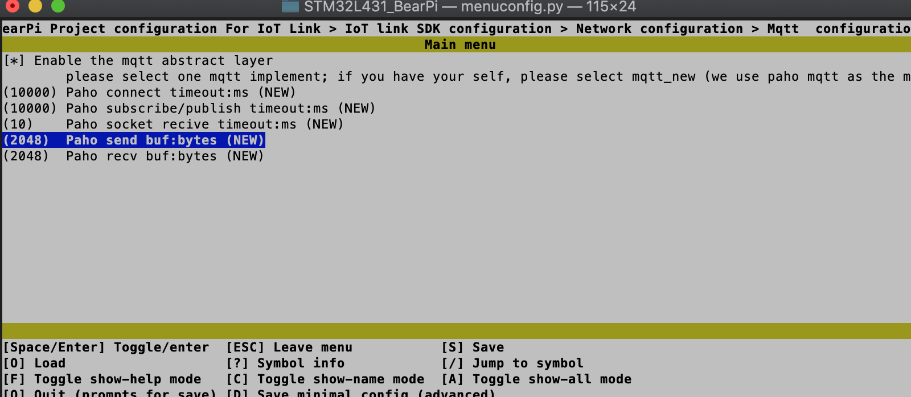

#### 配置IoT MQTT接入服务

在OC菜单下，使能OC MQTT（可以选择关闭OC COAP以及OC LWM2M）。

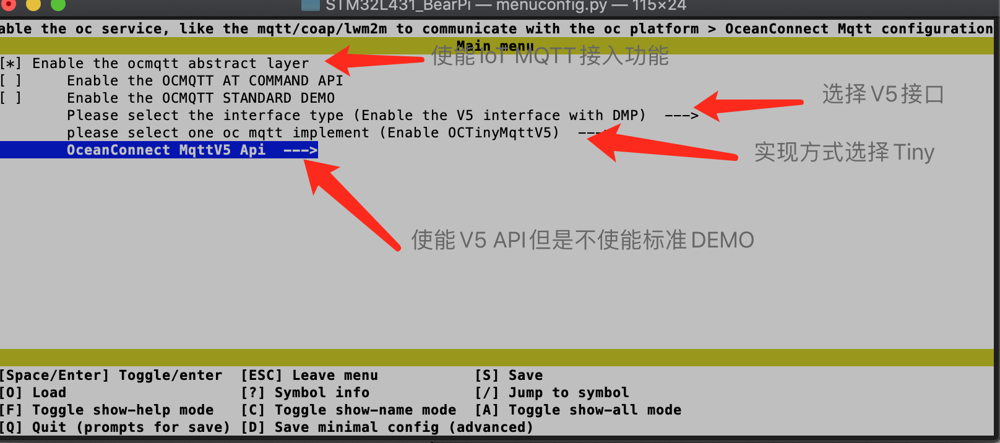

此处我们配置的为MQTT 接入IOT的流程；没有使能标准DEMO是因为我们使用target下的demo.

输入Q并保存退出，会发现我们刚才的配置会保存在.config文件中。

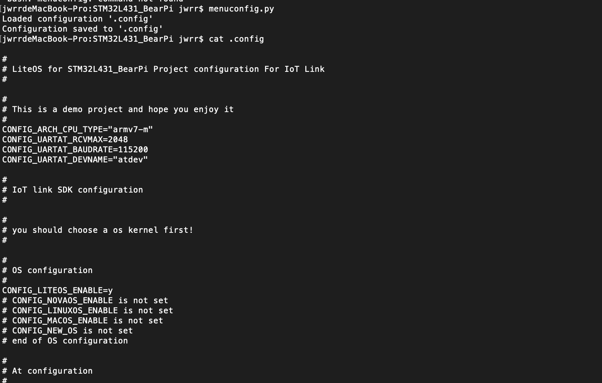

再输入genconfig(genconfig.py)会生成或者更新iot_config.h文件。Makefile依据.config文件选择哪些组件编译；编译器会根据iot_config.h文件决定怎么编译这个组件。

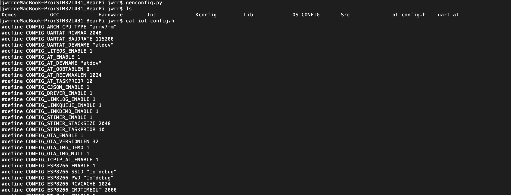

至此我们对于工程的配置已经完成。

### 编译烧录调试

#### 编译	   

 功能源码采用的是Makefile进行组织，理论上你有Make工具以及对应的交叉编译器都可以进行编译。本文使用的是AC6公司的SW4ST这个工具（基于Eclipse的一款工具）。其使用可以参考[SW4ST使用](../Huawei_IoT_Link_SDK_IDE_SW4STM32(AC6)_Guide.md)

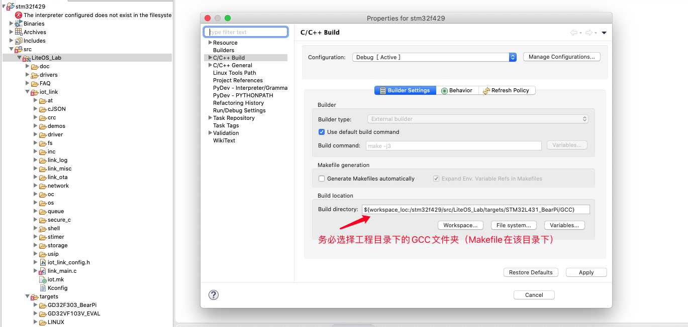

在SW4ST的菜单Project-->Clean下勾选清除后编译即可编译，并可以在Console下看到编译结果。

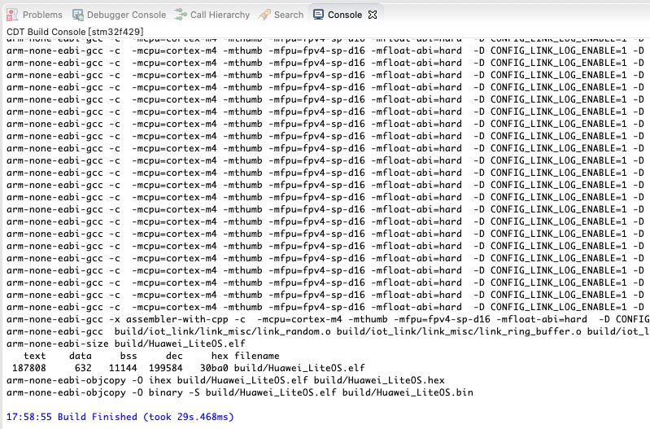

如果出现FLASH溢出行为，可以将不需要的组件（stime shell）通过配置禁用；或者在Makefile中修改优化等级从-O0 -g修改为-Os。

#### 烧录

在SW4ST的菜单中Run-->Debug Configurations。

创建一个Ac6 STM32Debugging(使用的stlink)。

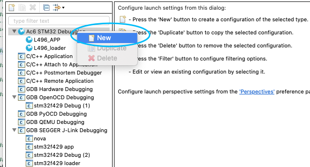

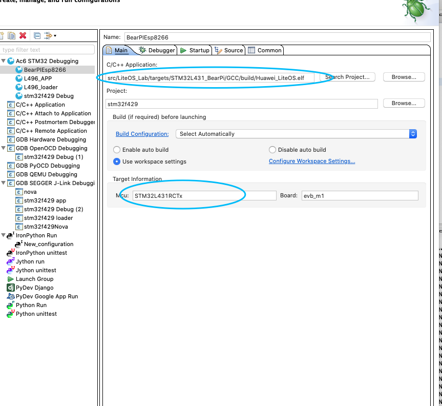

只需要保证MCU的型号一致即可。

对于BearPI而言，还需要设置重启模式，设置为软模式即可。

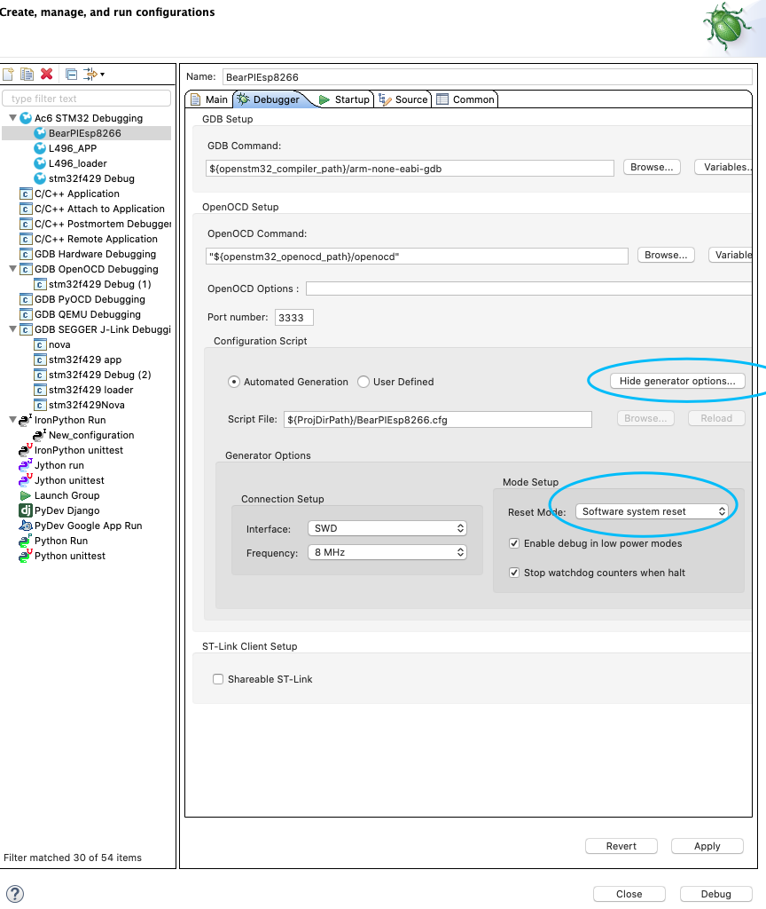

点击apply并debug，可以看到烧录完毕并进入调试界面。

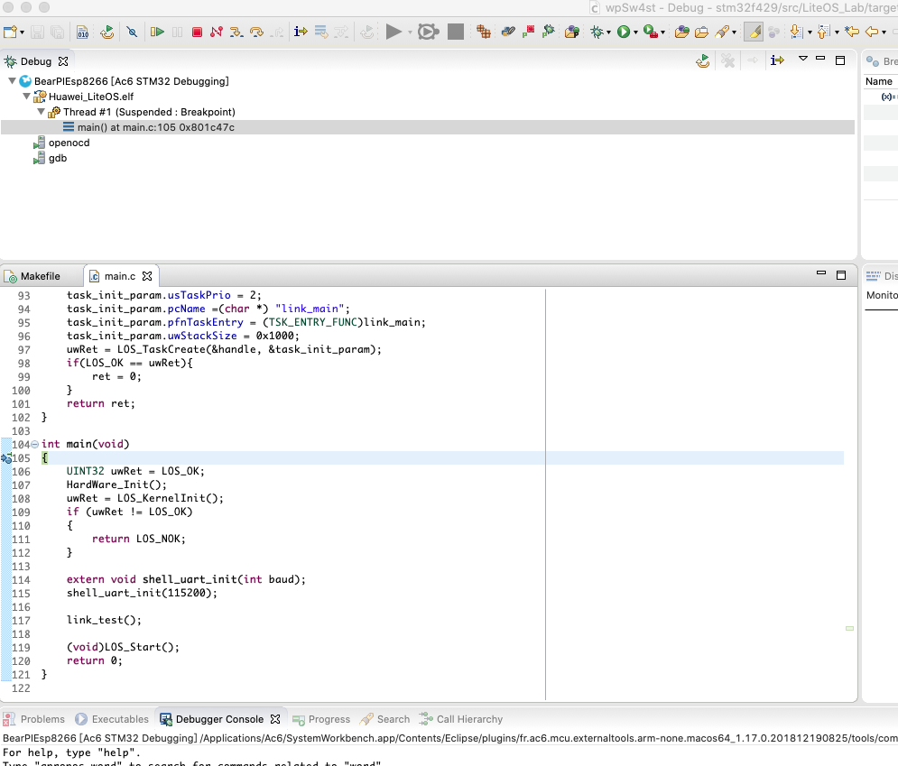

#### 调试

​    进入debug页面之后，我们可以像其他的IDE一样step into/step over/step out/run等调试。

同时可以接入串口，设置正确的波特率，会看到系统的输出信息。（wifi连接上并获取IP，向IoT平台订阅主题成功）。

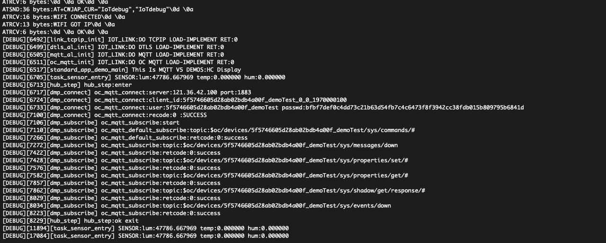

### 联合调试

#### 设备在线并上报信息	

当端侧显示连接OK时候，我们在IoT平台可以看到对应的设备应该已经在线，并接收到对应数据。

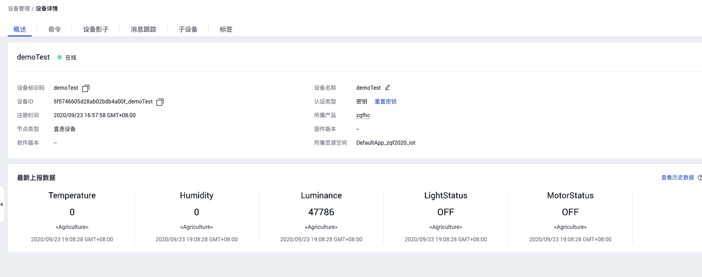

#### IoT平台下发命令

在命令中选择同步命令下发，可以观测到端侧设备可以接收到相关的命令。

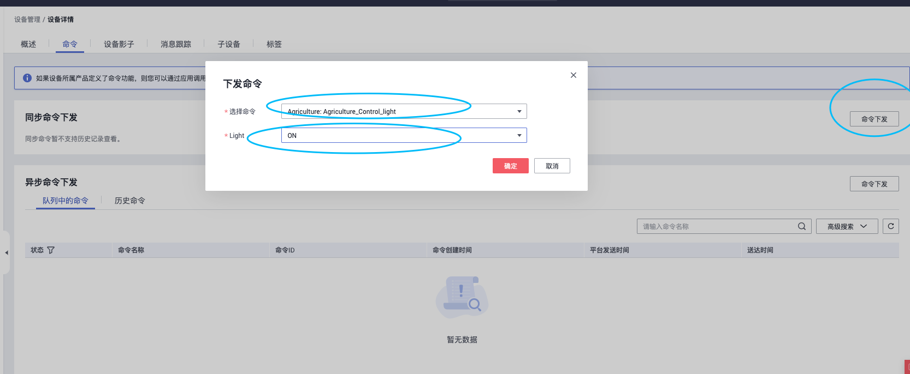

至此，我们将设备端和IoT平台的数据交互通道打通。