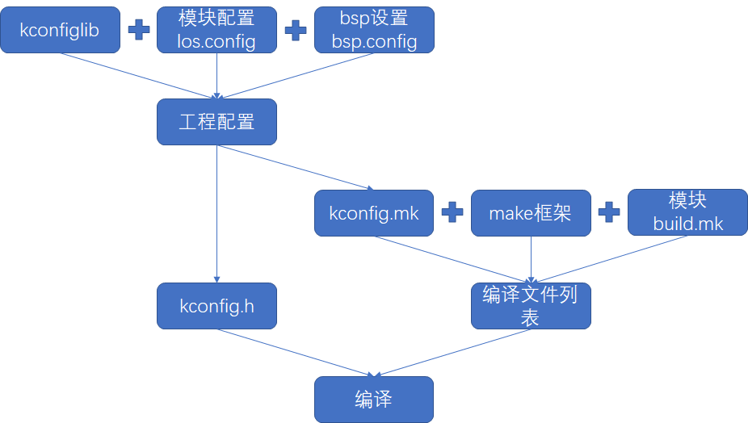

## 实现思路
编译模块的选择，编译模块相关参数的配置，由kconfig来实现。kconfig是业界多种操作系统广泛应用的配置方法。使用方便，语法简单。编译过程由make系统负责。通过实现Makefile框架，每个模块只需编写非常简单的“build.mk”文件即可配合kconfig完成所有模块的编译控制。

工作原理如下图所示：



### 实现细节
#### kconfig
##### kconfig库
kconfig脚本的解析选择开源实现，仓库托管于位于<https://github.com/ulfalizer/Kconfiglib>。在我们的仓库中使用`submodule`的机制引用进来。在代码树中的位置为`scritps/kconfig`。

##### kconfig配置脚本的编写
kconfig的语法比较简单，在这里不再详述。我们需要按照我们代码的目录结构，模块划分，编写kconfig脚本文件，描述每个模块以及模块中的变量配置，比如：

```
config BASE_CORE_TIMESLICE
    bool "Configuration item for task Robin tailoring."
    default y

config BASE_CORE_TIMESLICE_TIMEOUT
    int "Longest execution ticks of tasks with the same priorities."
    depends on BASE_CORE_TIMESLICE
    default 10
```

每个源代码模块都应该通过编写kconfig描述自己以及自己的变量配置。

根目录下的配置文件内容为：

```
mainmenu "Huawei LiteOS configuration"

rsource "arch/los.config"
rsource "components/los.config"
rsource "demos/los.config"
rsource "drivers/third_party/los.config"
rsource "kernel/los.config"
rsource "targets/los.config"
```

通过每个模块的配置文件，层层拓展，在此不再展开，详情可参考kconfig语法。

##### BSP配置
在本kconfig+make实现中，bsp有两个作用：
1. 一个模块，和其他模块代码一样提供一个编译模块
2. 对整个系统中的模块选择，变量配置的特化，为编译提供最原始的特性化配置

BSP通过bsp.config选择内核特性，包括MCU型号，厂商SDK名称，主频等等。

##### kconfig脚本的parse
我们需要根据我们的自身需求编写kconfig脚本的parse工具。我们对此parse工具的需求如下：
1. 根据前文所述的kconfig配置信息以及bsp的初始化配置选择生成供make框架使用的配置信息，和编译所需头文件
2. 支持通过形如`LOSCFG_XXX=y`或`LOSCFG_XXX=50`之类的参数配置工程的编译。

kconfig脚本的parse工具位于`scritps/prjconf`

## 使用方法
### 模块
kconfig脚本的编写这里不再赘述，仅描述make框架下每个模块的make描述脚本如何编写。

make是一个从顶层根目录一层一层描述扩展到子目录的，描述文件为`build.mk`。该文件的内容主要是通过Makefile变量描述要编译的子目录，当前目录包含的源代码，当前目录提供的include目录，追加全局编译选项，当前目录下文件的编译选项，当前模块下某个源代码需要的特殊编译选项等等。
1. 子目录列表由`sub-y`描述
2. 当前目录下源代码列表由`src-y`描述
3. 当前子目录下（以及子目录）的编译选项由`cflags`描述
4. 当前子目录追加的全局编译选项由`cflags-g`描述
5. 当前模块提供的头文件目录列表由`inc`描述

注意，所有描述子目录，源码目录，都采用相对路径，即相对于当前`build.mk`所在目录的相对目录，目录可以跨级。源码列表可以选用子目录中的文件。同时这些路径都可以使用`*`通配符。

#### 跟kconfig配置结果结合
由kconfig配置脚本和kconfig的parse工具生成的Makefile配置信息会将被选择的模块名定义为值为`y`的变量，比如，当选择了`LOSCFG_KERNEL_TICKLESS`，在生成的`kconfig.mk`中，会有如下定义：
```
LOSCFG_KERNEL_TICKLESS=y
```
Makefile框架在编译时会包含此文件，所以可以在tickless模块对应的`build.mk`中这么写：
```
src-$(LOSCFG_KERNEL_TICKLESS) += xxx.c yyy.c
```
这样当`LOSCFG_KERNEL_TICKLESS`被选中会定义`src-y += xxx.c yyy.c`如果没有被选中，则仅仅会定义`src- += xxx.c yyy.c`，而Makefile框架并不会采用这个结果。这样就达成了我们根据配置选择源代码的目标。
同理，我们可以根据模块的配置选择子目录由于子目录跟源代码列表类似，变量名约定为`sub-y`，在此不再赘述。

### 新加target

现在在添加新的target（bsp）的时候，需要同时将其加入到make系统和kconfig系统中。

#### 加入到kconfig系统
在源码`LiteOS/targets/los.config`里，描述了target的选择结构。新target需要参照以往target添加。类似：
```
menu "targets/bsps configuration"

choice TARGET
    prompt "please select target:"
config IOTCLUB_EVB_L1
    bool "IoTClub-EVB-L1"
    select CORTEX_M4
config IOTCLUB_EVB_M1
    bool "IoTClub-EVB-M1"
    select CORTEX_M4
endchoice
    
endmenu
```
#### 加入到make系统
在源码`LiteOS/targets/build.mk`里，参考现有内容添加新target的内容，类似：
```
sub-$(LOSCFG_IOTCLUB_EVB_L1)     += IoTClub-EVB-L1
sub-$(LOSCFG_IOTCLUB_EVB_M1)     += IoTClub-EVB-M1
```
#### target本身
1. build.mk
target需要在自身目录下添加build.mk描述自己的源码列表。全局定义信息，头文件目录等。
2. bsp.config
bsp.config描述此target对组件的默认选择情况。

3. gcc目录
Makefile请参考现有，内容非常简单：
```
los_root := $(abspath ../../..)

ld_file := IoTClub-EVB-L1.ld

include $(los_root)/scripts/make/entry.mk
```
gcc目录下除了链接脚本的其他文件都是通过工具生成的。

4. target_config.h
此文件现在内容可以非常简单比如这样：
```
#ifndef _TARGET_CONFIG_H
#define _TARGET_CONFIG_H

#include "stm32l4xx.h"

#include "kconfig.h"

#endif /* _TARGET_CONFIG_H */
```
