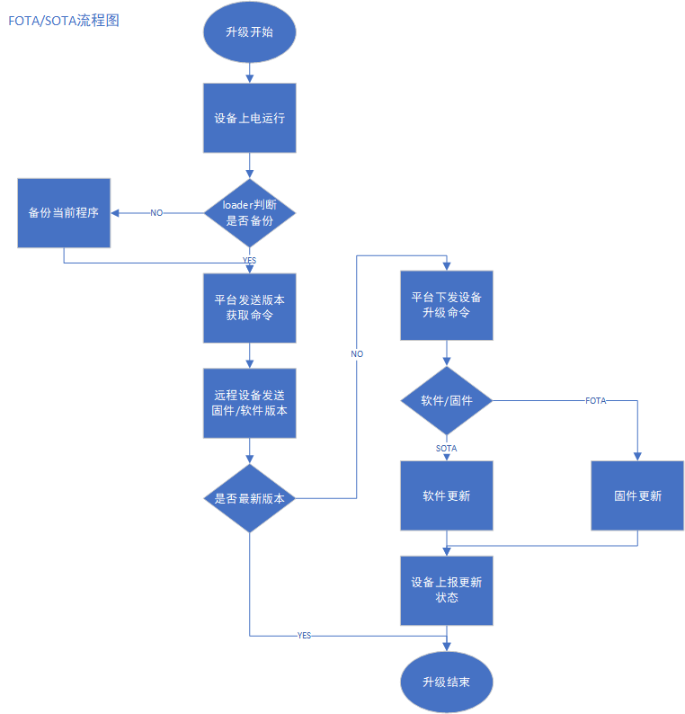
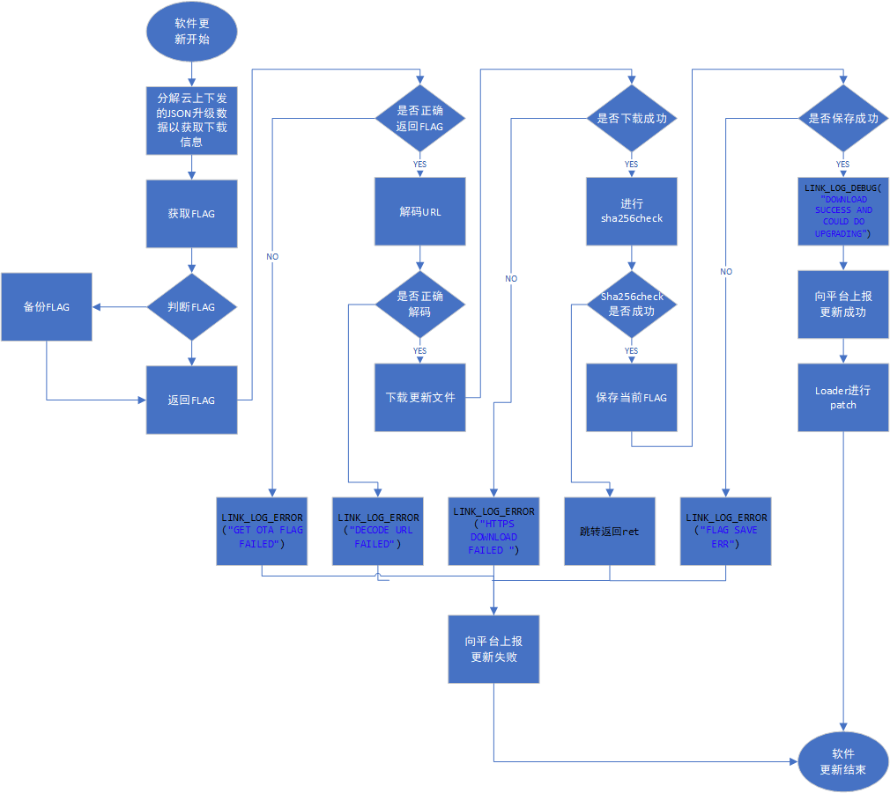

### 基于STM32F429 FIRE开发板的FOTA，SOTA实践
基于STM32F429 FIRE开发板的FOTA，SOTA升级流程如下图所示。

本文着重讲述软件更新/固件更新部分，其余部分可以参考[华为云软固件升级](<https://support.huaweicloud.com/api-iothub/iot_06_v5_3028.html>)
#### FOTA升级步骤
下图所示为具体的升级步骤流程。

当判断需要进行软件更新之后
1. 处理云平台上下发的JSON升级数据以获取下载信息（下载链接，文件版本，文件大小，签名信息等）
2. 获取当前程序的状态即flag，若获取失败打印LINK_LOG_ERROR("GET OTA FLAG FAILED")，上报平台更新失败信息
3. 解码URL下载链接，获取host，port，下载地址等信息，若获取失败打印LINK_LOG_ERROR("DECODE URL FAILED")，上报平台更新失败信息
4. 下载更新文件到download区域，若下载失败打印LINK_LOG_ERROR("HTTPS DOWNLOAD FAILED ")，上报平台更新失败信息
5. 下载完成之后进行sha256check校验，若校验失败跳转返回ret，上报平台更新失败信息
6. loader进行patch，上报平台更新成功信息
#### SOTA升级步骤
SOTA升级步骤与FOTA相同，本次程序更新修改了以下程序的以实现了SOTA
1. 需加入SOTA/FOTA区分程序段
2. 增加与FOTA相同的更新处理程序段，将ota类型改为EN_OTA_TYPE_SOTA
3. 在任务上报信息入口函数中将EN_OTA_TYPE_FOTA改为EN_OTA_TYPE_SOTA，将CN_OTA_FOTA_VERSION改为CN_OTA_SOTA_VERSION
4. 增加关于SOTA的捆绑函数ota_img_bind
	例如在文件flash_ota_img.c中的函数ota_img_init增加
	ota_img_bind(EN_OTA_TYPE_SOTA,&g_otaimg_flag);
	ota_img_bind(EN_OTA_TYPE_SOTA,&g_otaimg_backup);
	ota_img_bind(EN_OTA_TYPE_SOTA,&g_otaimg_download);
	ota_img_bind(EN_OTA_TYPE_SOTA,&g_otaimg_flagbackup);
	ota_img_bind(EN_OTA_TYPE_SOTA,&g_otaimg_running);
5. 在loader中加入处理SOTA的分支定义
#### SOTA升级包制作
SOTA升级包的制作与FOTA略有不同具体参考[华为云软件升级包制作指南](<https://support.huaweicloud.com/usermanual-iothub/iot_01_0047.html>)
注意：软件更新中，编译出来的.bin文件等类型也需要进行差分包或者全量包的制作
