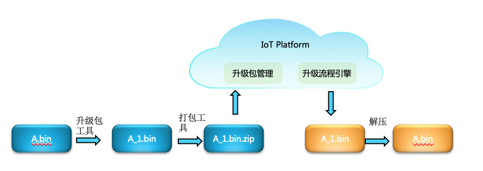
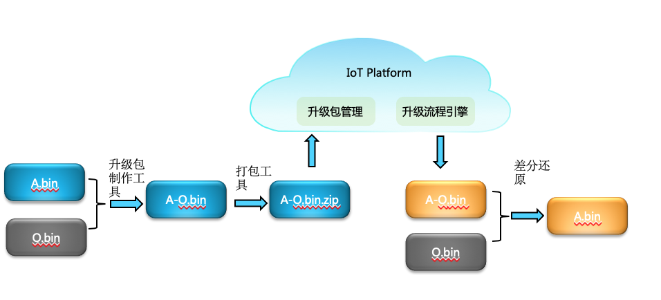

## OTA 方案概述

​	从整个流程看，OTA主要分为如下几个部分：

+ 开发者使用工具制作升级包
+ 开发者按照平台要求上传升级包
+ 开发者根据平台规则触发升级
+ 端侧和平台进行数据交互，下载数据包
+ 端侧启动升级

整个流程如下所示

从流程看， 升级包的制作和上传都需要开发者在本地完成；而升级包的下载以及升级包的还原需要端侧完成。需要主要的是：

+ 升级包的制作和端侧设备是需要配合的，制作相当于编码的过程，而升级还原相当于解码的过程；也就是端侧需要理解开发者制作的升级包，并能够完整的解压出来；本OTA使用HDIFFPATCH作为差分算法以及LZMA作为压缩算法。
+ 固件包的管理是开发者和平台之间的互动；在此过程中，平台出于安全等因素会制定自己的规则，需要开发者对升级包做一定的处理之后才能上传，通常包含签名以及添加必要的版本等信息；

下面的章节就上述流程展开论述。

###  升级包制作

提供ota_tools作为升级包的制作小工具， 该小工具是使用HDIFFPATCH以及LZMA制作的，提供了界面方便开发者使用；开发者也完全根据自己的需要手动编译工具或者使用第三方的差分工具来完成。

开发者使用该工具制作全量升级包以及差分升级包，并决定是否对生成的差分升级包进行数字签名。对于全量升级包，会使用lzma进行压缩；对于差分升级包，则务必基于当前运行的程序制作，否则当设备下载到差分升级包进行还原时，还原出的程序和原始程序会不一致。

简单的而言，对于全量升级包(A.bin为要升级的新程序)：

对于差分升级(其中O.bin为旧程序，也是当前设备正在运行的程序)：

 

关于差分制作工具的使用,参考[升级包制作工具说明文档](https://github.com/LiteOS/LiteOS_Lab/blob/iot_link/tools/ota_tool/ota_tool_user_guide.md)。

### 升级包打包上传

当前IoT平台需要先将使用升级包工具制作的升级包a.bin压缩为a.zip格式，然后使用打包工具进行签名为a.signed.zip，同时需要将打包工具使用的签名公钥上传到IoT平台上去，这样才能将a.signed.zip上传 [IoT 固件管理](https://console.huaweicloud.com/iotdm/?region=cn-north-4#/dm-portal/device/software-firmware/package) 。

### IoT平台升级流程

IoT平台的升级流程，主要包含基于LWM2M5号对象的固件升级、基于LWM2M 19号对象的PCP SOTA升级、基于HTTPS（针对MQTT）的软固件升级。

详细流程可以参考[IoT平台升级流程](https://support.huaweicloud.com/usermanual-iothub/iot_01_0047.html)。

## 设备端程序开发说明

针对OTA方案，端侧对于OTA而言主要有几个工作要实现：升级包下载、升级包存储、升级包还原。

### 升级包下载

对于IoT平台而言，不同的升级方案，其对应的升级包下载方式不同，参考[IoT平台升级流程](https://support.huaweicloud.com/usermanual-iothub/iot_01_0047.html)。

对应的端侧分别对应OTA_HTTPS组件、PCP组件、LWM2M组件。因此需要配合自己的连接方案配置对应的升级流程。

### 升级包存储

整个升级部分的存储区可以划分为如下几个部分：
如图所示: 

loader:如果有升级需求，则执行升级（解压缩以及差分还原）

Running:设备的应用程序

Flag:存储OTA的一些主要FLAG（OTA状态、下载升级包大小等）

Backup:用于备份当前的程序，区域大小一般选择和Running区域大小一致

Download:根据选择解决方案（差分还是全量）来定义其大小

为了保持升级交互流程对存储的调用统一，因此定义了一个标准的存储接口，存储开发者可以调用ota_img_bind将自己的存储接口挂载到系统上。ota_img_init是一个弱符号函数，开发者在该函数中初始化存储资源并将其挂载到系统中。详细定义参考ota_img.h文件定义。

当你已经实现了ota_img_init函数之后，可以打开CONFIG_OTA_IMG_CHECK来测试你的IMG适配是否OK。该配置项打开之后，会在调用ota_img_init之后调用img_check函数，采用产生随机数的形式来不定长度的读写IMG，整个过程会模拟FLAG读取以及存储、IMG的随机长度的读写、IMG的backup动作、recover动作以及patch动作，来协助开发者检查自己的IMG适配是否OK。

### 升级执行

​		对于升级，提供三个api供开发者调用，分别为ota_backup(执行备份操作，将当前运行的程序存储到备份区)、oat_patch(升级还原，根据下载包的内容决定做差分升级还是全量升级)、ota_recover(升级回滚，将备份区的内容拷贝到当前执行区)。

​		对于开发者而言，需要先备份然后执行升级，防止意外的升级失败。

## OTA实践

​	以STM32F429IGTx的野火开发板为例，[参考STM32F429实践](./ota_stm32f429.md)。

​        