### 基于STM32F429 FIRE开发板的MQTT OTA实践

#### 基本概述

使用的是stm32f429 野火开发板，采用MQTT协议接入IoT平台；OTA采用的是固件升级的方式；存储区loader以及running采用的是片内flash，flag/backup/download采用的是片外spiflash。

整个流程需要我们先在平台上建立好带升级功能的产品模型，以及基于此产品模型的设备；在本地端先编译出loader、版本1app、版本2app.使用版本1 版本2制作对应的升级版以及上传固件包，并上传到IoT平台。

#### IoT平台创建产品以及设备

选择手动创建一个MQTT的产品，包含一个service为DeviceStatus, 其中一个属性为radioValue.关键信息厂商名字以及产品名字务必保存，在上传升级包的时候用到；

如下所示：

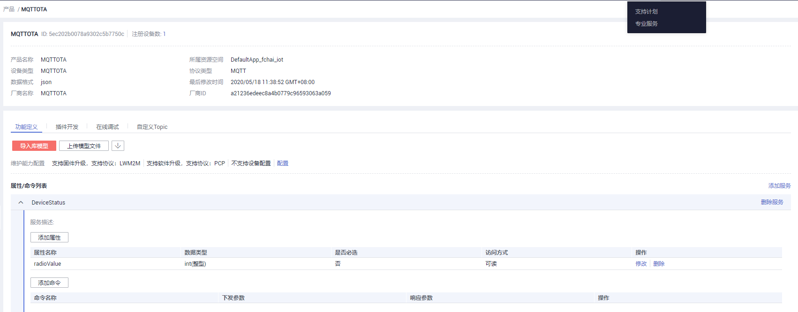

再建立该对应的设备，需要记住设备ID以及设备秘钥，需要和代码中一致。

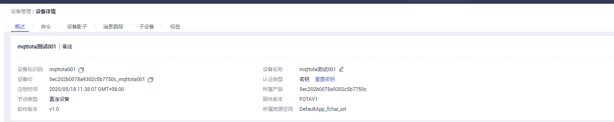

关于创建产品的细节可以参考[iot平台产品创建](<https://support.huaweicloud.com/devg-iothub/iot_01_0058.html>)

#### 本次侧编译loader以及固件

##### 配置并编译loader

loader中我们只需要配置到对应的OS、OTA以及其PATCH功能即可。使用menuconfig配置如下：

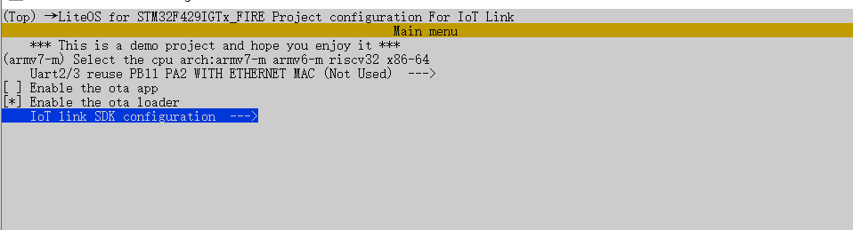

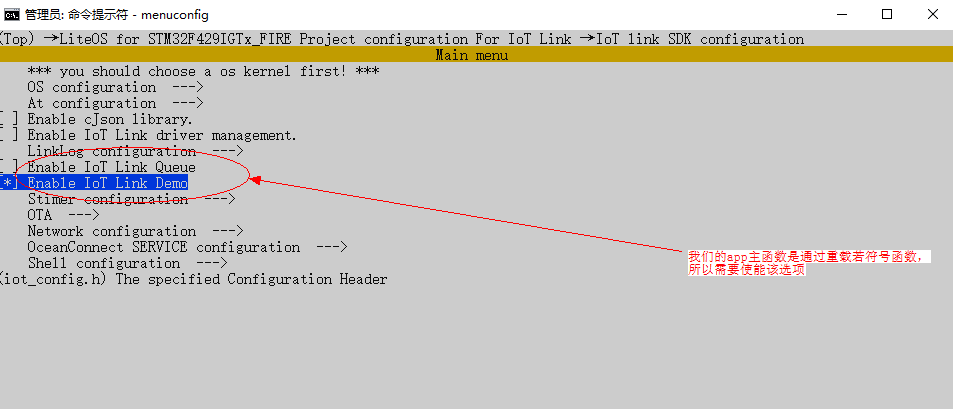

配置完毕使用genconfig更新对应的iot_config.h文件

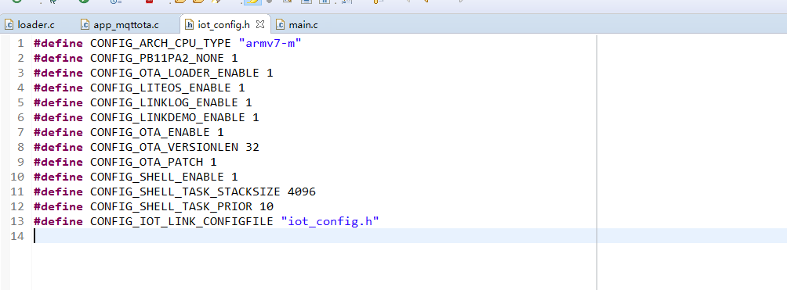

该模式下我们已经完成了loader的配置，通过make来编译对应的loader可执行文件（该连接脚本会调用loader.ld）（可以通过裁剪OS以及删除shell,修改编译选项为-Os来优化编译体积，为了调试方便，本次不做类似修改）

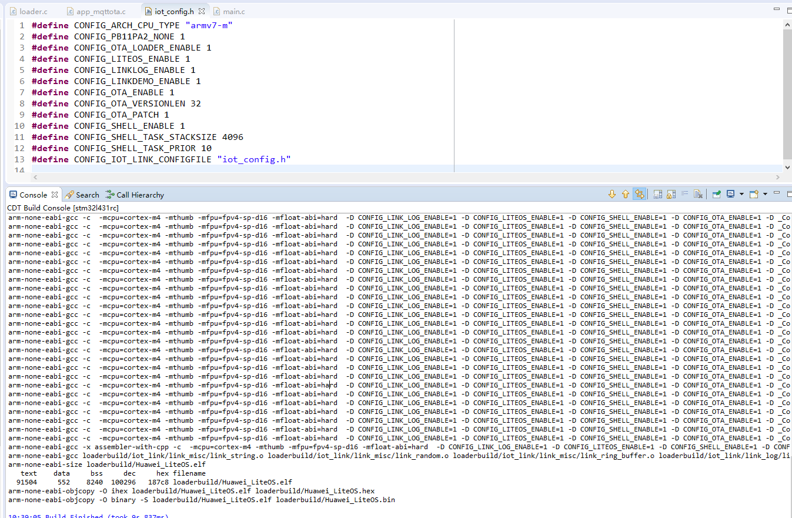

编译完毕之后，可以通过jflash或者其他的调试工具烧录进MCU，重启后可以看到串口输出：

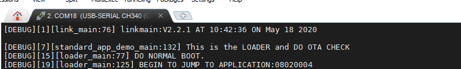

至此，loader部分配置/编译/烧录完成

#### APP应用编译

本APP方案为：SDK配置为：采用LiteOS内核、TCPIP采用lwip 、DTLS采用的是mbedtls的证书模式、MQTT采用的是PAHO、OCMQTT服务采用的是V5接口（不使能V5接口的自带DEMO）；BSP配置为使能板件的MAC功能（LWIP驱动程序）、使能ota_app功能。使用menuconfig以及genconfig重新配置并生成配置文件（包含iot_config.h以及.config）

生成的iot_config.h文件如下：

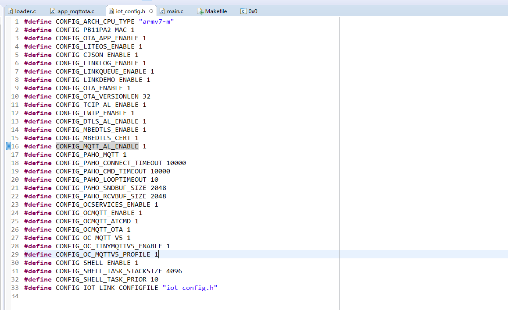

编译并下载该APP到MCU上，确保该程序能够连接上iot平台并能上报数据。

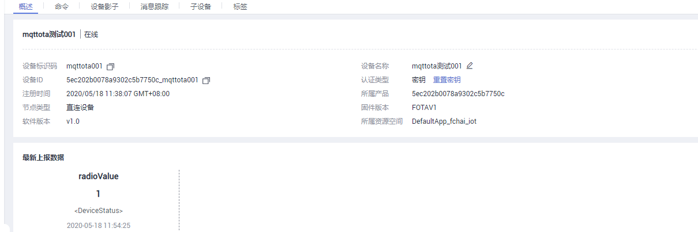

并能够在端侧通过shell查看当前的版本信息

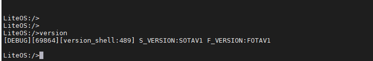

将该APP版本的bin文件拷贝出，用作后续的升级包制作，定义为FOTAV1版本，命名为appv1.bin；

修改app_mqttota.c文件的FOTAVERSION，修改为“FOTAV2”，保持配置不变，重新编译生成bin文件，拷贝出来命名为appv2.bin.这样我们就生成了两个版本的程序:appv1.bin以及appv2.bin

#### 本地侧制作升级包

需要在SDK包的tools/ota_tools中解压出差分制作工具。全量升级包不依赖于当前的运行程序；而差分包依赖于当前的运行程序进行还原。

##### 本地全量包制作

打开ota_tools，选择全量模式，以及选择需要制作的程序appv1.bin，最后生成appv1c.bin

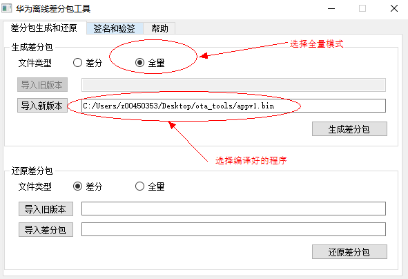

同理我们制作程序appv2.bin的升级程序appv1c.bin

##### 本地差分包制作

选择差分模式，同时旧程序选择appv1.bin，新程序选择appv2.bin，制作最后的升级包appv1v2.bin.该升级包表示v2对v1的差分部分，同时要求当前运行的程序必须是v1。

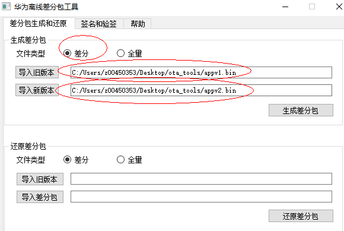

至此，我们已经制作了三个升级包：appv1c.bin（版本为FOTAV1）  appv2c.bin(版本为FOTAV2) appv1v2.bin（版本为FOTAV2）

#### 本地侧上传升级包

需要下载IoT平台的签名工具对升级包签名并上传。

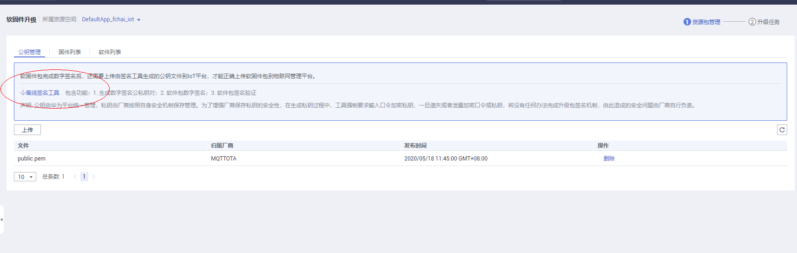

打开签名工具，生成对应的公钥和私钥（私钥需要填密码）

在公钥管理上，上传生成的公钥，后文需要使用对应的私钥来对文件进行签名。我们将生成的升级包分别压缩为appv1c.zip  appv2c.zip appv1v2.zip.以appv1c.zip来示例制作上传用的升级包（其他两个升级包采用类似的操作），运行离线签名工具：

1. 导入生成的私钥文件

2. 导入我们的升级包appv1c.zip。

3. 执行签名动作，会生成appv1c_signed.zip文件（该文件即为我们要上传的升级包）

4. 导入生成的公钥文件

5. 导入生成的程序包appv1_signed.zip

6. 执行验签动作，如果验证通过，则证明制作的上传包OK，否则需要重新检查

   选下所示：

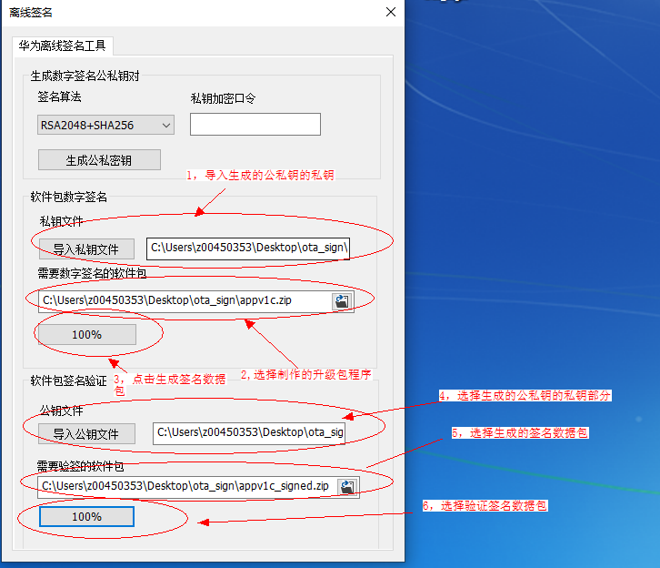

同理我们制作另外两个包：appv2c_signed.zip appv1v2_signed.zip

当制作完成之后，选择上传固件包，将我们制作的升级程序上传到IoT平台上。

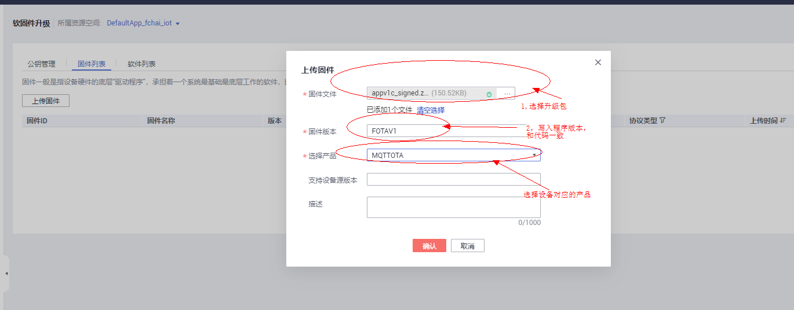

按照上传格式将三个升级包都上传到我们的固件包管理中；其中版本信息和程序中对应（appv1.bin为FOTAV1, appv2.bin为FOTAV2， appv1v2.bin为FOTAV2）

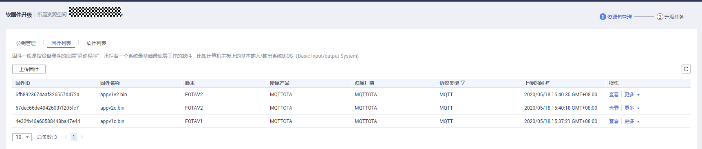

#### 本地侧烧写loader以及版本app

OTA升级是建立在本地能够启动并且连接到IoT平台的基础上，因此需要在本地烧录loader以及应用程序appv1.bin。

#### 触发升级以及观测结果

##### 执行全量升级

通过shell或者其他方式确认当前运行的程序为FOTAV1版本。然后再IoT平台上创建一个升级任务，升级固件选择appv2c.bin,同时选择对应的产品。

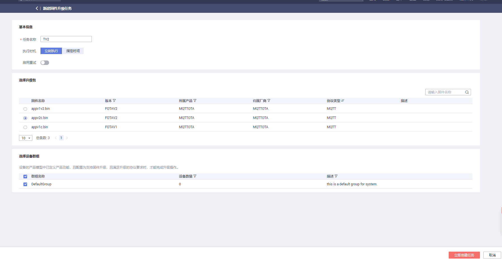

创建成果之后，我们可以看到端侧会受到固件升级的命令以及固件URL，启动https从IoT平台拉取升级包并启动升级。

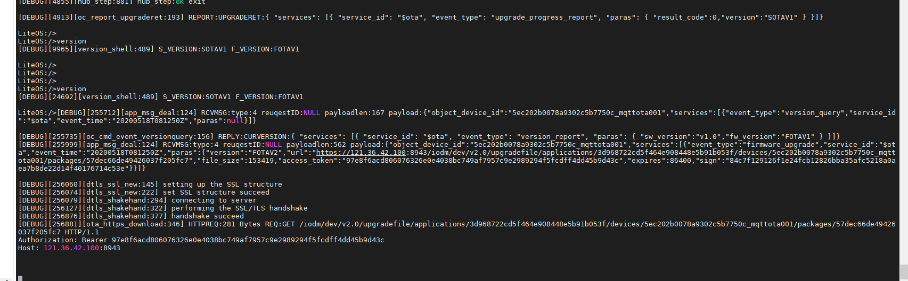

当升级完毕之后，会上传当前的升级结果。同时我们也可以从shell中查询升级之后的版本信息。

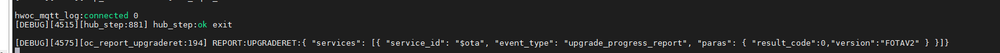

##### 执行差分升级

差分升级和全量升级的操作一致，只不过务必确保MCU当前执行的程序和我们制作差分升级包的时候使用的旧版本程序一致，否则可能存在差分还原出错的问题。

#### 关键代码和脚本的说明

#####  端侧的存储驱动

端侧的存储驱动代码在ota_flash中，通过hal_flash.c 以及hal_spi_flash.c分别驱动片内flash以及片外spi flash

##### 端侧的升级流程

端侧的升级流程为loader.c文件，需要menuconfig选中loader之后才会参与编译，同时编译链接脚本为os_loader.ld,将整个文件定位到0x08000000~0x0801FFFF的位置。在loader总会读取flag，check当前是否需要升级；如果需要执行升级则先调用ota_backup进行备份，然后调用ota_patch进行升级（全量或者差分）；如果升级失败，则调用ota_recover进行还原；

##### 端侧的应用程序

端侧的应用程序为app_mqttota.c文件，需要menuconfig选中app之后才会参与编译，同时编译链接脚本为os_app.ld。在app的主程序中，建立和IoT平台的链接，上报升级结果（如果有需要上报的请求）。

