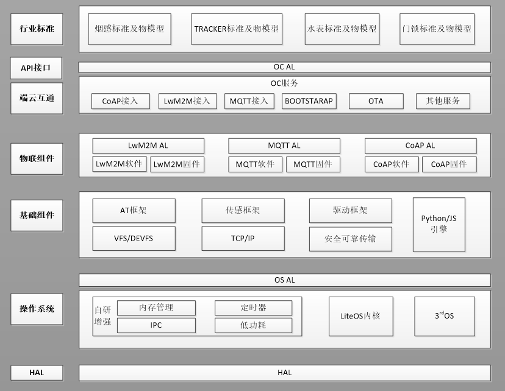
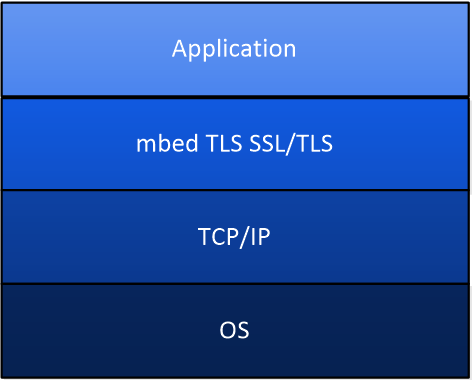
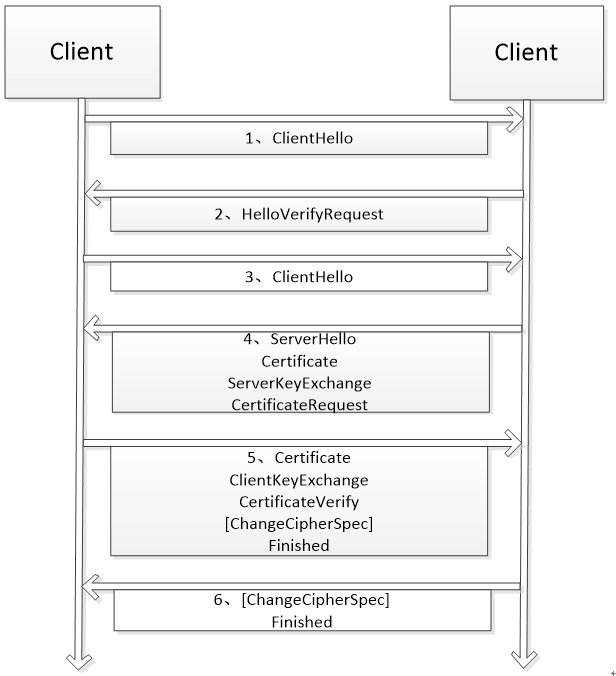
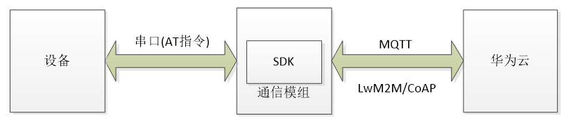
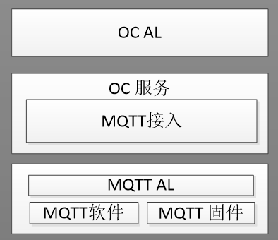
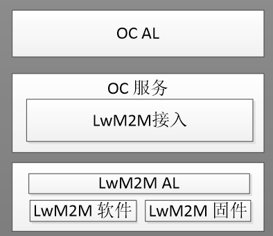
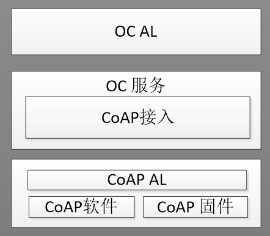
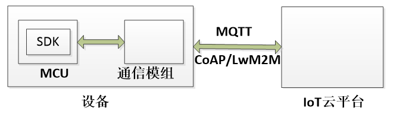
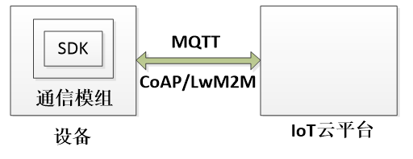

# 1 知识共享许可协议说明

**您可以自由地：**

​		**分享** — 在任何媒介以任何形式复制、发行本作品

​		**演绎** — 修改、转换或以本作品为基础进行创作

​		只要你遵守许可协议条款，许可人就无法收回你的这些权利。

**惟须遵守下列条件：**

​		**署名** — 您必须提供适当的证书，提供一个链接到许可证，并指示是否作出更改。您可以以任何合理的方式这样做，但不是以任何方式表明，许可方赞同您或您的使用。

​		**非商业性使用** — 您不得将本作品用于商业目的。

​		**相同方式共享** — 如果您的修改、转换，或以本作品为基础进行创作，仅得依本素材的授权条款来散布您的贡献作品。

​		**没有附加限制** — 您不能增设法律条款或科技措施，来限制别人依授权条款本已许可的作为。

**声明：**

​		当您使用本素材中属于公众领域的元素，或当法律有例外或限制条款允许您的使用，则您不需要遵守本授权条款。

​		未提供保证。本授权条款未必能完全提供您预期用途所需要的所有许可。例如：形象权、隐私权、著作人格权等其他权利，可能限制您如何使用本素材。


​		为了方便用户理解，这是协议的概述。您可以访问网址<https://creativecommons.org/licenses/by-nc-sa/3.0/legalcode>了解完整协议内容。

# 2 前言

**目的**

​		本文档用于指导开发者了解IoT Device SDK Tiny，并且能够通过集成IoT Device SDK Tiny对接华为云IoT物联网平台，开发自己的物联网应用。

**符号约定**

​		在本文中可能出现下列标志，它们所代表的含义如下。

| 符号                                 | 说明                                                         |
| ------------------------------------ | ------------------------------------------------------------ |
|  | 用于警示潜在的危险情形，若不避免，可能会导致人员死亡或严重的人身伤害 |
|  | 用于警示潜在的危险情形，若不避免，可能会导致中度或轻微的人身伤害 |
|  | 用于传递设备或环境安全警示信息，若不避免，可能会导致设备损坏、数据丢失、设备性能降低或其它不可预知的结果 “注意”不涉及人身伤害 |
|  | “说明”不是安全警示信息，不涉及人身、设备及环境伤害信息       |

**术语**

| 序号 | 术语名称              | 描述                                                         |
| ---- | ---------------------| ------------------------------------------------------------ |
| 1    | IoT Device SDK Tiny |IoT Device SDK Tiny软件开发工具包（Software Development Kit），包括端云互通组件、FOTA、JS引擎、传感框架等内容。|
| 2    | 设备                 | 用于采集数据的嵌入式设备，比如STM32开发板，或者温湿度采集的传感器等。|
| 3    | 应用                |物联网平台中，应用包括用户在物联网平台上创建的应用和用户自行开发的应用服务器。应用是用户在物联网平台中为用户的业务划分一个项目空间，每个项目空间会分配一个应用ID和应用密钥，用于将开发完的应用服务器与真实设备接入到这个项目空间中，实现设备的数据采集和设备管理。应用服务器是用户基于物联网平台开放的API接口或者SDK进行自行开发的物联网应用，可接入物联网平台进行设备的管理。|
| 4    | 产品模型            | 产品模型（也称Profile）用于描述设备具备的能力和特性。开发者通过定义Profile，在物联网平台构建一款设备的抽象模型，使平台理解该款设备支持的服务、属性、命令等信息。  |
| 5    | 编解码插件            | 物联网平台和应用服务器使用JSON格式进行通信，所以当设备使用二进制格式上报数据时，开发者需要在物联网平台上开发编解码插件，帮助物联网平台完成二进制格式和JSON格式的转换。 |
| 6    | AT指令               | AT指令集是从终端设备（Terminal Equipment，TE)或数据终端设备（Data Terminal Equipment，DTE)向终端适配器(Terminal Adapter，TA)或数据电路终端设备(Data Circuit Terminal Equipment，DCE)发送的。本文通过AT指令操作WIFI或者GSM模组。|
| 7    | 端云互通组件          | 端云互通组件是华为物联网解决方案中，资源受限终端对接到华为云物联网平台的重要组件。 |
| 8    | 华为云物联网平台    | 华为物联网联接管理平台（IoT Connection Management Platform）是面向运营商和企业/行业领域的统一开放云平台，支持SIM和非SIM场景的各种联接和联接管理。 |
|9|nodeId|设备唯一物理标识，如IMEI、MAC地址等，用于设备在接入物联网平台时携带该标识信息完成注册鉴权。|
|10|deviceId|设备ID，用于唯一标识一个设备，在注册设备时由物联网平台分配获得，是设备在IoT平台上的内部标识，用于设备注册鉴权，及后续在网络中通过deviceId进行消息传递。|
|11|密钥|用于设备采用原生MQTT协议接入物联网平台时的鉴权认证。|
|12|MQTT|MQTT（Message Queue Telemetry Transport）是一个物联网传输协议，被设计用于轻量级的发布/订阅式消息传输，旨在为低带宽和不稳定的网络环境中的物联网设备提供可靠的网络服务。MQTTS指MQTT+SSL/TLS，在MQTTS中使用SSL/TLS协议进行加密传输。|
|13|CoAP|受约束的应用协议CoAP（Constrained Application Protocol）是一种软件协议，旨在使非常简单的电子设备能够在互联网上进行交互式通信。CoAPS指CoAP over DTLS，在CoAPS中使用DTLS协议进行加密传输。|
|14|LwM2M|LwM2M（lightweight Machine to Machine）是由OMA（Open Mobile Alliance)定义的物联网协议，主要使用在资源受限(包括存储、功耗等)的NB-IoT终端。|


# 3 了解SDK
## 3.1 SDK介绍
​		IoT Device SDK Tiny是部署在具备广域网能力、对功耗、存储、计算资源有苛刻限制的终端设备上的轻量级的互联互通中间件，您只需调用API接口，便可实现设备快速接入到物联网平台以及数据上报和命令接收等功能。

​		IoT Device SDK Tiny提供端云协同能力，集成了MQTT、LWM2M、CoAP、mbedtls、LwIP全套IoT互联互通协议栈，且在这些协议栈的基础之上，提供了开放API，用户只需关注自身的应用，而不必关注协议内部实现细节，直接使用SDK封装的API，通过连接、数据上报、命令接收和断开四个步骤就能简单快速的实现与华为云IoT平台的安全可靠连接。使用该SDK，用户可以大大减少开发周期，聚焦自己的业务开发，快速构建自己的产品。

​		同时该SDK还具有可裁剪特性，在移植过程中可以根据需求进行定制化组件，节省内存空间，减小移植难度。

## 3.2 软件架构
​		IoT Device SDK Tiny的软件架构如下图所示，主要分为以下几层：

- API接口：通过应用编程接口将SDK能力开放给设备，终端设备调用SDK能力，快速完成华为物联网平台的接入、业务数据上报、下发命令处理等。

- 端云互通组件：提供了终端采用MQTT、CoAP、LWM2M等多种协议接入华为云物联网平台的能力。

- 物联组件：集成了MQTT、CoAP、LWM2M等物联网标准协议，您也可以根据现有设备特征，添加自定义的协议。

- 基础组件：提供了驱动、传感器、AT指令等框架，您可以基于SDK提供的框架，根据具体的硬件平台进行适配。

- OS适配层：提供了LiteOS、NovaOS、linux、ucos_ii、macOS、FreeRTOS等多操作系统的适配，您也可以根据需要去适配自己的操作系统。


- HAL硬件平台抽象层：提供交叉编译能力，以便于SDK 集成在不同硬件平台。




​		集成策略如下图所示：

|         集成策略     |说明                        |
|:---------------------:|----------------------------|
|可集成性|作为独立的组件，不依赖特定的芯片架构和网络硬件类型，可以轻松的集成到各种通信模组上，如NB-IoT模组、WIFI模组、GSM模组、以太网硬件等。|
|可移植性|适配层提供了常用的硬件以及网络适配接口，终端或者模组厂家可以根据自己的硬件实现这些接口后，即可完成SDK的移植。|
|集成约束|SDK的集成需要满足一定的硬件规格（1）要求模组、芯片有物理网络硬件支持、能支持UDP协议栈（2）模组、芯片有足够的Flash和RAM资源供协议栈做集成。建议硬件选型规格如下所示；RAM容量 > 32K，Flash > 128K , CPU频率 > 100MZ|


## 3.3 安全介绍
​		IoT Device SDK Tiny以LwM2M/CoAP协议端云连接传输数据包时，不能保证UDP通信双方的身份认证、消息传输过程中的加密传输，所以使用DTLS(Datagram Transport Layer Security)，即数据包传输层安全性协议进行加密。

​		DTLS握手协议和TLS类似。DTLS协议在UDP之上实现了客户机与服务器双方的握手连接，在握手过程中验证对方的身份，并且使用RSA或者DH（Diffie-Hellman）实现会话密钥的建立，以便在后面的数据传输中对数据加密。它利用cookie验证机制和证书实现了通信双方的身份认证；并且用在报文段头部加上序号，缓存乱序到达的报文段；还利用重传机制实现了可靠传送。在握手完成后，通信双方就可以利用握手阶段协商好的会话密钥来对应用数据进行加解密。

​		IoT Device SDK Tiny使用mbedtls加密库实现加密的优点：mbedTLS（前身PolarSSL）是面向嵌入式系统，实现的一套易用的加解密算法和SSL/TLS库。mbedTLS系统开销极小，对于系统资源要求不高。mbedTLS是开源项目，并且使用Apache 2.0许可证，使得用户既可以讲mbedTLS使用在开源项目中，也可以应用于商业项目。目前使用mbedTLS的项目很多，例如Monkey HTTP Daemon，LinkSYS路由器。

​		其软件架构如下图所示：



​		IoT Device SDK Tiny首先和物联网开放平台完成握手流程，后续的应用数据将全部为加密数据，其握手流程大致如图所示：



## 3.4 OTA升级

​		IoT Device SDK Tiny端云互通组件支持物联网开放平台的软固件升级。软件或者固件升级都可以分为下载、升级、上报的流程。端侧设备需要配合云端的下载或者上报流程完成程序的更新。关于云端的软固件升级可以参考[云端软固件升级](https://support.huaweicloud.com/api-iothub/iot_06_v5_3027.html)。目前OTA升级的方式包含LWM2M和MQTT两种方式。


# 4 下载SDK

​		IoT Device SDK Tiny的源码还是托管在github上https://github.com/LiteOS/LiteOS_Lab/tree/iot-device-sdk-tiny，代码会持续更新。进入网址后选择master分支;选择Clone并且下载源码压缩包;

​		下载后解压获得源码文件夹，IoT Device SDK Tiny源代码目录说明：

|  一级目录 | 二级目录 | 三级目录 | 说明 |
|:--------|:--------|:---------|------|
| LiteOS_Lab | at                | ——       | AT指令框架实现                                               |
|| cJSON             | ——       | cJSON                                                        |
|| crc               | ——       | crc校验                                                      |
|                      |demos|——|示例|
|| driver            | ——       | 驱动框架                                                     |
||docs|——|存放使用文档及API说明等文档|
|| fs                | ——       | 文件系统，含VFS、SPIffs、RAMfs、KIfs、DEVfs、FATfs           |
|| inc               | ——       | 存放内核内部使用头文件                                       |
|| link_log          | ——       | 日志                                                         |
|| link_misc         | ——       | 杂项                                                         |
||link_ota|——|OTA升级代码实现|
||network|coap|CoAP的适配及协议实现|
|||tls|mbedtls的适配及协议实现|
|||lwm2m|LwM2M的开源协议栈wakaama的适配|
|||mqtt|MQTT的适配及协议实现|
|||tcpip|TCPIP适配及协议栈实现、lwIP驱动、OS适配及协议栈实现、MacOS_socket适配及协议栈实现|
||oc|oc_coap|CoAP协议适配华为云物联网平台|
|||oc_lwm2m|LwM2M协议适配华为华为云物联网平台|
|||oc_mqtt|MQTT协议适配华为华为云物联网平台|
||os|osal|IoT Device SDK Tiny的OS适配|
|||xxos|包括freertos、linux、liteos、macos、novaos、ucos_ii等操作系统的适配|
||queue|——|queue组件的代码实现|
||secure_c| ——       |C安全函数库|
||shell|——|shell组件代码实现|
||stimer|——|stimer组件代码实现|
|| storage           | ——       | 存储分区                                                     |
|| usip              | ——       | usip协议                                                     |
|| iot.mk            | ——       | Makefile                                                     |
|| iot_config.h      | ——       | 宏定义                                                       |
|| iot_link_config.h |——|                                                              |
|| link_main.c |——| SDK初始化入口 |
|| README.md         |——| SDK 简介                                                     |

# 5 集成开发
## 5.1 针对模组厂商
​		在物联网解决方案中，作为模组厂商的您需要让模组实现MQTTS、LwM2M、CoAP等物联网协议栈及连接平台的能力，您只需要将IoT Device SDK Tiny集成在现有的模组固件包中，这样模组就具备了接入华为物联网平台的能力。模组逻辑架构图如下：




​		设备通过AT指令驱动模组即可对接华为物联网平台。为了满足设备一致性要求，华为对AT指令做了统一规划，只有遵循规划的指令，集成的模组才具备认证资格。

​		因此，对于需要集成IoT Device SDK Tiny的模组厂商而言，您首先需要了解AT指令规划，再结合SDK系统架构框图，根据自身硬件特点选取需要移植的SDK组件，包括云服务抽象层API，物联组件协议适配和OS适配等。

​		关于AT指令的定义和参考使用烦请参考[ MQTT模组AT规划](https://support.huaweicloud.com/api-iothub/iot_06_v5_1400.html)。

### 5.1.2 云服务抽象层API
​		端云互通组件是IoT Device SDK Tiny中的重要组件，提供端云协同能力和基于MQTT协议和LwM2M协议、CoAP协议对接华为云的开放API。

​		对基于MQTT/ LwM2M/CoAP协议对接华为云的开发者（基于MQTT/ LwM2M/CoAP协议或基于支持MQTT/ LwM2M协议的模组，以及内置对接华为云的模组）而言，无需关注对接华为云物联网协议的实现细节，仅仅需要将所选择的物联网协议注册到云服务抽象层（OC AL），再调用OC AL提供的抽象层接口即可。


#### 5.1.2.1 OC-MQTT
​		OC AL提供的基于MQTT协议抽象层接口代码目录为：…\iot_link\oc\oc_mqtt，具体如下：


|目录|描述|
|:-|:-|
|…/oc_mqtt_al|适配华为OC服务的MQTT抽象层。通过注册机制，最终调用到用户注册的函数|
| …/oc_mqtt_tiny_v5    |SDK内置的soft类设备适配华为OC服务的MQTT的具体实现(针对云端V5版本接口)。|
|…/oc_mqtt_profile_v5|SDK内置的基于物模型的接口，解析了topic，定义了相关的数据格式|


​		OC AL提供的MQTT协议端云互通API烦请参考最新的oc_mqtt_al.h文件。

#### 5.1.2.2 OC-LwM2M


​		OC AL提供的基于LwM2M协议抽象层接口代码目录为：…\iot_link\oc\oc_lwm2m，具体如下：


|目录|描述|
|:-|:-|
|…/oc_lwm2m_al|华为云服务OC LwM2M的抽象层接口及实现。通过注册，最终调用底层的适配函数|
|…/atiny_lwm2m|SDK内置的soft类设备适配华为OC服务的LwM2M的具体实现。通过抽象层提供的oc_lwm2m_register注册函数，将相关功能注册到SDK中|
|…/oc_lwm2m_imp/boudica150|SDK内置的boudica150适配华为OC服务的LwM2M的具体实现。通过抽象层提供的oc_lwm2m_register注册函数，将相关功能注册到SDK中|

​		OC AL提供的基于LwM2M协议端云互通API参考oc_lwm2m_al.h文件。

#### 5.1.2.3 OC-CoAP
​		OC AL提供的基于CoAP协议抽象层接口代码目录为：…\iot_link\oc\oc_coap，具体如下：


|目录|描述|
|:-|:-|
|…/oc_coap_al|华为云服务OC LwM2M的抽象层接口及实现。通过注册，最终调用底层的适配函数|
|…/atiny_coap|SDK内置的soft类设备适配华为OC服务的CoAP的具体实现。通过抽象层提供的oc_coap_register注册函数，将相关功能注册到SDK中|

​		OC AL提供的基于CoAP协议端云互通API参考oc_coap_al.h文件


### 5.1.3 物联组件协议层
​		物联组件协议层目录：…\network\。IoT Device SDK Tiny集成了LwM2M、CoAP、MQTT等物联网标准协议，您可以直接调用已实现协议，或添加自定义协议，将其注册进SDK中。
#### 5.1.3.1. MQTT AL

​		根据MQTT标准协议，IoT Device SDK Tiny提供的MQTT服务都是建立在标准的MQTT协议基础上，并提供MQTT协议抽象层接口。适配MQTT的软件结构示意图如下：




```c
typedef struct
{
   ///< connect to the server
   void* (* connect)   (mqtt_al_conpara_t *param);
   ///< disconnect from the server
   int    (* disconnect)(void *handle );
   ///< publish a message to the server
   int	   (* publish)    (void *handle, mqtt_al_pubpara_t *msg);
   ///< subscribe a topic to the server
   int    (* subscribe)   (void *handle, mqtt_al_subpara_t *subpara);
   ///< unsubscribe a topic to the server
   int    (* unsubscribe) (void *handle, mqtt_al_unsubpara_t *unsubpara);
   ///< check the mqtt engine status
   en_mqtt_al_connect_state (* check_status) (void *handle);
}mqtt_al_op_t;
int mqtt_al_install(mqtt_al_op_t *op);
```


​		相关适配接口介绍：

|接口分类|接口名|说明|
|:-|:-|:-|
|MQTT相关接口|void * mqtt_al_connect( mqtt_al_conpara_t *conparam)|请求连接|
||int mqtt_al_disconnect(void *handle)|断开连接|
||int mqtt_al_publish(void *handle, mqtt_al_pubpara_t *pubpara)|发布消息|
||int mqtt_al_subscribe(void *handle, mqtt_al_subpara_t *subpara)|订阅请求|
||int mqtt_al_unsubscribe(void *handle, mqtt_al_unsubpara_t *unsubpara) |取消订阅|
||en_mqtt_al_connect_state mqtt_al_check_status(void *handle)|检查连接状态|


#### 5.1.3.2. LWM2M AL
​		适配LwM2M的软件结构示意图如下：



``````c
typedef struct
{
    /* lwm2m config, prepare endpoint name and message deal callback */
    int (*config)(void **handle, lwm2m_al_init_param_t *init_param);

    /* lwm2m deinit */
    int (*deconfig)(void *handle);

    /* lwm2m add object */
    int (*add_object)(void *handle, int object_id, int object_instance_id, int resource_id, void *param);

    /* lwm2m delete object */
    int (*delete_object)(void *handle, int object_id);

    /* lwm2m connect */
    int (*connect)(void *handle);

    /* lwm2m disconnect */
    int (*disconnect)(void *handle);

    /* lwm2m send */
    int (*send)(void *handle, lwm2m_al_send_param_t *send_param);
} lwm2m_al_op_t;
``````

| 接口分类      | 接口名                                                       | 说明       |
| :------------ | :----------------------------------------------------------- | :--------- |
| LWM2M相关接口 | int (*config)(void **handle, lwm2m_al_init_param_t *init_param); | 配置初始化 |
|               | int (*deconfig)(void *handle);                               | 取消初始化 |
|               | int (*add_object)(void *handle, int object_id, int object_instance_id, int resource_id, void *param); | 添加对象   |
|               | int (*delete_object)(void *handle, int object_id);           | 删除对象   |
|               | int (*connect)(void *handle);                                | 请求连接   |
|               | int (*disconnect)(void *handle);                             | 断开连接   |
|               | int (*send)(void *handle, lwm2m_al_send_param_t *send_param); | 发送       |

#### 5.1.3.3. COAP AL

​		适配CoAP的软件结构示意图如下：



```c
typedef struct
{
   ///< coap init, prepare context, session, etc
   int    (* init)     (coap_al_initpara_t *initparam);
   ///< coap deinit
   int    (* deinit)   (void *handle);
   ///< coap add option
   void*  (* add_opt)  (coap_al_optpara_t *optparam);
   ///< new coap request
   void*  (* request)  (coap_al_reqpara_t *reqparam);
   ///< send a request to server
   int	   (* send)     (coap_al_sndpara_t *sndparam);
   ///< recv and handle response from server
   int    (* recv)     (coap_al_rcvpara_t *rcvparam);
}coap_al_op_t;
int coap_al_install(coap_al_op_t *op);
```


​		相关适配接口介绍：

|接口分类|接口名|说明|
|:-|:-|:-|
|CoAP相关接口|int coap_al_init(coap_al_initpara_t *initparam);|初始化|
||int coap_al_deinit(void *handle);|取消初始化|
||void *coap_al_add_option(coap_al_optpara_t *optparam);|添加CoAP选项|
||void *coap_al_new_request(coap_al_reqpara_t *reqparam);|创建新的消息请求|
||int coap_al_send(coap_al_sndpara_t *sndparam);|发送消息给服务器|
||int coap_al_recv(coap_al_rcvpara_t *rcvparam);|接收并处理服务器下发的数据|
||int coap_al_install(coap_al_op_t *op);|将协议栈注册到系统中|
||int coap_al_uninstall();|取消注册|

### 5.1.4 基础组件适配
​		基础组件包括传感器框架、驱动框架、VFS/DEVFS、安全可靠传输、TCP/IP等，您可根据实际需求选择适配。
#### 5.1.4.1 适配TCP/IP


​		对于IoT Device SDK Tiny而言，其网络协议栈决定于底层操作系统，使用第三方操作系统时，可以将相关的网络传输接口进行抽象，提供相关的协议栈接口即可。IoT Device SDK Tiny中调用的所有网络传输的接口，通过注册机制，最终都会调用到用户注册的函数。

​		用户可以调用link_sal_install函数进行TCPIP功能注册。同时用户必须实现link_tcpip_imp_init函数，该函数是一个弱符号函数。在该SDK初始化的过程中,调用顺序为：link_tcpip_init--->link_tcpip_imp_init--->link_sal_install,在初始化完毕之后，才可以使用TCPIP相关的功能。详细参考sal_imp.h头文件，同时我们已经适配了LWIP/ESP8266/L716等软件或者模组提供的TCPIP功能，如果你有第三方的组件或者模组，可以参考实现。


### 5.1.5 OS适配
#### 5.1.5.1 适配OS
​		对于IoT Device SDK Tiny而言，其运行依赖操作系统，如果使用第三方的操作系统，则可以将相关的操作系统进行抽象，提供相关的任务创建删除、互斥锁、信号量、内存管理接口即可。IoT Device SDK Tiny中调用的所有系统相关的接口，通过注册机制，最终都会调用到用户注册的函数。

​		用户可以调用osal_install函数进行注册操作系统服务。调用顺序如下:

​		osal_init--->os_imp_init-->osal_install。其中os_imp_init是弱符号函数，需要用户根据自的需要实现，在其中调用osal_install函数实现系统服务的注册。

## 5.3 针对设备厂商
​		作为开发并销售最终设备的厂商，您需要进行设备集成开发，以便让设备具备接入物联网平台的能力。根据设备自身硬件的特点不同，您需要根据自身行业特征及业务情况选择合适的接入方案。
### 5.3.1 配有模组的设备
#### 5.3.1.1 MCU+模组模式
​		此模式下，设备包含MCU（Micro Controller Unit）和通信模组，其中MCU集成IoT Device SDK Tiny及产品逻辑，模组作为通信模块，提供通信网络。



​		如果采用的模组已获得华为认证，则该模组内已集成IoT Device SDK Tiny，并遵循华为AT指令规划，设备只需通过串口发送AT指令驱动模组，即可完成对接云平台。AT指令规划参考：AT指令规划。
​		如果采用的模组没有被华为认证，您需要在MCU侧集成IoT Device SDK Tiny及产品逻辑，模组仅作为通信模块收发数据。MCU侧集成IoT Device SDK Tiny流程参考模组厂商集成流程。

#### 5.3.1.2 openCPU模式
​		此模式下，设备只包含通信模组，不需要外加MCU，直接基于模组做二次集成开发，您需要在模组内集成IoT Device SDK Tiny和产品逻辑，IoT Device SDK Tiny集成流程参考模组厂商集成流程。



#### 5.3.2 没有模组的设备
​		如果设备没有模组，你可以通过以太网接入华为云，同样需要在MCU侧集成IoT Device SDK Tiny，可参考模组厂商集成流程。


