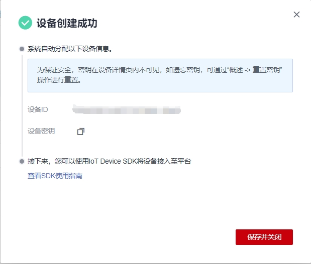

## 基于OpenHarmony 3.1 对接华为云IoTDA

本文主要介绍基于OpenHarmony 3.1来接入华为云IoTDA平台，以BearPi-HM_Nano开发板为例，使用`IoT Device SDK C Tiny`对接华为云物联网平台的简单流程。由于OpenHarmony 3.2以及4.0针对轻量级设备代码架构变化不大，文章后面有讲述通过OpenHarmony 4.0的相应适配。

## 1 云侧开发

### 1.1 前提条件

- 已注册华为云官方帐号。未注册可单击[注册页面](https://reg.huaweicloud.com/registerui/public/custom/register.html#/register)完成注册。
- 已完成实名制认证。未完成可在华为云上单击[实名认证](https://account.huaweicloud.com/usercenter/#/accountindex/realNameAuth)完成认证，否则无法使用设备接入功能。
- 已开通设备接入服务。未开通则访问[设备接入服务](https://www.huaweicloud.com/product/iothub.html)，单击“管理控制台”后开通该服务。

### 1.2 创建产品

1. 登录[管理控制台](https://console.huaweicloud.com/iotdm/?region=cn-north-4#/dm-portal/home)，单击左侧导航栏**“产品”**，单击页面左侧的“创建产品”。

2. 根据页面提示填写参数，然后单击“确认”，完成产品的创建。

   | **基本信息** |                                                              |
   | ------------ | ------------------------------------------------------------ |
   | 所属资源空间 | 平台自动将新创建的产品归属在默认资源空间下。如需归属在其他资源空间下，下拉选择所属的资源空间。如无对应的资源空间，请先创建[资源空间](https://support.huaweicloud.com/usermanual-iothub/iot_01_0006.html)。 |
   | 产品名称     | 为产品命名。产品名称在相同资源空间有唯一性。长度不超过64，只允许中文、字母、数字、以及_?'#().,&%@!-等字符的组合。 |
   | 协议类型     | 选择MQTT。                                                   |
   | 数据格式     | 选择JSON。                                                   |
   | 所属行业     | 请根据实际情况选择。                                         |
   | 设备类型     | 请根据实际情况选择。                                         |
   | 高级配置     |                                                              |
   | 产品ID       | 定制ProductID，用于唯一标识一个产品。如果携带此参数，平台将产品ID设置为该参数值；如果不携带此参数，产品ID在物联网平台创建产品后由平台分配获得。 |
   | 产品描述     | 产品描述。请根据实际情况填写。                               |
   
<p align='center'></p>
   
   <p align='center'>图1 创建产品</p>

### 1.3 开发产品模型

1. 找到新增的产品，单击“详情”进入产品界面。

2. 在产品详情“模型定义”页面，直接上传模型文件[BearPi_Agriculture.zip](https://iot-developer.obs.cn-north-4.myhuaweicloud.com/BearPi_Agriculture.zip)。

   说明：

   1. 在产品列表中，单击对应的产品，进入产品详情页。您可以查看产品ID、产品名称、设备类型、数据格式、厂商名称、所属资源空间、协议类型等产品基本信息。
   2. 产品创建成功后，您可以单击“删除”删除不再使用的产品。删除产品后，该产品下的产品模型、编解码插件等资源将被清空，请谨慎操作。

### 1.4 注册设备

1. 访问[设备接入服务](https://www.huaweicloud.com/product/iothub.html)，单击[管理控制台](https://console.huaweicloud.com/iotdm/?region=cn-north-4#/dm-portal/home)进入设备接入控制台。

2. 在左侧导航栏选择“ 设备 > 所有设备”，单击左上角“注册设备”，按照如下表格填写参数后，单击“确定”。

   <p align='center'></p>
   
<p align='center'>图2 注册单个设备</p>

| 参数名称     | 说明                                                         |
| ------------ | ------------------------------------------------------------ |
| 所属资源空间 | 选择设备所属的资源空间。                                     |
| 所属产品     | 选择设备所属的产品。如没有，请先[创建产品](https://support.huaweicloud.com/bestpractice-iothub/iot_bp_0077.html#ZH-CN_TOPIC_0000001160366184__section980065112310)。 |
| 设备标识码   | 即node_id，填写为设备的IMEI、MAC地址或Serial No；若没有真实设备，填写自定义字符串，长度为4至64个字符，只允许字母、数字、下划线（_）、连接符（-）的组合。 |
| 设备名称     | 即device_name，可自定义。                                    |
| 设备认证类型 | 选择**“密钥”**。                                             |
| 密钥         | 设备密钥，可自定义，不填写物联网平台会自动生成。             |

   <p align='center'></p>

   <p align='center'>图3 获取设备密钥</p>

   说明：

   1. 设备注册成功后，请妥善保管好设备ID和密钥，用于设备接入平台认证。
   2. 若密钥丢失，只能通过[重置密钥](https://support.huaweicloud.com/usermanual-iothub/iot_01_0065.html#section1)生成新的密钥，无法找回注册设备时生成的密钥。
   3. 用户可在[设备列表](https://support.huaweicloud.com/usermanual-iothub/iot_01_0065.html#section2)删除不再使用的设备。删除设备不支持撤回，请谨慎操作。

## 2 设备侧开发

### 2.1 硬件环境

BearPi-HM_Nano开发板、E53_IA1扩展模块、Type-C数据线、PC。

### 2.2 软件环境

**注意**   **此处软件环境构建流程描述相对简单**，**且只是方式中的一种，用户可以自行选择下载方式**。

参考链接单击[这里](https://gitee.com/openharmony/docs/tree/master/zh-cn/device-dev/quick-start)，搭建环境可以选择基于IDE方式或者基于命令行方式，其中BearPi-HM_Nano主控芯片为Hi3861，因此搭建环境时需要安装Hi3861对应环境。

也可以直接点击参考链接单击[Release-Notes](https://gitee.com/openharmony/docs/blob/master/zh-cn/release-notes/Readme.md#/openharmony/docs/blob/master/zh-cn/release-notes/OpenHarmony-v3.1.4-release.md)，以3.14为例通过如下命令下载对应的源码，前置条件看前方链接（下载源码方式不限）。

```shell
repo init -u git@gitee.com:openharmony/manifest.git -b refs/tags/OpenHarmony-v3.1.4-Release --no-repo-verify
repo sync -c
repo forall -c 'git lfs pull'
```

下载源码之后，在源码根目录执行如下命令，下载编译工具

```shell
./build/prebuilts_download.sh
```

### 2.3 IoT Device SDK C Tiny使用

1. 下载源码：下载源码后将文件夹重命名为`iot_device_sdk_c_tiny`。

2. 将源码文件夹`iot_device_sdk_c_tiny`拷贝到OpenHarmony源码根目录下的src->third_party目录中，此处需要注意的是OpenHarmony和`IoT Device SDK C Tiny`共同具备的三方库直接使用OpenHarmony的库文件，如CJSON和mbedtls等。

3. 在OpenHarmony 源码device/board/bearpi/bearpi_hm_nano/app/BUILD.gn中添加如下代码，根据#是否注释来决定具体编译demo的选择。

   ```shell
    "//third_party/iot_device_sdk_c_tiny/demos/mqtt_tiny_v5_agriculture_demo:mqtt_tiny_v5_agriculture_demo",
   ```

   

   

   <p align='center'>图4 demo的选择</p>

   说明：

   图4中使用MQTT对接华为云的demo，看一下该demo的BUILD.gn文件，具体如图5所示，其中A区域包含开发板硬件和wifi相关的库文件，B区域包括MQTT对接华为云必须的一些库文件，如cJson，mqtt相关、osal相关以及配置库文件，C区域表示编译该文件时需要编译iot_device_sdk_c_tiny库，编译时会按照指定路径找到该文件所必要的库以及C文件进行编译。

   <p align='center'></p>

   <p align='center'>图5 代码编译文件</p>

4. 设置参数。

   <p align='center'></p>

   <p align='center'>图6 参数修改</p>

   **注意：**

   （1）如果需要对接上云需要根据自己的设备修改配网信息，wifi热点账号以及密码以及自己在云端注册的设备ID和设备秘钥，注意此设备仅支持2.4G频段的wifi。

   （2）对接地址修改为[管理控制台](https://console.huaweicloud.com/iotdm/?region=cn-north-4#/dm-portal/home)界面“总览”的“接入信息”设备接入MQTT协议地址，若对接其他地址，请自行修改地址。

   （3）使用MQTT或MQTTS需要根据`//third_party/iot_device_sdk_c_tiny/iot_device_sdk_tiny_config/iot_config.h`中的宏 `#define CONFIG_OC_MQTTV5_DEMO_TLS 1`的配置有关，为1则使用MQTTS对应端口号8883，不配置默认使用的是MQTT对应端口号1883。若对接其他端口，请自行修改CN_SERVER_PORT的值。

   （4）若使用MQTTS对接，将使用到上图中的证书，若对接的非IoTDA平台，请自行更换对应平台的证书。

   （5）编译和烧录，分为IDE方式和命令行方式，这里不一一介绍。

   （6）烧录后，按下开发板RESET复位键，设备将启动。

   （7）上述代码基于OpenHarmony 3.1版本，若为其他版本按需修正相应BUILD.gn文件中引入的OpenHarmony源码路径。

5. 注意如下位置对于Mbedtls库文件的依赖

   对于文件`//third_party/iot_device_sdk_c_tiny/network/dtls/BUILD.gn`以及文件`//third_party/iot_device_sdk_c_tiny/oc/oc_mqtt/BUILD.gn`中的如下图所示，如果因OpenHarmony版本不同导致的路径不同，请对照源码修改。

   <p align='center'></p>

   <p align='center'>图7 Mbedtls依赖配置</p>

6. 编译与烧录：编译可以通过hb build -f命令，也可以使用`./build.sh --product-name bearpi_hm_nano`命令。烧录可以通过Hiburn工具或者专用的IDE工具，注意驱动的安装。

## 3 设备接入平台

代码烧录到设备后重启设备即可正常对接华为云IoTDA平台。

登录平台可以看见数据上报的具体信息，也可以进行命令下发等操作控制设备，具体如下图8-10。

<p align='center'></p>

<p align='center'>图8 数据上报</p>


<p align='center'>图9 命令下发</p>

<p align='center'></p>

<p align='center'>图10 日志信息</p>

**注意：** **本文采用的WIFI联网方式，如果使用有线网络方式，可参考相关开发者的[有线Demo](https://gitee.com/talkweb_oh/third_party_iotlink)。**


# 基于OpenHarmony 4.0 对接华为云IoTDA

基于OpenHarmony 3.2以及4.0后轻量级设备源码变动较小，因此以OpenHarmony 4.0为例进行描述。具体有如下四点不同。

## 1 WIFI以及传感器驱动文件

OpenHarmony 4.0的WIFI驱动文件有所变动，可以将OpenHarmony源码路径中的其他demo中的E53_IA1.h文件以及E53_IA1.c和wifi_connect.c文件拷贝过来，分别位于`device/board/bearpi/bearpi_hm_nano/app/D6_iot_cloud_oc/include`和 `device/board/bearpi/bearpi_hm_nano/app/D6_iot_cloud_oc/src`中。

## 2 硬件驱动文件路径修正

修改OpenHarmony源码根目录中的`third_party/iot_device_sdk_c_tiny/demos/mqtt_tiny_v5_agriculture_demo/BUILD.gn`文件如下图所示。

```shell
"//base/iothardware/peripheral/interfaces/inner_api",
```

<p align='center'></p>

<p align='center'>图11 路径更正</p>

## 3 删除无用的冲突静态库文件

删除OpenHarmony源码根目录下`device/soc/hisilicon/hi3861v100/sdk_liteos/build/libs/libmqtt.a`以及`device/board/bearpi/bearpi_hm_nano/third_party/libs/libpahomqtt_static.a`文件，避免冲突。

## 4 编译产物名称问题

在OpenHarmony 3.1以及之前版本最终我们烧录的文件为`Hi3861_wifiiot_app_allinone.bin`,在OpenHarmony 4.0中如果没有找到对应文件，烧录的时候选择`OHOS_Image.bin`即可，或者将其重命名为`Hi3861_wifiiot_app_allinone.bin`。