#  本SDK的kconfig配置说明

## 关于kconfig工具

kconfig工具来源于[ Ulf Magnusson的github工程](https://github.com/cruise2018/Kconfiglib)，在此感谢他提供的这么一款优秀的基于python的配置工具。开发者可以移步到其官方仓库下载并安装，也可以使用本SDK下的tools目录的下kconfiglib目录。该目录下有两个非常重要的文件menuconfig.py以及genconfig.py文件。menuconfig.py用于UI的配置并生成.config文件；genconfig.py基于.config生成所需的iot_config.h文件；

本SDK提供的工具，主要生成两个重要的文件：

* .config文件，主要是配置iot.mk的内容,控制哪些组件参与编译，哪些组件不参与编译
* iot_config.h，被各个组件引用，决定组件编译的各种详细配置

本SDK修改了genconfig.py文件，使得其输出的为iot_config.h文件，该文件将被iot_link/iot_link_config.h文件所引用。如果你使用本提供的kconfig，按照以下步骤就可以生成iot_config.h文件。

*  将SDK下的kconfig/Kconfiglib目录加入系统的path路径;
* 如果是linux/macos应该将menuconfig.py 以及genconfig.py添加可执行权限
* 进入到对应的target目录下，执行menuconfig.py，按照自己的解决方案配置并保存
* 执行genconfig.py,会生成对应的iot_config.h文件。

详细使用情况可以参考如下用例。

## 已MACOS为例介绍使用情况

上文介绍了kconfig的基本使用方法，本节已MACOS为例进行说明。

***假设的需求配置***：系统使用MACOS，TCPIP协议栈使用MACOS，DTLS使用MBEDTLS并设置为CERT模式，MQTT设置为PAHO，OC服务使用OCMQTT的OCTINYMQTT（基于MQTT的对接华为OceanConnect的流程组件）并使能其DEMO。

需求已经定好了，那么开始我们的表演吧。

进入到targets/MACBOOK目录下，运行menuconfig.py，即可进入我们的配置初始界面。

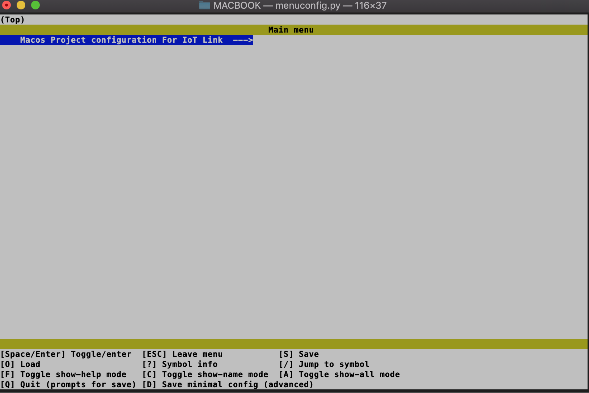

其和该target的kconfig刚好是对应的。

打开该文件的kconfig文件，发现其空空如也，仅仅是引用了iot_link目录下的kconfig_iotlink，没错，主要的配置都在kconfig_iotlink中，这么设计，可以很方便的把该SDK集成到第三方的配置当中。

ok,接下来我们按照需求配置进行一一配置。

+ 配置OS

  进入到主目录之后找到OS选项进行配置。

  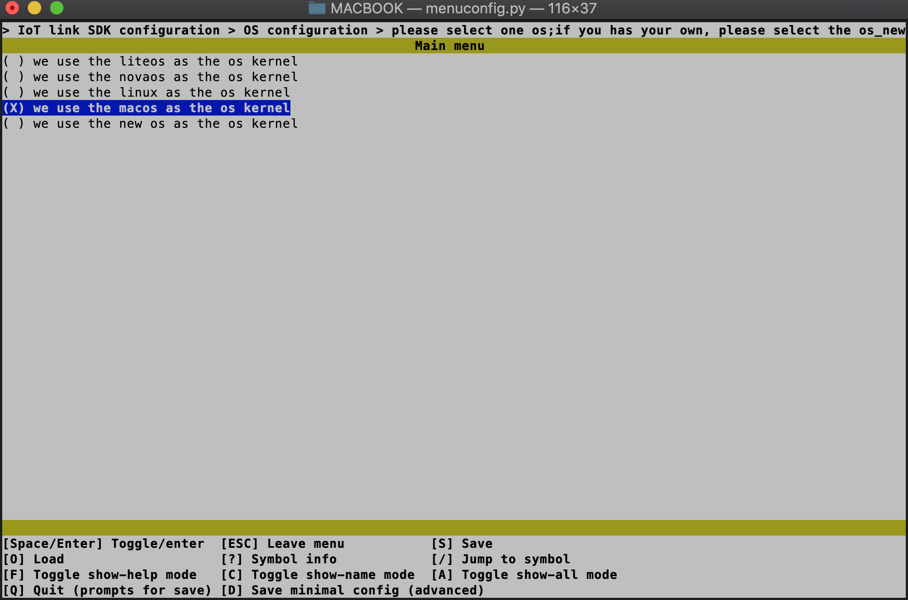

+ 配置TCPIP

  TCPIP选项在network中

  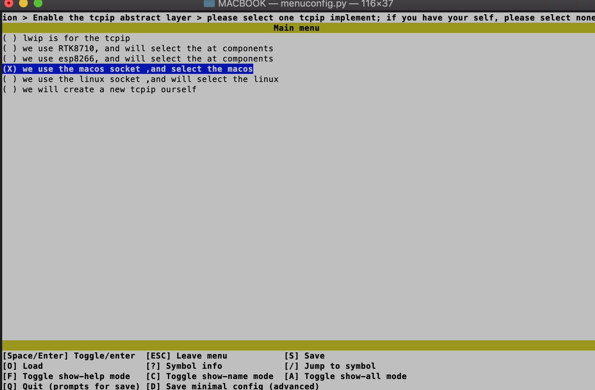
  
+ 配置DTLS

  DTLS选项在network中

  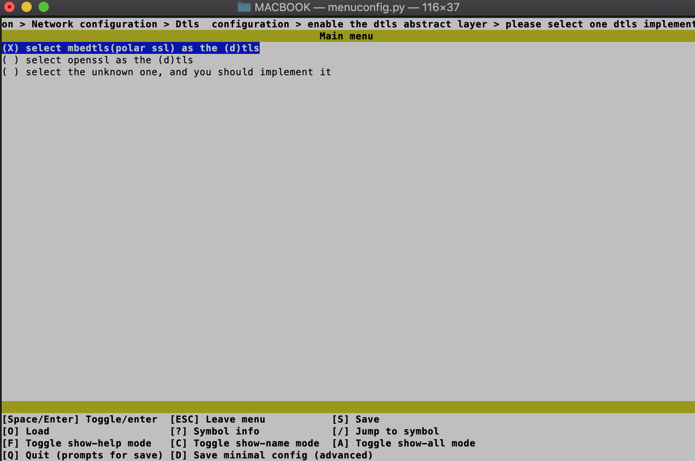
  
+ 配置MQTT

  MQT选项在network中

  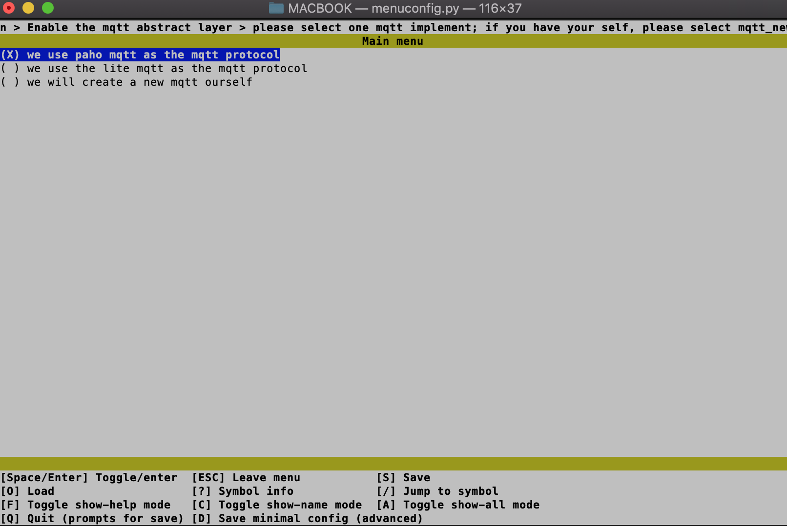
  
+ 配置OCMQTT

  OCMQTT选项在OC服务中

  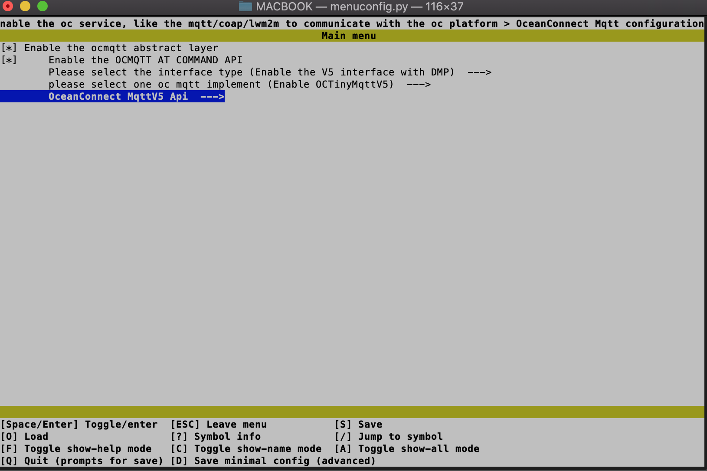
  
  好的，配置工作已经完成，输入q,并选择y退出并保存（该配置有记忆性，下次配置将在上次的配置基础上进行调整，因此是增量调整，比较方便）。
  
  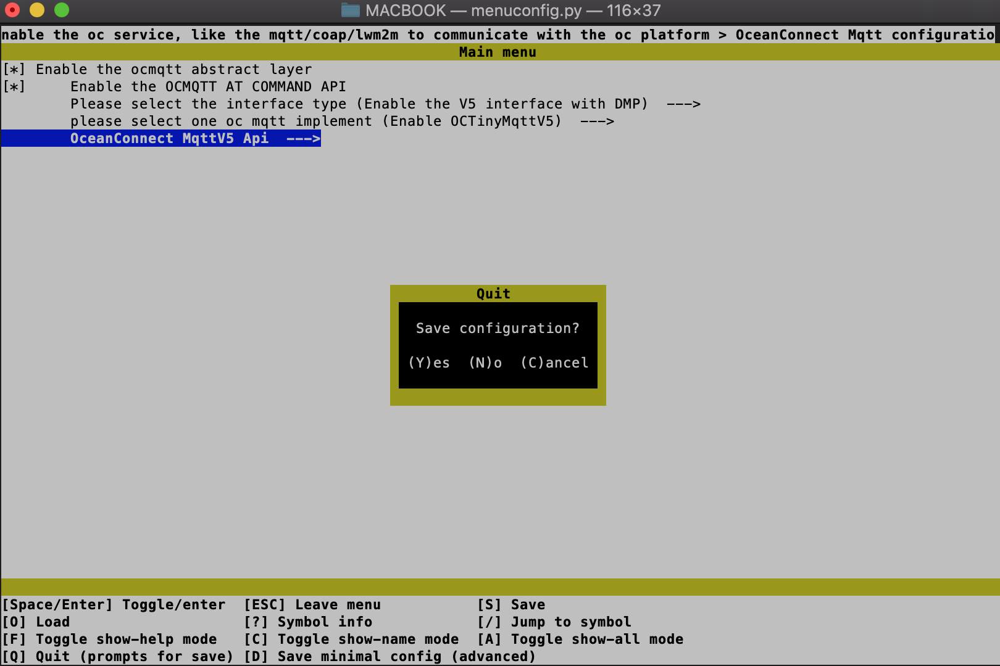

可以看到我们的当前目录下已经有了.config文件, 相当于旧版本的config.mk文件。

运行genconfig.py，则会生成iot_config.h文件。

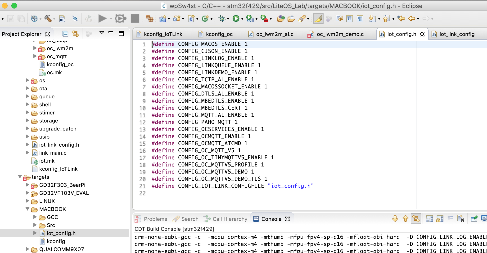

进入GCC目录下，添加我们的配置文件以及需要引入的编译控制，开发者自己的工程可以按照此进行添加)，其已经引用了我们的.config iot.mk

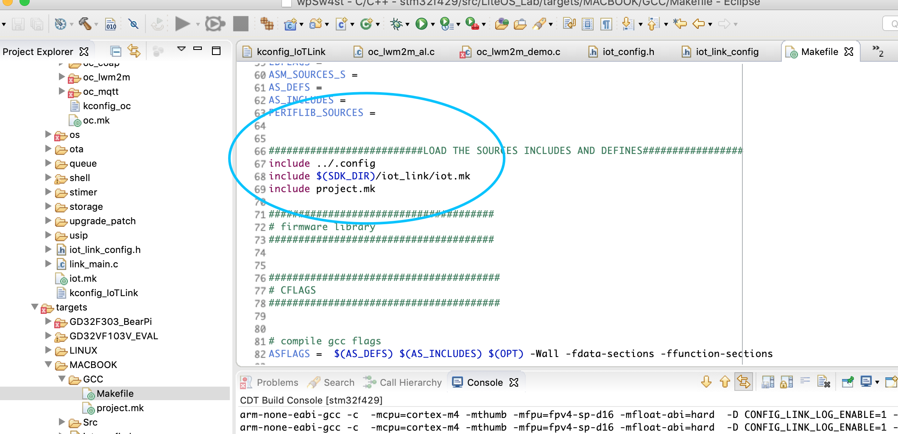

执行make，发现生成的可执行文件（需要注意的是我们使用的是macos的内核和其协议栈）。

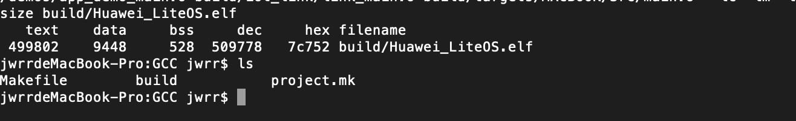

运行该文件。

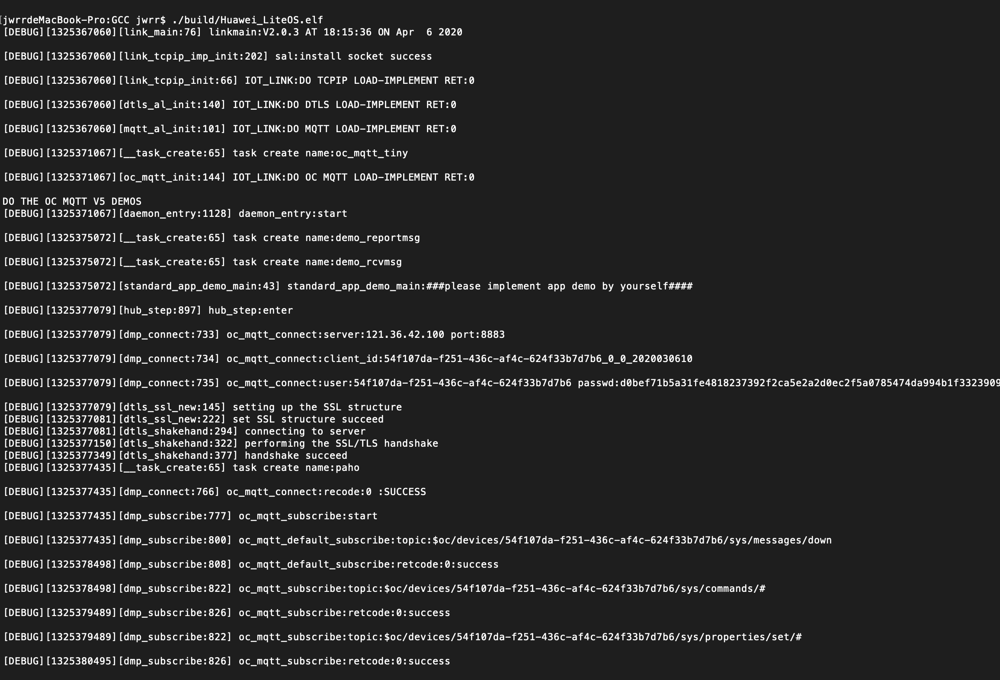

好了，到此为止，相信你已经知道了如何配置该SDK了。

##  配置注意点

* 在配置之前，你应该了解使用本SDK的方案，比方使用什么样的内核，是否需要TCPIP，是否使用加密等

* OceanConnect的MQTT对接的TLS，目前是证书模式，因此你需要配置DTLS为证书模式

* OceanConnect的LWM2M/COAP对接的DTLS，目前是PSK模式，因此你需要配置DTLS为PSK模式

* 更多需要注意的我们会在此不断更新。

  最后，希望你喜欢该配置方式，并反馈更多的建议！

