# ota_tool使用说明
## 目 录
<!-- TOC -->

- [1 前言](#1)
- [2 差分包生成和还原](#2)
	-  [2.1 差分包生成](#2.1)
	-  [2.2 差分包还原](#2.2)
- [3 签名和验签](#3)
	-  [3.1 生成公私钥对](#3.1)
	-  [3.2 签名](#3.2)
	-  [3.3 验签](#3.3)  

<h1 id="1">1.前言</h1>
  
 ota_tool是一个差分包制作工具。该工具提供差分包的制作以及还原功能。提供差分包签名和签名验证功能。
 参考[固件升级](https://support.huaweicloud.com/devg-IoT/iot_02_9984.html)和[软件升级](https://support.huaweicloud.com/devg-IoT/iot_02_9983.html)，将ota_tool生成的签名后的差分包，制作成升级包进行升级。

  github下载ota_tool.
 
  地址：https://github.com/LiteOS/LiteOS_Lab/tree/iot_link/tool/ota_tool/ota_tool.zip

注意：ota_tool当前版本只支持英文路径

<h1 id="2">2.差分包生成和还原</h1>
解压缩ota_tool.zip，打开ota_tool.exe

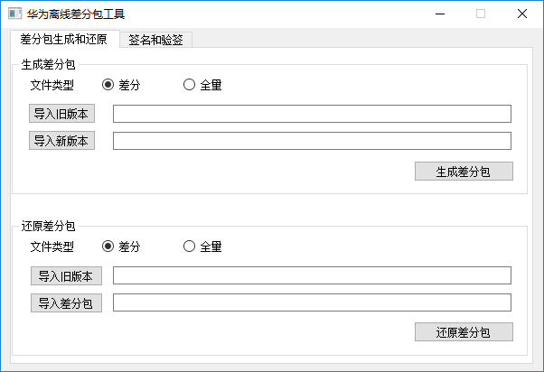

<h2 id="2.1">2.1 差分包生成</h2>

如果要制作差分包，文件类型选择 “差分”，必须提供软件的旧版本和新版本。

如果制作全量包，选择“全量”，只需要提供软件新版本。

单击[导入旧版本]，在弹出的对话框中选择软件旧版本

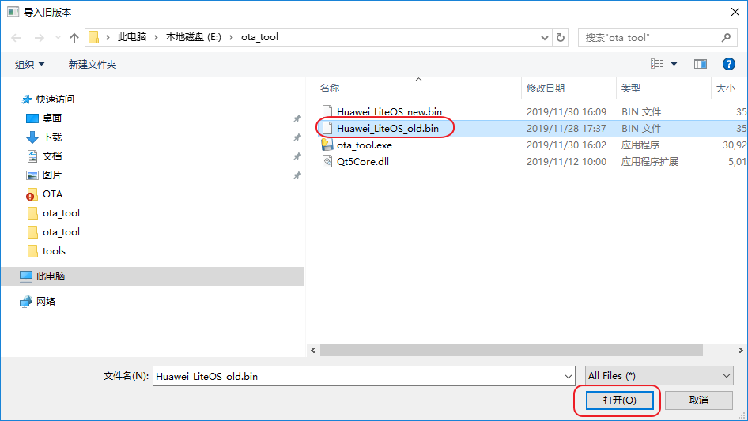

单击[导入新版本]，在弹出的对话框中选择软件新版本

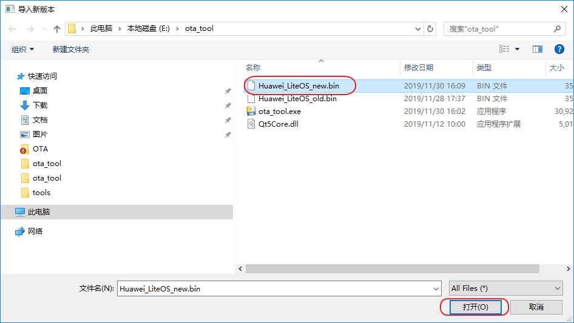

单击[生成差分包]，在弹出的对话话框中输入要保存的差分包名称

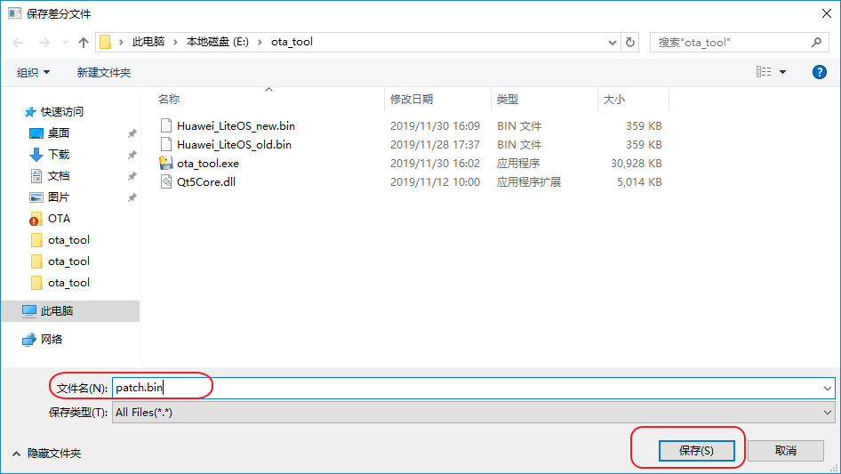

单击[保存]，弹出消息框单击[OK]

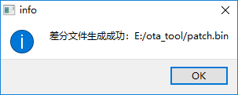

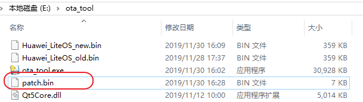

<h2 id="2.2">2.2 差分包还原</h2>

如果差分包的文件类型为“差分”，必须提供软件的旧版本和差分包。

如果差分包的文件类型为“全量”，只需要提供差分包。

单击[导入旧版本]，在弹出的对话框中选择软件旧版本

单击[导入差分包]，在弹出的对话框中选择差分包

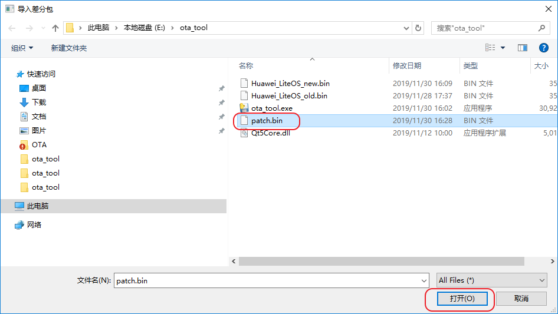

单击[还原差分包]，在弹出的对话话框中输入要保存的还原后文件名称

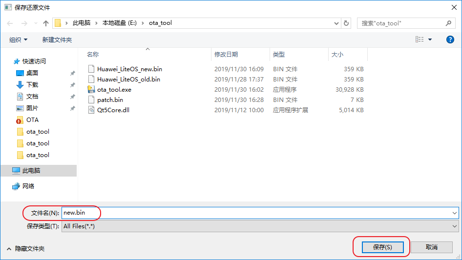

单击[保存]，弹出消息框单击[OK]

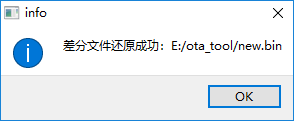

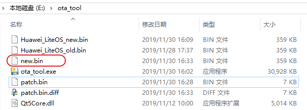

<h1 id="3">3.签名和验签</h1>

为了保证差分包不被第三方篡改数据，ota_tool提供差分包签名功能，在进行软固件升级时，设备需要对差分包进行验签。

ota_tool采用私钥签名，公钥验签模式。公钥私钥必须成对使用。

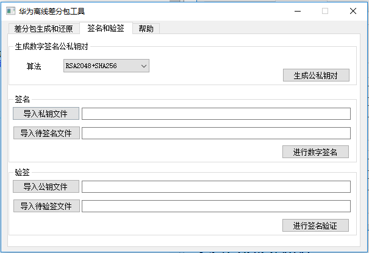

<h2 id="3.1">3.1 生成公私钥对</h2>

单击[生成公私钥对]，在弹出对对话框中选择保存公私钥目录，然后单击[选择文件夹]
公私钥钥对生成需要花费一两秒钟，请耐心等待生成结果。

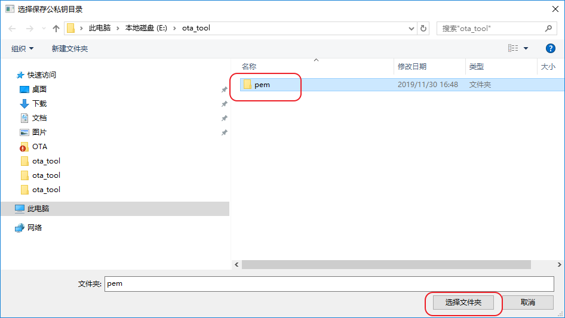

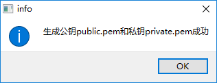

loader侧验签用公钥参考public.c

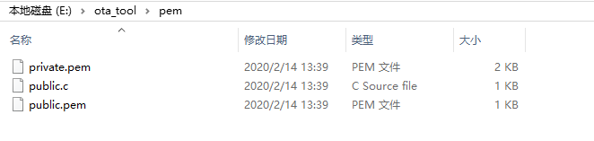

<h2 id="3.2">3.2 签名</h2>

单击[导入私钥文件]，在弹出的对话框中选择签名用的私钥文件

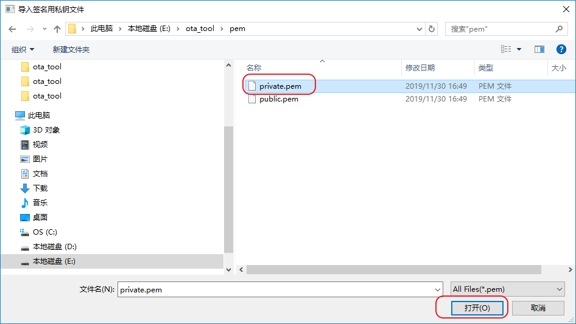

单击[导入待签名文件]，在弹出的对话框中选择待签名差分文件

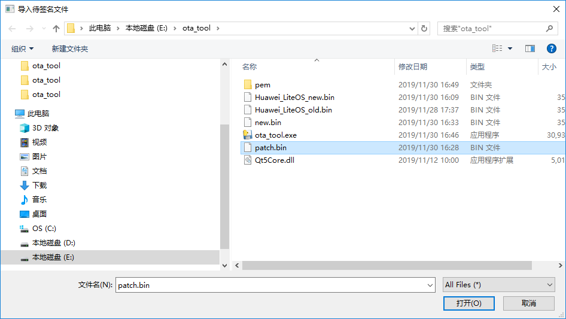

单击[进行数字签名]，签名后的文件如下。

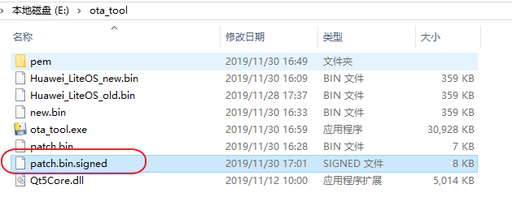

<h2 id="3.3">3.3 验签</h2>

单击[导入公钥文件]，在弹出的对话框中选择验签用的公钥文件

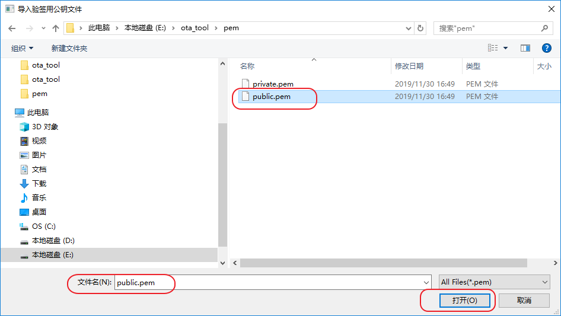

单击[导入待验签文件]，在弹出的对话框中选择待验签文件

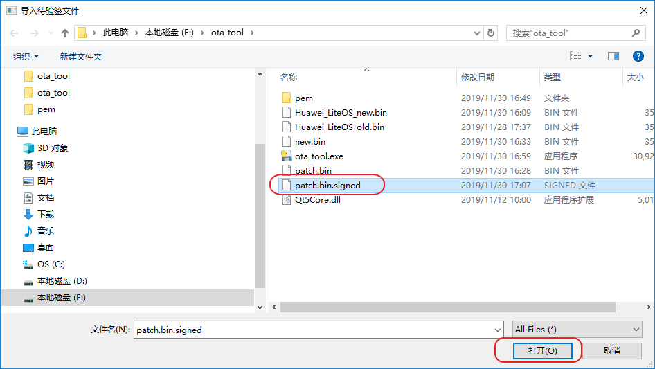

单击[进行签名验证]，弹出验证结果对话框。

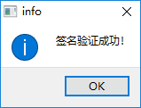

